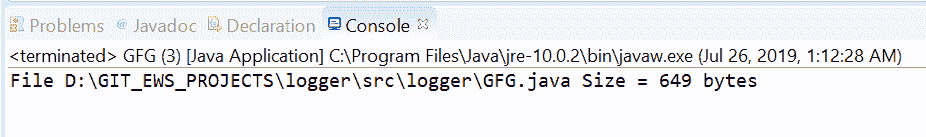
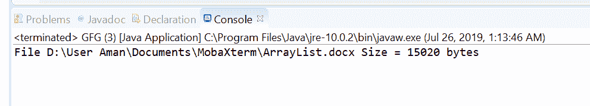

# Java中的`Files.size()`方法示例

> 原文：[https://www.geeksforgeeks.org/files-size-method-in-java-with-examples/](https://www.geeksforgeeks.org/files-size-method-in-java-with-examples/)

`size()`方法属于`java.nio.file.Files`类。它帮助我们获取文件的大小（以字节为单位）。此方法通过将文件路径作为参数返回文件大小（以字节为单位）。由于压缩、支持稀疏文件或其他原因，大小可能与文件系统上的实际大小不同。非常规文件的大小是特定于实现的，因此未指定。

**语法：**

```java
public static long size(Path path)
                 throws IOException
```

**参数：** 这个方法接受一个参数`path`，它是文件的路径。

**返回值：** 该方法返回文件大小，以字节为单位。

**异常：** 这个方法会抛出以下异常：

1.  `IOException` - 如果出现输入/输出错误。
2.  `SecurityException` - 在默认提供程序的情况下，安装了安全管理器，其`checkRead`方法拒绝对文件的读访问。

下面的程序说明`size(Path)`方法：

**程序 1：**

```java
// Java program to demonstrate
// Files.size() method

import java.io.IOException;
import java.nio.file.*;

public class GFG {
    public static void main(String[] args)
        throws IOException
    {

        // create object of Path
        Path path
            = Paths.get("D:\\GIT_EWS_PROJECTS\\logger"
                        + "\\src\\logger"
                        + "\\GFG.java");

        // get File Size
        long result;
        result = Files.size(path);

        System.out.println("File " + path
                           + " Size = "
                           + result + " bytes");
    }
}
```

**输出：** 

**程序 2：**

```java
// Java program to demonstrate
// Files.size() method

import java.io.IOException;
import java.nio.file.*;

public class GFG {
    public static void main(String[] args)
        throws IOException
    {

        // create object of Path
        Path path
            = Paths.get("D:\\User Aman\\"
                        + "Documents\\MobaXterm\\"
                        + "\\ArrayList.docx");
        // get File Size
        long result;
        result = Files.size(path);

        System.out.println("File " + path
                           + " Size = "
                           + result + " bytes");
    }
}
```

**输出：** 

**参考文献：** [https://docs.oracle.com/javase/10/docs/api/java/nio/file/Files.html#size(java.nio.file.Path)](https://docs.oracle.com/javase/10/docs/api/java/nio/file/Files.html#size(java.nio.file.Path))