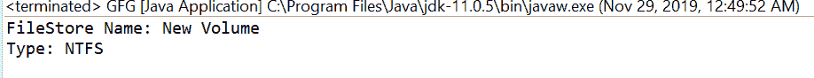
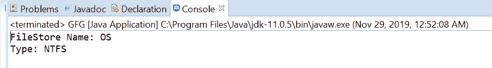

# Java 中的 `FileStore.type()` 方法示例

> 原文：[https://www.geeksforgeeks.org/filestore-type-method-in-java-with-examples/](https://www.geeksforgeeks.org/filestore-type-method-in-java-with-examples/)

`FileStore` 类的 `type()` 方法被用来返回这个文件存储的类型，返回的字符串格式高度特定于实现。

### 语法：
```java
public abstract String type()
```

### 参数：
此方法不接受任何参数。

### 返回值：
此方法返回一个代表这个文件存储类型的字符串。

下面的程序说明了 `type()` 方法：

### 程序 1：
```java
// Java program to demonstrate
// FileStore.type() method

import java.io.IOException;
import java.nio.file.FileStore;
import java.nio.file.Files;
import java.nio.file.Path;
import java.nio.file.Paths;

public class GFG {
    public static void main(String[] args) {
        // create object of Path
        Path path = Paths.get("E:\\Tutorials\\file.txt");

        // get FileStore object
        try {
            FileStore fs = Files.getFileStore(path);

            // print FileStore name and Total usable space
            System.out.println("FileStore Name: " + fs.name());
            String type = fs.type();
            System.out.println("Type: " + type);
        } catch (IOException e) {
            // TODO Auto-generated catch block
            e.printStackTrace();
        }
    }
}
```

### 输出：


### 程序 2：
```java
// Java program to demonstrate
// FileStore.type() method

import java.io.IOException;
import java.nio.file.FileStore;
import java.nio.file.Files;
import java.nio.file.Path;
import java.nio.file.Paths;

public class GFG {
    public static void main(String[] args) {
        // create object of Path
        Path path = Paths.get("C:\\Movies\\document.txt");

        // get FileStore object
        try {
            FileStore fs = Files.getFileStore(path);

            // print FileStore name and Total usable space
            System.out.println("FileStore Name: " + fs.name());
            String type = fs.type();
            System.out.println("Type: " + type);
        } catch (IOException e) {
            // TODO Auto-generated catch block
            e.printStackTrace();
        }
    }
}
```

### 输出：


参考文献：[https://docs.oracle.com/javase/10/docs/api/java/nio/file/FileStore.html#type()](https://docs.oracle.com/javase/10/docs/api/java/nio/file/FileStore.html#type())