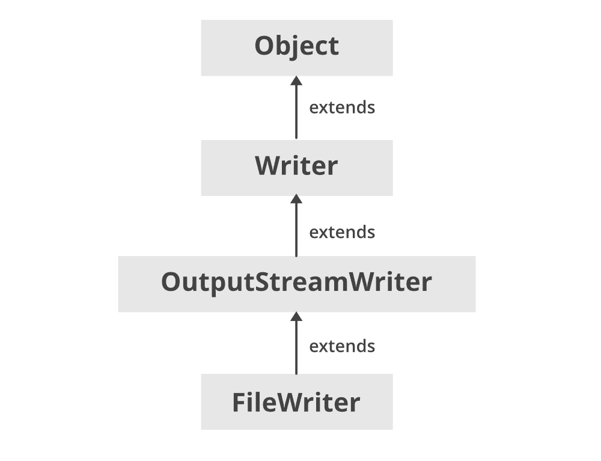
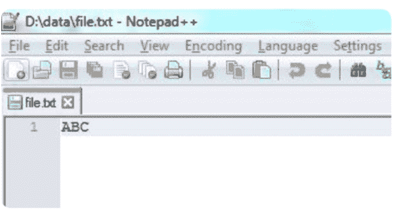

# Java 中的 FileWriter 类

> 原文: [https://www.geeksforgeeks.org/filewriter-class-in-java/](https://www.geeksforgeeks.org/filewriter-class-in-java/)

`FileWriter` 类的 `java.io` 包用于将字符形式的数据写入文件。

*   这个类继承自 `OutputStreamWriter` 类，后者又继承自 `Writer` 类。
*   这个类的构造函数假设默认字符编码和默认字节缓冲区大小是可以接受的。要自己指定这些值，请在 `FileOutputStream` 上构建一个 `OutputStreamWriter`。
*   `FileWriter` 用于编写字符流。要写入原始字节流，请考虑使用 `FileOutputStream`。
*   如果输出文件尚不存在，则 `FileWriter` 会创建输出文件。

## 文件编写器的层次结构



`FileWriter` 扩展了 `OutputStreamWriter` 和 `Writer` 类。它实现了 `Closeable`、`Flushable`、`Appendable`、`AutoCloseable` 接口。

## file writer 的构造函数

### 1. `FileWriter(File file)`
给定一个文件对象，构造一个 `FileWriter` 对象。如果文件存在但不是常规文件，或者不存在但无法创建，或者由于任何其他原因无法打开，它将抛出 `IOException`。

```java
FileWriter fw = new FileWriter(File file);
```

### 2. `FileWriter(File file, boolean append)`
给定一个文件对象，构造一个 `FileWriter` 对象。如果第二个参数为 `true`，那么字节将被写入文件的末尾，而不是开头。如果文件存在但不是常规文件，或者不存在但无法创建，或者由于任何其他原因无法打开，它将抛出 `IOException`。

```java
FileWriter fw = new FileWriter(File file, boolean append);
```

### 3. `FileWriter(FileDescriptor FD)`
构造一个与文件描述符相关联的 `FileWriter` 对象。

```java
FileWriter fw = new FileWriter(FileDescriptor FD);
```

### 4. `FileWriter(File file, Charset charset)`
在给定文件和 `Charset` 的情况下构造 `FileWriter`。

```java
FileWriter fw = new FileWriter(File file, Charset charset);
```

### 5. `FileWriter(File file, Charset charset, boolean append)`
当给定文件和 `Charset` 以及一个指示是否追加写入数据的 `boolean` 时，构造 `FileWriter`。

```java
FileWriter fw = new FileWriter(File file, Charset charset, boolean append);
```

### 6. `FileWriter(String fileName)`
构造一个给定文件名的 `FileWriter` 对象。

```java
FileWriter fw = new FileWriter(String fileName);
```

### 7. `FileWriter(String fileName, boolean append)`
为给定的文件名构造一个 `FileWriter` 对象，该对象带有一个布尔值，指示是否追加写入的数据。

```java
FileWriter fw = new FileWriter(String fileName, boolean append);
```

### 8. `FileWriter(String fileName, Charset charset)`
当给定文件名和字符集时，构造一个 `FileWriter`。

```java
FileWriter fw = new FileWriter(String fileName, Charset charset);
```

### 9. `FileWriter(String fileName, Charset charset, boolean append)`
当给定文件名和字符集以及指示是否追加数据的布尔变量时，构造 `FileWriter`。

```java
FileWriter fw = new FileWriter(String fileName, Charset charset, boolean append);
```

## 申报

```java
public class FileWriter extends OutputStreamWriter
```

## 例

### Java 示例

```java
// Java program to create a text File using FileWriter

import java.io.FileWriter;
import java.io.IOException;
import java.util.*;
class GFG {
    public static void main(String[] args)
        throws IOException
    {
        // initialize a string
        String str = "ABC";
        try {

            // attach a file to FileWriter
            FileWriter fw
                = new FileWriter("D:/data/file.txt");

            // read each character from string and write
            // into FileWriter
            for (int i = 0; i < str.length(); i++)
                fw.write(str.charAt(i));

            System.out.println("Successfully written");

            // close the file
            fw.close();
        }
        catch (Exception e) {
            e.getStackTrace();
        }
    }
}
```



## 覆盖与追加文件

在创建 `FileWriter` 时，我们可以决定是将文件追加到现有文件，还是覆盖任何现有文件。这可以通过选择适当的构造函数来决定。覆盖任何现有文件的构造函数只接受一个参数，即文件名。

```java
Writer fileWriter = new FileWriter("c:\\data\\output.txt");
```

追加文件或覆盖文件的构造函数采用两个参数，文件名和一个布尔变量，决定是追加还是覆盖文件。

```java
Writer fileWriter = new FileWriter("c:\\data\\output.txt", true); //追加到文件
Writer fileWriter = new FileWriter("c:\\data\\output.txt", false); //覆盖文件
```

## 基本方法

### 1. `write()`
1.  `write(int a)`: 此方法写入 `int a` 指定的单个字符。
2.  `write(String str, int pos, int length)`: 此方法从位置 `pos` 一直到 `length` 字符数写入字符串的一部分。
3.  `write(char ch[], int pos, int length)`: 此方法从位置 `pos` 一直到 `length` 字符数写入数组 `ch[]`中的字符位置。
4.  `write(char ch[])`: 此方法写入由 `ch[]`指定的字符数组。
5.  `write(String st)`: 此方法将“st”指定的字符串值写入文件。

### Java 示例

```java
// Java program to write text to file

import java.io.FileWriter;

public class GFG {

    public static void main(String args[])
    {

        String data = "Welcome to gfg";

        try {
            // Creates a FileWriter
            FileWriter output
                = new FileWriter("output.txt");

            // Writes the string to the file
            output.write(data);

            // Closes the writer
            output.close();
        }

        catch (Exception e) {
            e.getStackTrace();
        }
    }
}
```

### 2. `getEncoding()`
此方法用于获取用于写入数据的编码类型。

### Java 示例

```java
// java program to show the usage
// of getEncoding() function

import java.io.FileWriter;
import java.nio.charset.Charset;

class Main {
    public static void main(String[] args)
    {

        String file = "output.txt";

        try {
            // Creates a FileReader with default encoding
            FileWriter o1 = new FileWriter(file);

            // Creates a FileReader specifying the encoding
            FileWriter o2 = new FileWriter(
                file, Charset.forName("UTF11"));

            // Returns the character encoding of the reader
            System.out.println("Character encoding of o1: "
                               + o1.getEncoding());
            System.out.println("Character encoding of o2: "
                               + o2.getEncoding());

            // Closes the reader
            o1.close();
            o2.close();
        }

        catch (Exception e) {
            e.getStackTrace();
        }
    }
}
```

### 输出

```java
The character encoding of output1: Cp1253
The character encoding of output2: UTF11
```

在上面的例子中，我们创建了两个名为 `output1` 和 `output2` 的 `FileWriter`。

1.  `output1`: 未指定字符编码。因此，`getEncoding()`方法返回默认的字符编码。
2.  `output2`: 指定字符编码，`UTF11`。因此，`getEncoding()`方法返回指定的字符编码。

### 3. `close()`方法
在完成向 `FileWriter` 写入字符后，我们应该关闭它。这是通过调用 `close()`方法来完成的。

```java
try {
    // Creates a FileReader with default encoding
    FileWriter o1 = new FileWriter(file);

    // Creates a FileReader specifying the encoding
    FileWriter o2 = new FileWriter(file, Charset.forName("UTF11"));

    // Returns the character encoding of the reader
    System.out.println("Character encoding of o1: " + o1.getEncoding());
    System.out.println("Character encoding of o2: " + o2.getEncoding());

    // Closes the FileWriter
    o1.close();
    o2.close();
}
```

## file writer vs file output stream

*   `FileWriter` 写入字符流，而 `FileOutputStream` 用于写入原始字节流。
*   `FileWriter` 处理 16 位字符，而另一方面，`FileOutputStream` 处理 8 位字节。
*   `FileWriter` 处理 Unicode 字符串，而 `FileOutputStream` 向文件写入字节，它不接受字符或字符串，因此为了接受字符串，它需要用 `OutputStreamWriter` 包装。

## 文件编写器的方法

| 方法 | 描述 |
| --- | --- |
| `void write(String text)` | 它用于将字符串写入 `FileWriter`。 |
| `void write(char c)` | 它用于将字符写入 `FileWriter`。 |
| `void write(char[] c)` | 它用于将字符数组写入 `FileWriter`。 |
| `void flush()` | 它用于刷新 `FileWriter` 的数据。 |
| `void close()` | 它用于关闭 `FileWriter`。 |

## 输出流编写器的方法

| 方法 | 描述 |
| --- | --- |
| `flush()` | 冲洗溪流。 |
| `getEncoding()` | 返回此流使用的字符编码的名称。 |
| `write(char[] cbuf, int off, int len)` | 写入字符数组的一部分。 |
| `write(int c)` | 写一个字符。 |
| `write(String str, int off, int len)` | 写入字符串的一部分。 |

## 作家的方法

| 方法 | 描述 |
| --- | --- |
| [`append(char c)`](https://www.geeksforgeeks.org/writer-appendchar-method-in-java-with-examples/) | 将指定的字符追加到此编写器中。 |
| `append(CharSequence csq)` | 将指定的字符序列追加到此编写器。 |
| `append(CharSequence csq, int start, int end)` | 向此编写器追加指定字符序列的子序列。 |
| [`close()`](https://www.geeksforgeeks.org/writer-close-method-in-java-with-examples/) | 关闭流，首先刷新它。 |
| `nullWriter()` | 返回一个丢弃所有字符的新 `Writer`。 |
| [`write(char[] cbuf)`](https://www.geeksforgeeks.org/writer-writechar-method-in-java-with-examples/) | 写入字符数组。 |
| [`write(String)`](https://www.geeksforgeeks.org/writer-writestring-method-in-java-with-examples/) | 写一个字符串。 |