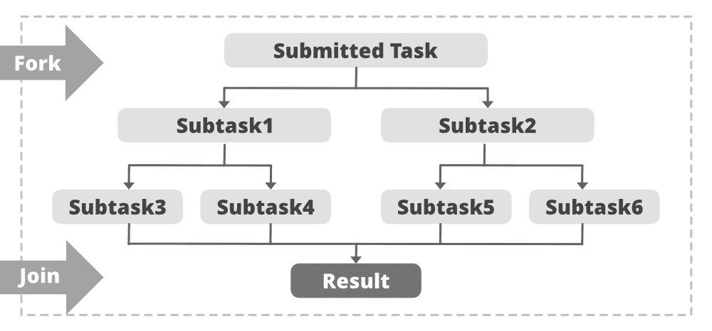

# Java 中的 ForkJoinPool 类示例

> 原文：[https://www.geeksforgeeks.org/forkjoinpool-class-in-java-with-examples/](https://www.geeksforgeeks.org/forkjoinpool-class-in-java-with-examples/)

`ForkJoinPool` 类是 fork/join 框架的中心，是 `ExecutorService` 接口的实现。`ForkJoinPool` 类是 `AbstractExecutorService` 类的扩展，它实现了 fork/join 框架的工作窃取算法（即用完要做的事情的工作线程可以从其他仍然忙碌的线程中窃取任务），并可以执行 `ForkJoinTask` 进程。

**`ForkJoinPool` 类继承了 `java.util.concurrent.AbstractExecutorService` 类的以下方法：**

*   `invokeAll()`
*   `invokeAny()`

**`ForkJoinPool` 类继承了从 `java.lang.Object` 类继承的方法的以下方法：**

*   `clone()`
*   `equals()`
*   `finalize()`
*   `getClass()`
*   `hashCode()`
*   `notify()`
*   `notifyAll()`
*   `wait()`

**语法：**

```java
public class ForkJoinPool extends AbstractExecutorService
```

**Fork：** Fork 步骤将任务拆分成更小的子任务，这些任务同时执行。

**Join：** 子任务执行后，任务可以将所有结果连接成一个结果。

**如下图所示：**



**示例：**

**`getActiveThreadCount()`：** 此方法返回当前正在窃取或执行任务的估计线程数。它可能高估了活动线程的数量。

**语法**

```java
public int getActiveThreadCount()
```

## Java 代码示例

```java
// Java program to demonstrate the
// Implementation of getActiveThreadCount()

import java.util.ArrayList;
import java.util.List;
import java.util.concurrent.ForkJoinPool;
import java.util.concurrent.RecursiveAction;
class NewTask extends RecursiveAction
{
    private long Load = 0;

    public NewTask(long Load) { this.Load = Load; }

    protected void compute()
    {
        // fork tasks into smaller subtasks
        List<NewTask> subtasks = new ArrayList<NewTask>();
        subtasks.addAll(createSubtasks());

        for (RecursiveAction subtask : subtasks) {
            subtask.fork();
        }
    }

    // function to create and add subtasks
    private List<NewTask> createSubtasks()
    {
        // create subtasks
        List<NewTask> subtasks = new ArrayList<NewTask>();
        NewTask subtask1 = new NewTask(this.Load / 2);
        NewTask subtask2 = new NewTask(this.Load / 2);
        NewTask subtask3 = new NewTask(this.Load / 2);

        // to add the subtasks
        subtasks.add(subtask1);
        subtasks.add(subtask2);
        subtasks.add(subtask3);

        return subtasks;
    }
}
public class JavaForkJoingetActivethreadcountExample1 {
    public static void main(final String[] arguments)
        throws InterruptedException
    {
        // get no. of available core available
        int proc = Runtime.getRuntime().availableProcessors();

        System.out.println("Number of available core in the processor is: "
            + proc);

        // get no. of threads active
        ForkJoinPool Pool = ForkJoinPool.commonPool();

        System.out.println("Number of active thread before invoking: "
            + Pool.getActiveThreadCount());

        NewTask t = new NewTask(400);

        Pool.invoke(t);

        System.out.println("Number of active thread after invoking: "
            + Pool.getActiveThreadCount());
        System.out.println("Common Pool Size is: "
                           + Pool.getPoolSize());
    }
}
```

**输出**

```java
Number of available core in the processor is: 4
Number of active thread before invoking: 0
Number of active thread after invoking: 3
Common Pool Size is: 3
```

## 分叉连接池类的方法

| 方法 | 描述 |
| --- | --- |
| `public boolean awaitQuiescence(long timeout, TimeUnit unit)` | 此方法执行池直到池静止，否则，协助执行任务直到指定的时间值和单位过去或池静止。 |
| `public boolean awaitTermination(long timeout, TimeUnit unit)` | 此方法会一直阻塞，直到所有任务在关闭请求后完成执行，或者发生超时，或者当前线程被中断，以先发生的为准。 |
| `public static ForkJoinPool commonPool()` | 此方法返回公共池实例。 |
| `public void execute(Runnable task)` | 这个方法在将来的某个时候执行给定的命令。 |
| `public int getActiveThreadCount()` | 此方法返回当前正在窃取或执行任务的估计线程数。它可能高估了活动线程的数量。 |
| `public boolean getAsyncMode()` | 如果此池对从未加入的分叉任务使用本地先进先出调度模式，则此方法返回 true。 |
| `public static int getCommonPoolParallelism()` | 此方法返回公共池的目标并行度。 |
| `public ForkJoinPool.ForkJoinWorkerThreadFactory getFactory()` | 此方法返回用于建造新工人的工厂。 |
| `public int getParallelism()` | 此方法返回该池的目标并行度。 |
| `public int getPoolSize()` | 此方法返回已经启动但尚未终止的工作线程数。 |
| `public int getQueuedSubmissionCount()` | 此方法返回提交给此池但尚未开始执行的任务数的估计值。 |
| `public long getQueuedTaskCount()` | 此方法返回工作线程当前在队列中持有的任务总数的估计值。 |
| `public int getRunningThreadCount()` | 此方法返回未被阻止等待加入任务或等待其他托管同步的工作线程数的估计值。 |
| `public long getStealCount()` | 此方法返回一个线程从另一个线程的工作队列中窃取的任务总数的估计值。 |
| `public Thread.UncaughtExceptionHandler getUncaughtExceptionHandler()` | 此方法返回由于执行任务时遇到不可恢复的错误而终止的内部工作线程的处理程序。 |
| `public boolean hasQueuedSubmissions()` | 如果有任何提交到此池的任务尚未开始执行，此方法将返回 true。 |
| `public <T> T invoke(ForkJoinTask<T> task)` | 此方法执行给定的任务，并在完成时返回其结果。 |
| `public boolean isQuiescent()` | 如果所有工作线程当前都处于空闲状态，则此方法返回 true。 |
| `public boolean isShutdown()` | 如果调用 `isShutdown()` 的池已关闭，则此方法返回 true。 |
| `public boolean isTerminated()` | 如果关闭后所有任务都已完成，则此方法返回 true。 |
| `public boolean isTerminating()` | 如果终止过程已经开始但尚未完成，则此方法返回 true。 |
| `protected <T> RunnableFuture<T> newTaskFor(Callable<T> callable)` | 这个方法返回一个 `RunnableFuture`，当运行时，它将调用底层的可调用函数，作为一个 `Future`，它将产生可调用函数的结果作为它的结果，并提供底层任务的取消。 |
| `public void shutdown()` | 如果此池已关闭，此方法返回 true。 |
| `public List<Runnable> shutdownNow()` | 此方法可能会尝试取消和/或停止所有任务，并拒绝所有后续提交的任务。 |
| `public ForkJoinTask<?> submit(Runnable task)` | 这个方法提交一个可运行的任务来执行，并返回一个代表该任务的未来。 |
| `public String toString()` | 此方法返回一个字符串，该字符串标识该池及其状态，包括运行状态、并行度以及工作进程和任务计数的指示。 |