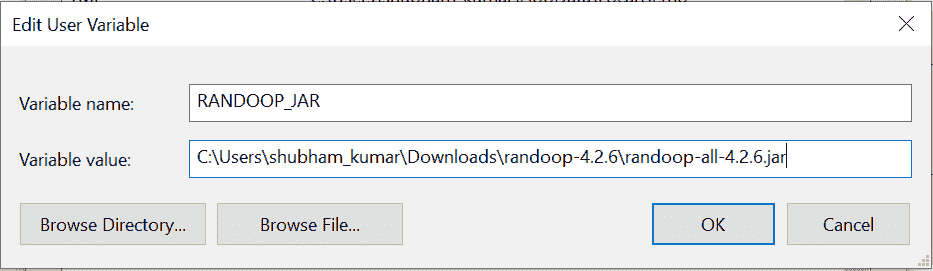
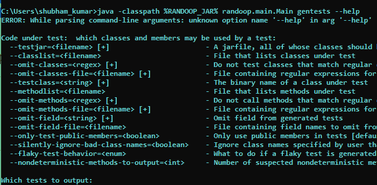
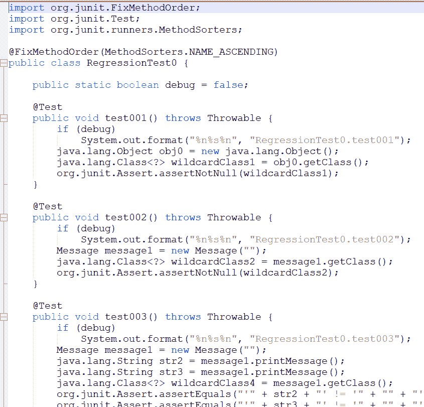
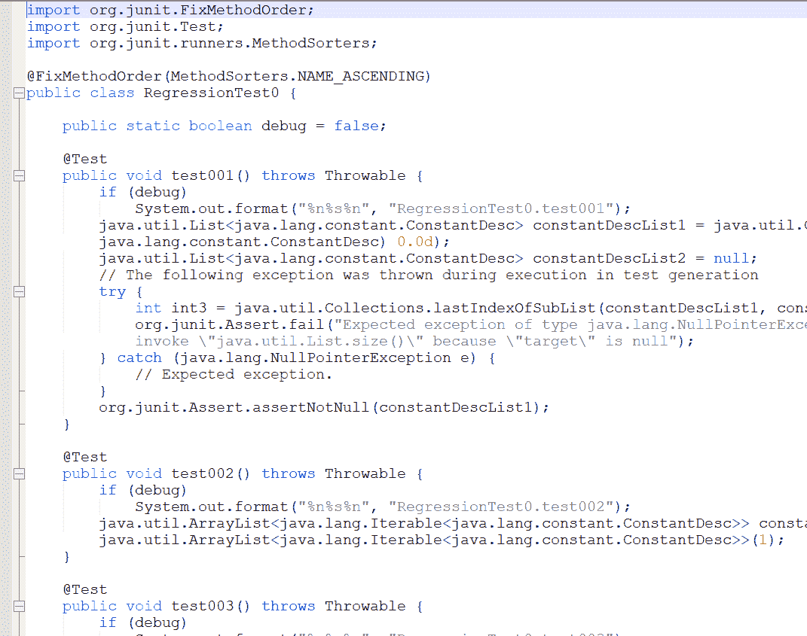

# 使用 Java 中的 Randoop API 生成 JUnit 测试用例

> 原文：[https://www.geeksforgeeks.org/generate-junit-test-cases-using-randoop-api-in-java/](https://www.geeksforgeeks.org/generate-junit-test-cases-using-randoop-api-in-java/)

这里我们将讨论如何使用 Randoop 生成[单元测试](https://www.geeksforgeeks.org/unit-testing-software-testing/)用例，以及当前实例的示例图和快照。所以基本上在开发中如果我们谈论测试用例，那么每个开发人员都必须手动编写测试用例。这被计算在开发工作中，也增加了项目的时间和成本估算。所以我们可以在一些 API 的帮助下减少编写测试用例的时间。其中之一就是 **Randoop**。Java 和 Randoop 是我们前进之前的先决条件。使用 randoop 生成测试用例需要基础知识，您需要了解 Junit 的基础知识来验证结果。

## Randoop 的工作方式

Randoop 会自动为你的类创建 Junit 测试。它是一个 Java 的单元测试生成器。Randoop 使用反馈导向的随机测试生成来生成单元测试。这种技术是伪随机的，但是很聪明，为测试中的类生成方法/构造函数调用序列。

## Randoop 通常会生成两种类型的测试用例

*   检测当前代码中的错误的错误揭示测试。
*   可用于检测未来错误的回归测试。

## 运行 Randoop

现在你的机器里有下载的 jar 了。要运行它，你必须调用 Randoop 的主方法，比如 `randoop.main.Main`。

### 第一步

首先要设置 `randoop-all-4.2.6.jar` 和的环境变量。



### 步骤 2

设置可变开路端子后，输入下面给出的线路，如果一切配置正确，则输出如下。

```java
java -classpath %RANDOOP_JAR% randoop.main.Main gentests --help
```



### 步骤 3

现在，为 java 文件（`--Test class`）生成测试用例。

*   创建一个示例 java 文件来生成测试用例。
*   在这个例子中，我们使用 `--test class` 选项来测试单个类文件。

#### 例

```java
public class Message {
   private String message;

   public Message(String message){
      this.message = message;
   }    
   public String printMessage(){
      System.out.println(message);
      return message;
   }    
}
```

### 第四步

使用 `javac Message.java` 编译，它将生成 `Message.class` 文件，randoop 将使用该文件生成测试用例。

### 步骤 5

现在打开终端/cmd，输入如下命令：

#### 语法

> `java -classpath <location of the class file>;<location where jar file located> randoop-all-4.2.x randoop.main.Main gentests --testclass=<class file name>`

#### 示例

```java
java -classpath C:\Users\public\Downloads\testbin;%RANDOOP_JAR% randoop.main.Main gentests --testclass=Message
```

> 运行此命令后，`Message.class` 文件的所有可能的测试用例都将在新的 Java 文件中列出，这些文件是由名为 `retractiontest0`，`retractiontest0` 的 Randoop 生成的。



## 为 java 文件生成测试用例（`--classlist`）

实现：在这个例子中，我们将为用简单文本文件编写的类文件列表生成测试用例，并将该文本文件作为输入提供给 randoop。

#### 语法

> `java -classpath <location where jar file located> randoop-all-4.2.x randoop.main.Main gentests --classlist=<location of the file>`

#### 示例

```java
java -classpath %RANDOOP_JAR% randoop.main.Main gentests --classlist=C:\User\test1.txt
```

#### 输出



到目前为止，我们已经完成了使用 Randoop API 生成 Junit 测试用例的工作，这也是我们的目标。下面以表格的形式列出了一些有用的操作，以获得对 Randoop API 的支持。它们如下：

| 操作 | 已执行的操作 |
| --- | --- |
| `--jar=<filename>[+]` | 一个 jar 文件，它的所有类都应该被测试 |
| `--classlist` | 列出测试中的类的文件 |
| `--omit-classes=<regex>[+]` | 不要测试匹配正则表达式的类 |
| `--omit-class-classes-file=<filename>[+]` | 包含要省略的方法的正则表达式的文件 |
| `--testclass=<string>[+]` | 被测类的二进制名称 |
| `--methodlist=<filename>` | 列出测试中的方法的文件 |
| `--omit-methods=<regex>[+]` | 不要调用匹配正则表达式的方法 |
| `--omit-methods-file=<filename>[+]` | 包含要忽略的方法的正则表达式的文件 |
| `--omit-fields=<string>[+]` | 从生成的测试中省略字段 |
| `--omit-fields-file=<filename>` | 包含要从生成的测试中忽略的字段名的文件 |
| `--only-test-public-members=<boolean>` | 仅在测试中使用公共成员[默认为 false] |
| `--silently-ignore-bad-class-names=<boolean>` | 忽略用户指定的找不到的类名[默认为 false] |
| `--flaky-test-behavior=` | 如果产生不稳定的测试怎么办[默认输出] |
| `--nondeterministic-methods-to-output=` | 疑似不确定的打印方法数量[默认为 10] |