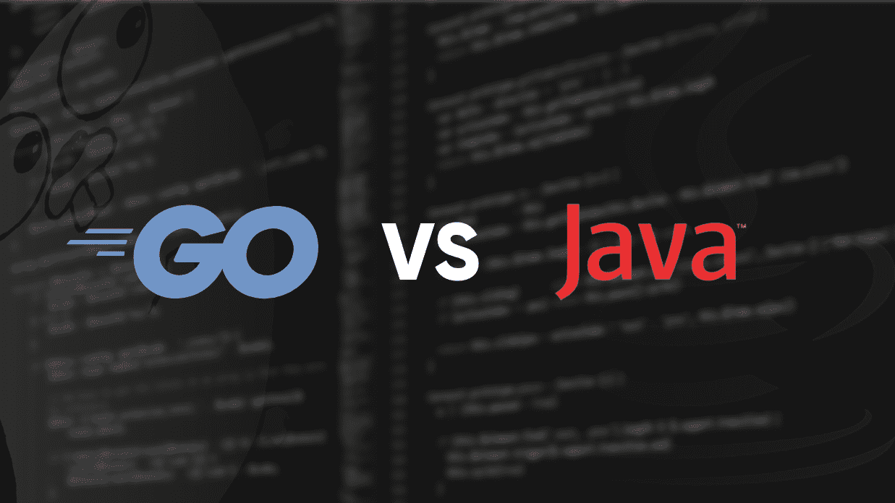

# 围棋 vs Java

> 原文:[https://www.geeksforgeeks.org/go-vs-java/](https://www.geeksforgeeks.org/go-vs-java/)

[`Go`](https://www.geeksforgeeks.org/go-programming-language-introduction/) 是一种过程编程语言。它于 2007 年由罗伯特·格里森、罗布·派克和肯·汤普森在谷歌开发，但于 2009 年作为开源编程语言推出。程序通过使用包来组装，以便有效地管理依赖关系。这种语言也支持环境采用与动态语言相似的模式。

[`Java`](https://www.geeksforgeeks.org/java/) 是目前最流行、应用最广泛的编程语言和平台之一。平台是一种有助于开发和运行用任何编程语言编写的程序的环境。[`Java`](https://www.geeksforgeeks.org/java/) 快速、可靠、安全。从桌面到网络应用，从科学超级计算机到游戏机，从手机到互联网，[`Java`](https://www.geeksforgeeks.org/java/) 被应用到每一个角落。

以下是 [`Go`](https://www.geeksforgeeks.org/go-programming-language-introduction/) 语言和 [`Java`](https://www.geeksforgeeks.org/java/) 语言的一些区别:

| 去 | [`Java`](https://www.geeksforgeeks.org/java/) 语言(一种计算机语言，尤用于创建网站) |
| --- | --- |
| [`Go`](https://www.geeksforgeeks.org/go-programming-language-introduction/) 是一种过程和并发编程语言。 | [`Java`](https://www.geeksforgeeks.org/java/) 是一种面向对象的编程语言。 |
| 它不支持带有`构造函数`和`解构函数`的类。 | 它支持带有`构造函数`和`解构函数`的类。 |
| 它不包含`异常处理`的概念，而是`异常处理` [`Go`](https://www.geeksforgeeks.org/go-programming-language-introduction/) 有错误。 | 它包含`异常处理`的概念。 |
| 它不支持`隐式类型转换`。 | 它支持`隐式类型转换`。 |
| 它不支持`继承`。 | 它支持`继承`。 |
| 它支持 [`Goroutine`](https://www.geeksforgeeks.org/goroutines-concurrency-in-golang/)。 | 它不支持 [`Goroutines`](https://www.geeksforgeeks.org/goroutines-concurrency-in-golang/)。 |
| 它不支持`函数重载`。 | 它支持`函数重载`。 |
| 它不支持`泛型`。 | 它支持`泛型`。 |
| 它支持`频道`。 | 它不支持`通道`。 |
| 它不包含`do-while`和`while`语句。 | 它包含`do-while`和`while`语句。 |
| [`Go`](https://www.geeksforgeeks.org/go-programming-language-introduction/) 语言程序比 [`Java`](https://www.geeksforgeeks.org/java/) 程序更紧凑。 | [`Java`](https://www.geeksforgeeks.org/java/) 程序没有 [`Go`](https://www.geeksforgeeks.org/go-programming-language-introduction/) 程序紧凑。 |
| 围棋中的线很便宜。 | 与 [`Go`](https://www.geeksforgeeks.org/go-programming-language-introduction/) 相比，[`Java`](https://www.geeksforgeeks.org/java/) 中的线程非常昂贵。 |
| [`Go`](https://www.geeksforgeeks.org/go-programming-language-introduction/) 以不同于 [`Java`](https://www.geeksforgeeks.org/java/) 的方式支持`公共`和`私有`功能。虽然 [`Go`](https://www.geeksforgeeks.org/go-programming-language-introduction/) 不支持`私有`和`公共`关键字，但函数名的第一个字母决定了它是`公共`的(大写)还是`私有`的(小写)。 | 在 [`Java`](https://www.geeksforgeeks.org/java/) 中，方法可以是`公共`的，也可以是`私有`的。 |