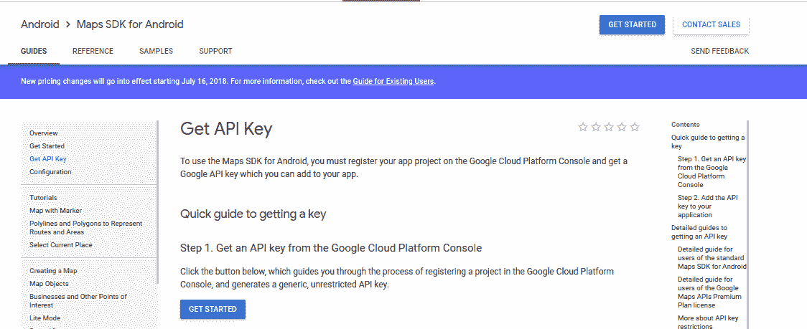
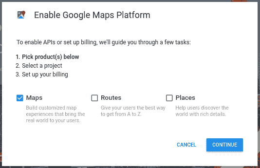
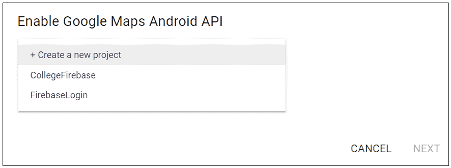
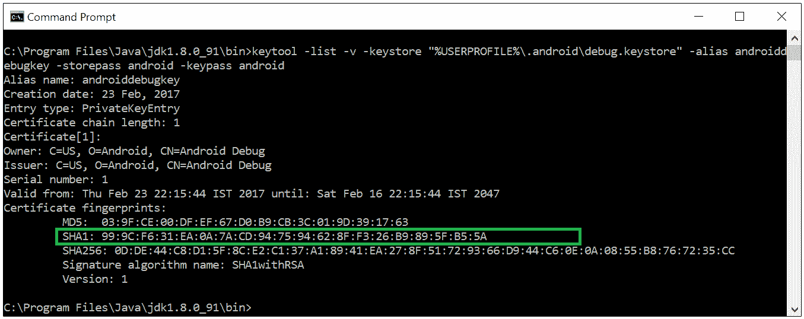
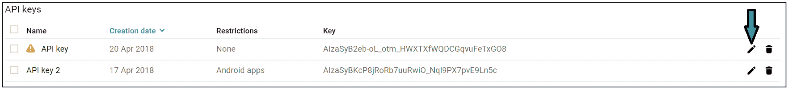
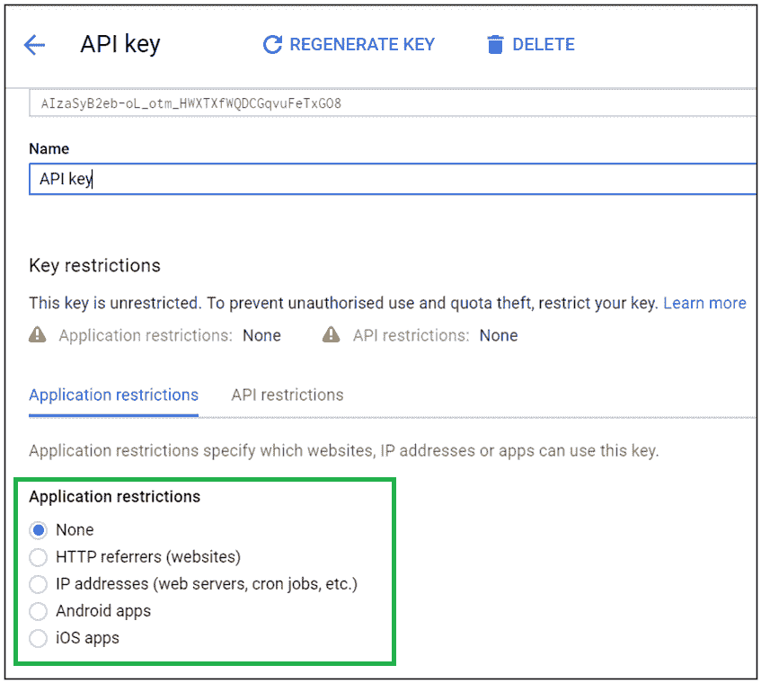
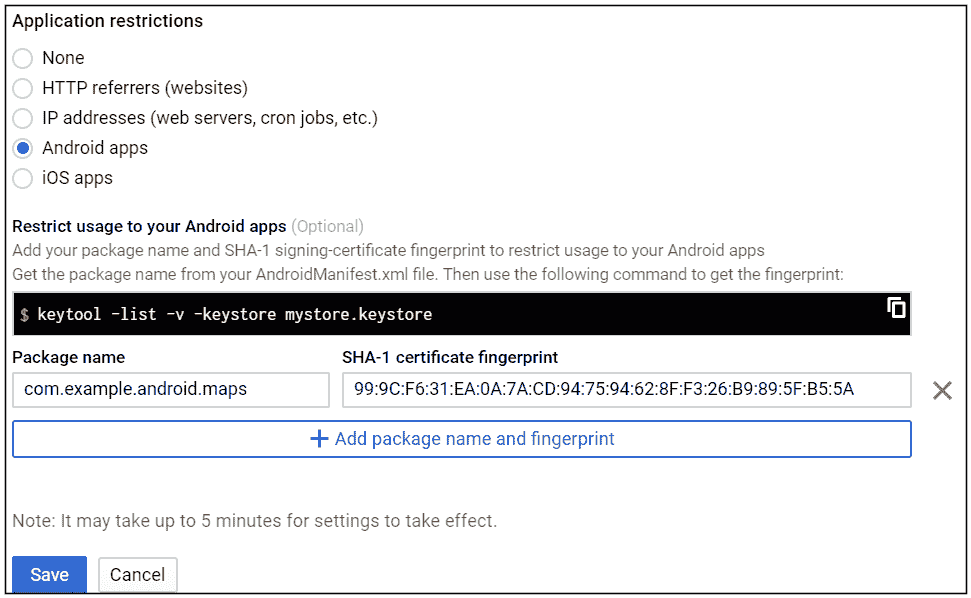

# 安卓版谷歌地图

> 原文：[https://www.geeksforgeeks.org/google-maps-in-android/](https://www.geeksforgeeks.org/google-maps-in-android/)

地图非常有用，它提高了应用程序的生产力。谷歌地图应用编程接口允许安卓开发者将谷歌地图集成到他们的应用中。

以下是将谷歌地图集成到安卓应用程序的分步过程：

## 步骤 1：获取 API 密钥

1.  转到 [https://developers.google.com/maps/documentation/android-api/signup](https://developers.google.com/maps/documentation/android-api/signup) 点击 `GET STARTED` 按钮，如图：
    
2.  现在选择地图复选框，点击继续按钮，如下所示：
    
3.  选择一个要启用谷歌地图应用编程接口的项目，然后单击下一步。将为所选项目生成一个新密钥。
    
4.  跳过计费流程。

## 步骤 2：获取 SHA1 证书指纹

为了集成谷歌地图应用编程接口，你的机器的 SHA1 证书是必需的。因此要找到 SHA1 证书，请按照以下步骤操作：

1.  打开命令提示符，进入你的 Java bin 文件夹。
    ```bash
    cd C:\Program Files\Java\jdk1.8.0_91\bin
    ```
2.  执行以下 CMD 命令以获取证书指纹：
    ```bash
    keytool -list -v -keystore "%USERPROFILE%\.android\debug.keystore" -alias androiddebugkey -storepass android -keypass android
    ```
    

## 步骤 3：配置 API 密钥

1.  前往 [https://console.developers.google.com/apis/credentials](https://console.developers.google.com/apis/credentials)。
2.  在 *API 密钥* 部分，点击您想要选择的 API 密钥右侧的 *铅笔按钮*，用于附加您的应用。
    
3.  在应用限制中，选择安卓应用。
    
4.  点击“添加包名和指纹”。
5.  输入您的应用程序的包名和在上述步骤中找到的指纹，然后单击保存按钮。
    

## 步骤 4：配置项目依赖与清单文件

1.  在 `项目->app->src -> build.gradle -> dependencies` 中插入以下内容：
    ```gradle
    compile 'com.google.android.gms:play-services:11.6.0'
    ```
2.  在 `AndroidManifest.xml` 文件中添加以下声明：
    ```xml
    <meta-data
        android:name="com.google.android.gms.version"
        android:value="@integer/google_play_services_version" />
    <meta-data
        android:name="com.google.android.maps.v2.API_KEY"
        android:value="ENTER API_KEY GENERATED BY YOU IN ABOVE STEPS" />
    ```
3.  在清单文件中添加以下权限：
    ```xml
    <uses-permission android:name="android.permission.WRITE_EXTERNAL_STORAGE" />
    <uses-permission android:name="android.permission.INTERNET" />
    <uses-permission android:name="android.permission.ACCESS_NETWORK_STATE" />
    ```
4.  在 `Manifest.xml` 中指定以下规格：
    ```xml
    <uses-feature
        android:glEsVersion="0x00020000"
        android:required="true"/>
    ```

## 步骤 5：添加地图界面与代码

1.  在 `ActivityMain.xml` 中添加以下片段代码，以便将谷歌地图添加到您的活动中。
    ```xml
    <fragment
        android:id="@+id/map"
        class="com.google.android.gms.maps.SupportMapFragment"
        android:layout_width="match_parent"
        android:layout_height="match_parent"
        />
    ```
2.  在 `MainActivity.java` 中添加以下代码：
    ```java
    public class MapsMarkerActivity extends AppCompatActivity implements OnMapReadyCallback {
        @Override
        protected void onCreate(Bundle savedInstanceState) {
            super.onCreate(savedInstanceState);
            // Retrieve the content view that renders the map.
            setContentView(R.layout.ActivityMain);
            // Get the SupportMapFragment and request notification
            // when the map is ready to be used.
            SupportMapFragment mapFragment = (SupportMapFragment) getSupportFragmentManager().findFragmentById(R.id.map);
            mapFragment.getMapAsync(this);
        }
        @Override
        public void onMapReady(GoogleMap googleMap) {
            // Add a marker in Sydney, Australia,
            // and move the map's camera to the same location.
            LatLng myPos = new LatLng(Location.getLatitude(), Location.getLongitude());
            googleMap.moveCamera(CameraUpdateFactory.newLatLng(myPos));
        }
    }
    ```

## 步骤 6：运行代码

运行您的应用程序。