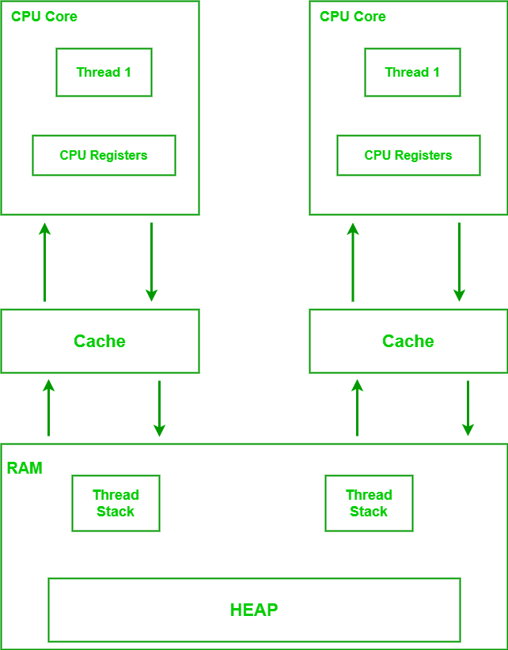

# Java中的Happens-Before关系

> 原文: [https://www.geeksforgeeks.org/happens-before-relationship-in-java/](https://www.geeksforgeeks.org/happens-before-relationship-in-java/)

**先决条件:** [多线程](https://www.geeksforgeeks.org/multithreading-in-java/)、[同步](https://www.geeksforgeeks.org/synchronized-in-java/)、[`volatile`关键字](https://www.geeksforgeeks.org/volatile-keyword-in-java/)

“Happens-before”是一个概念、一种现象，或者仅仅是定义编译器或CPU对指令重新排序的基础的一组规则。在Java语言中，happens-before不是任何关键字或对象，它只是一个规则，在多线程环境中，对周围指令的重新排序不会导致代码产生不正确的输出。

如果这是你第一次遇到这个概念，这个定义可能看起来有点难以接受。要理解它，让我们首先了解对它的需求从何而来。

## Java内存模型

Java内存模型（JMM）定义了在单个或多线程环境中，线程和硬件之间如何存储和交换数据。

需要牢记的几点如下：

*   每个CPU内核都有自己的一组寄存器。
*   每个CPU内核一次可以执行多个线程。
*   每个CPU内核都有自己的一组缓存。
*   一个线程在一个CPU内核上执行，但是它的数据是从内存中存储和访问的，内存中的局部变量位于“线程栈”中，而对象位于“堆”中。



线程内部的局部变量和对象引用存储在线程栈中，而对象本身存储在堆中。运行在CPU上的线程对变量的请求遵循以下路线：*内存 -> 缓存 -> CPU寄存器*。类似地，当变量发生一些处理并且其值被更新时，这些变化通过*CPU寄存器 -> 缓存 -> 随机存取存储器*传播。因此，当使用共享一个变量的多个线程时，当一个线程更新一个共享变量的值时，必须先更新寄存器，然后更新缓存，最后更新内存。当另一个线程需要读取共享变量时，它会读取内存中的值，该值会通过缓存和寄存器传输。如果从基本层面来看，如果读写操作被延迟，使得在执行另一次读写之前，正确的值没有存储在内存中，那么它可能会导致内存一致性错误。

当使用多个线程时，这种存储和检索过程可能会带来一些问题，例如：

*   [**竞态条件**](https://www.geeksforgeeks.org/introduction-of-process-synchronization/)：两个线程共享某个变量，对其进行读写，但不同步，导致值不一致的情况。
*   **更新可见性**：其中一个线程对共享变量的更新可能对另一个线程不可见，因为该值尚未更新到内存中。

这些问题通过使用同步块和`volatile`变量来解决。

## 指令重新排序

在编译或处理过程中，编译器或CPU可能会对指令重新排序以并行运行它们，从而提高吞吐量和性能。例如，我们有3个指令：

```java
FullName = FirstName + LastName        // 语句1
UniqueId = FullName + TokenNo         // 语句2

Age = CurrentYear - BirthYear        // 语句3
```

编译器不能并行运行1和2，因为2需要1的输出，但是1和3可以并行运行，因为它们彼此独立。因此，编译器或CPU可以这样重新排序这些指令：

```java
FullName = FirstName + LastName      // 语句1
Age = CurrentYear - BirthYear       // 语句3

UniqueId = FullName + TokenNo        // 语句2
```

然而，如果在多线程应用程序中执行重新排序，其中线程共享一些变量，那么它可能会让我们失去程序的正确性。

现在回想一下我们在前一节中谈到的两个问题：竞态条件和更新的可见性。Java为我们提供了一些解决方案来处理这些类型的情况。我们将了解它们是什么，最后happens-before将在这一部分介绍。

## `volatile`

对于声明为`volatile`的字段/变量：

```java
private volatile count;
```

*   对该字段的每次写入都将被直接写入/刷新到主存储器（即绕过缓存）。
*   该字段的每次读取都是直接从主存储器中读取的。

这意味着共享变量`count`，无论何时被线程写入或读取，它总是对应于其最近写入的值。这将防止竞态条件，因为现在线程将总是使用共享变量的正确值。此外，对共享变量的更新也将对所有读取它的线程可见，从而防止了更新可见性问题。

`volatile`还决定了一些更重要的观点：

*   在写入`volatile`变量时，该线程可见的所有非`volatile`变量也将被写入/刷新到主内存，即它们的最新值将与`volatile`变量一起存储在内存中。
*   在您读取`volatile`变量时，该线程可见的所有非`volatile`变量也将从主内存中刷新，即它们的最新值将被分配给它们。

这被称为`volatile`变量的**可见性保证**。

所有这些看起来和工作正常，除非CPU决定重新排序您的指令，导致您的应用程序执行不正确。让我们理解我们的意思。考虑程序的这一部分：

### 实现

下图中的代码用简单的语言描述如下：

*   输入学生提交的新作业。
*   然后收集新任务。

我们的目标是每次“只”收集新准备的作业。因此建议如下所示的示例代码：

```java
// 示例类
class ClassRoom {

    // 声明并初始化该类的变量
    private int numOfAssgnSubmitted = 0;
    private int numOfAssgnCollected = 0;
    private Assignment assgn = null;
    // Volatile共享变量
    private volatile boolean newAssignment = false;

    // 该类的方法

    // 方法1
    // 由线程1使用
    public void submitAssignment(Assignment assgn)
    {
        // this关键字引用当前实例本身
        // 1
        this.assgn = assgn;
        // 2
        this.numOfAssgnSubmitted++;
        // 3
        this.newAssignment = true;
    }

    // 方法2
    // 由线程2使用
    public Assignment collectAssignment()
    {
        while (!newAssignment) {
            // 等待直到提交新作业
        }

        Assignment collectedAssgn = this.assgn;

        this.numOfAssgnCollected++;
        this.newAssignment = true;

        return collectedAssgn;
    }
}
```

*   线程`Thread1`使用`submitAssignment()`方法，线程1在`assgn`字段接受学生提交的作业，然后增加提交的作业数，然后将`newAssignment`变量翻转为`true`。
*   线程`Thread2`使用方法`collectAssignment()`，线程2等待直到提交新的赋值，当`newAssignment`的值变为`true`时，它将提交的赋值存储到变量`collectedAssgn`中，增加收集的赋值计数并将`newAssignment`翻转为`false`，因为没有剩余的未决赋值。最后，它返回收集的赋值。

现在，`volatile`变量`newAssignment`充当并发运行的线程1和线程2之间的共享变量。由于所有其他变量对每个线程和`newAssignment`本身都是可见的，读写操作将直接使用主内存完成。

如果我们关注`submitAssignment()`方法，语句1、2和3是相互独立的，因为没有语句使用另一个语句，因此您的CPU可能会想“为什么不重新排序它们？”无论出于什么原因，它都可以提供更好的性能。因此，让我们假设CPU以这种方式重新排序了三个语句：

```java
this.newAssignment = true; // 3
this.assgn = assgn;   // 1
this.numOfAssgnSubmitted++; // 2
```

现在想一想，我们的目标是什么，它是每次收集一个新的作业，但是现在由于语句3甚至在新的`assgn`已经存储在`assgn`中之前就将`newAssignment`更新为`true`，线程2中的`while`循环现在将退出，并且有可能线程2的指令在线程1的剩余指令之前执行，导致提交赋值的旧值对象。即使这些值是直接从主存储器中检索的，如果在这种情况下指令以错误的顺序执行也是没有用的。

在这一点上，即使保证了变量的可见性，指令的重新排序也可能导致不正确的执行。因此，关于`volatile`变量的可见性，Java引入了happens-before保证。

## Happens-Before与`volatile`

Happens-before关系规定了关于重新排序的状态。具体如下：

*   当重新排序在写入`volatile`变量之前发生的对变量的任何写入时，将保留在写入`volatile`变量之前。
*   当对位于某个非`volatile`或`volatile`变量读取之前的`volatile`变量的任何读取进行重新排序时，保证会在任何后续读取之前发生。

就上述例子而言，第一点是相关的。在写入`volatile`变量（语句3）之前发生的对变量（语句1和2）的任何写入都将保留在对`volatile`变量的写入之前。这意味着禁止在1和2之前对语句3进行重新排序。这反过来保证了只有在作业的新值被赋值给`assgn`时，`newAssignment`才被设置为`true`。这就是所谓的**happens-before的可见性保证**。另外，语句1和2可以在它们之间重新排序，只要它们没有在语句3之后被重新排序。

## 同步块

在Java同步块的情况下：

*   当一个线程进入同步块时，该线程将从主内存中刷新该线程当时可见的所有变量的值。
*   当线程退出同步块时，所有这些变量的值将被写入主内存。

### 在同步块中Happens-Before

在同步块的情况下，happens-before用于重新排序的状态：

*   在同步块退出之前发生的对变量的任何写入都保证保持在同步块退出之前。
*   在读取变量之前发生的同步块的入口，保证保持在同步块入口之后的任何变量读取之前。

现在深入到Java中happens-before关系的根源。让我们考虑一个场景来更好地理解它。

如果一个动作“x”在另一个动作“y”之前可见且有序，则由`hb(x, y)`指示的两个动作之间存在happens-before关系。

*   如果`x`和`y`是同一个线程的动作，并且在程序顺序中`x`在`y`之前，那么`hb(x, y)`。
*   从对象的构造函数的末尾到该对象的终结器的开头有一个happens-before边。
*   如果一个动作`x`与后面的动作`y`同步，那么我们也有`hb(x, y)`。
*   如果`hb(x, y)`和`hb(y, z)`，那么`hb(x, z)`。

> **注意：** 重要的是要知道，如果我们有`hb(x, y)`，那么不一定意味着`x`总是出现在`y`之前的实现中，只要执行产生正确的结果，对这样的动作重新排序是合法的。

下面是关于同步状态的更多规则：

*   [监视器上的解锁发生在该监视器上的每次后续锁定之前。](https://en.wikipedia.org/wiki/Monitor_(synchronization))
*   对`volatile`字段的写入发生在该字段的每次后续读取之前。
*   在线程上调用`start()`发生在已启动线程中的任何操作之前。
*   线程中的所有操作都发生在任何其他线程从该线程上的`join()`成功返回之前。
*   任何对象的默认初始化都发生在程序的任何其他操作（默认写入除外）之前。
*   当一条语句调用`Thread.start()`时，与该语句有happens-before关系的每条语句也与新线程执行的每条语句有happens-before关系。导致创建新线程的代码的效果对新线程是可见的。
*   当一个线程终止并导致另一个线程中的`Thread.join()`返回时，被终止的线程执行的所有语句都与成功连接后的所有语句具有happens-before关系。执行连接的线程现在可以看到线程中代码的效果。