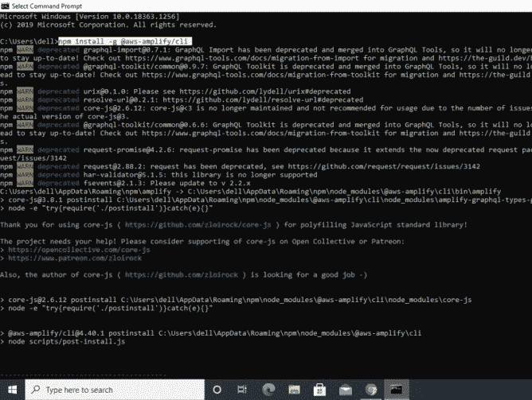
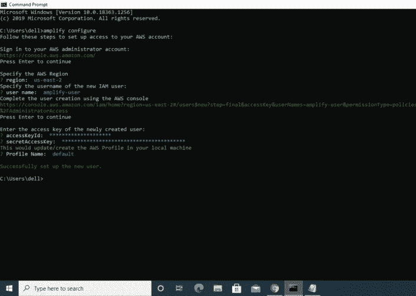
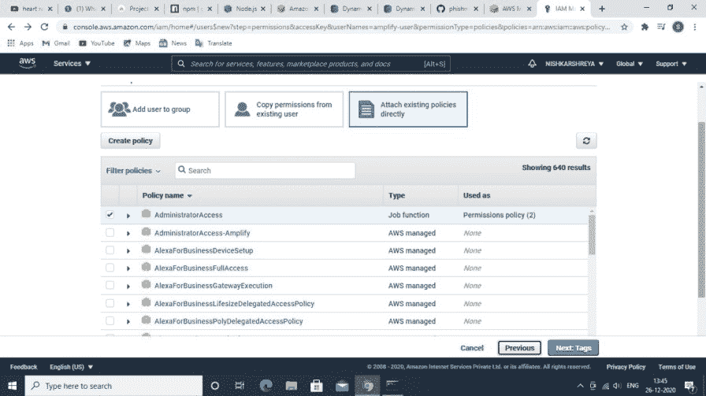
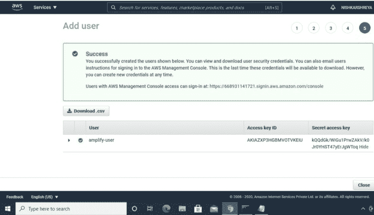
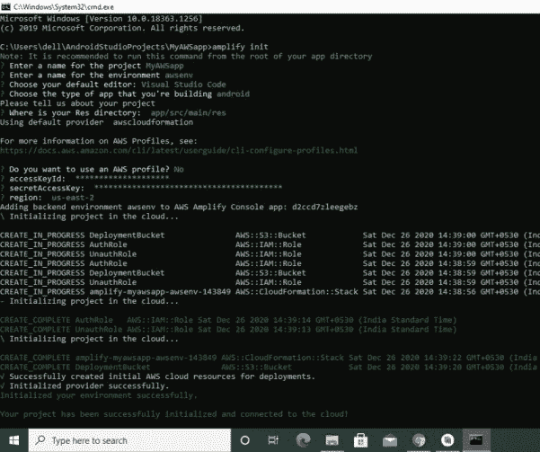
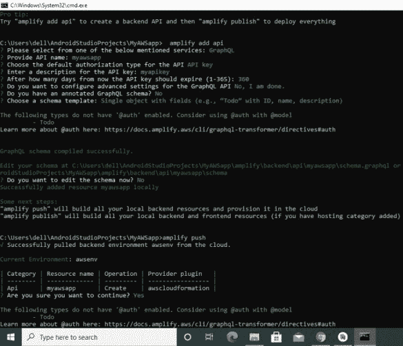
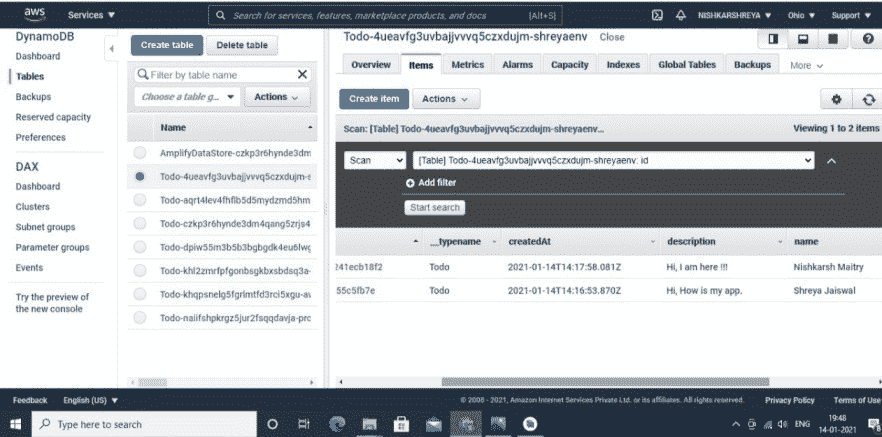

# 如何构建一个以 AWS DynamoDB 为数据库的 TODO 安卓应用？

> 原文：[https://www.geeksforgeeks.org/how-to-build-a-todo-android-application-with-aws-dynamodb-as-database/](https://www.geeksforgeeks.org/how-to-build-a-todo-android-application-with-aws-dynamodb-as-database/)

这是一个在 Android Studio IDE 上做的 TODO 应用，代码是用 `JAVA` 写的，数据存储在 [AWS DynamoDB](https://www.geeksforgeeks.org/dynamodb-introduction/) 中。通过 Amplify 命令行界面在应用程序和 AWS 之间建立连接，成功存储的数据通过在 DynamoDB 中创建一个待办事项表来获得，还创建了一个显示数据结构的模式。数据成功提取并显示在应用程序的主页上。这个项目的目的是展示如何将你的安卓应用程序与 AWS 连接起来，并使用 AWS 资源（DynamoDB）。下面给出了一个视频示例，以了解我们在本文中要做什么。

<video class="wp-video-shortcode" id="video-553037-1" width="640" height="360" preload="metadata" controls=""><source type="video/mp4" src="https://media.geeksforgeeks.org/wp-content/uploads/20210116081234/WhatsApp-Video-2021-01-15-at-11.55.29-PM.mp4?_=1">[https://media.geeksforgeeks.org/wp-content/uploads/20210116081234/WhatsApp-Video-2021-01-15-at-11.55.29-PM.mp4](https://media.geeksforgeeks.org/wp-content/uploads/20210116081234/WhatsApp-Video-2021-01-15-at-11.55.29-PM.mp4)</video>

在跳到实现之前，先看看下面的术语。

*   **Amplify 命令行界面**：Amplify 命令行界面（CLI）是一个组合工具链，用于为您的应用程序创建、集成和管理 AWS 云服务/资源。
*   **DynamoDB**：是一个快速灵活的 NoSQL 数据库。这是一个完全管理的数据库，可以帮助您处理文档和键值数据模型。

**先决条件：** [安装 Node.js](https://nodejs.org/en/download/)（10.x 版），安装 [NPM](https://www.npmjs.com/get-npm)（6.x 版），创建一个 AWS 账号（如果没有的话），安装 Android Studio（4.0 或更高版本），Android SDK API level 29（Android 10），安装 Amplify CLI（在命令提示符下运行）：

```
npm install -g @aws-amplify/cli
```

## 分步实施

### 1. 配置 Amplify 命令行界面

**第一步：在命令提示符**上写下以下内容

```
amplify configure
```



安装 Amplify

**步骤 2：** 如果你已经创建了一个 IAM 用户，那么写 **“你想使用 AWS 配置文件吗？是”** 然后在其下方写下 **接入密钥 Id** 和 **秘密接入密钥**，否则写下 **“您想使用 AWS 配置文件吗？否”** 创建一个 IAM 用户，并使用其 **访问密钥** 和 **秘密访问密钥**。



配置 Amplify



授予权限



用户已创建

**第三步：写下以下内容以初始化新的 Amplify 项目**

```
amplify init
```



初始化 Amplify

**第四步：使用 GraphQL 查询语言创建后端 API，然后使用 `amplify push` 进行部署**

```
amplify add api
amplify push
amplify publish
```



将 API 添加到您的后端

### 2. 借助 Amplify 将 AWS 集成到 Android Studio 中

**第一步：在 `gradle` 脚本**的 `build.gradle (Project: Todo)` 的依赖项中添加以下内容

```java
buildscript {
   repositories {
       google()
       jcenter()
   }

   dependencies {
       classpath 'com.android.tools.build:gradle:4.1.1'

       // Add this line into `dependencies` in `buildscript`
       classpath 'com.amplifyframework:amplify-tools-gradle-plugin:1.0.2'
   }
}

allprojects {
   repositories {
       google()
       jcenter()
   }
}

// Add this line at the end of the file
apply plugin: 'com.amplifyframework.amplifytools'
```

**第二步：在 `gradle` 脚本的 `build.gradle (Module: app)` 的依赖项中添加以下内容。运行 `gradle` 同步**

```java
dependencies {
    implementation 'com.amplifyframework:aws-api:1.6.9'
    implementation 'com.amplifyframework:aws-datastore:1.6.9'
}
```

**第三步：在 Android Studio 中，转到 `Project -> amplify -> app -> backend -> api -> schema.graphql`**

```java
type Todo @model {
  id: ID!
  name: String!
  description: String
}
```

**第四步：在 `onCreate()` 方法的 `MainActivity` 和 `MainActivity2` 中添加以下代码，初始化 Amplify**

```java
 try {
     Amplify.addPlugin(new AWSDataStorePlugin());
     Amplify.configure(getApplicationContext());

     Log.i("Tutorial", "Initialized Amplify");
 } catch (AmplifyException e) {
     Log.e("Tutorial", "Could not initialize Amplify", e);
 }
```

**步骤 5：** **在 `onCreate()` 方法的 `MainActivity2` 中添加以下代码，创建一个 `Todo` 项，该 `Todo` 项有两个属性：名称和描述**

```java
 Todo todo = Todo.builder()
                        .name(name1)
                        .description(name2)
                        .build();
```

**第六步：在 `onCreate()` 方法的 `MainActivity2` 中添加以下代码，使用 `mutate` 保存项目**

```java
 Amplify.API.mutate(
                     ModelMutation.create(todo),
                     response -> Log.i("MyAmplifyApp", "Added Todo with id: " + response.getData().getId()),
                     error -> Log.e("MyAmplifyApp", "Create failed", error)
                );
```

前往您的 **AWS 管理控制台** -> **AppSync** -> 选择您的 **API** -> **数据源** -> 选择 **待办事项表** -> **项**



数据已成功存储

**第七步：** **在 `onCreate()` 方法的 `MainActivity` 中添加以下代码，以获取数据/运行查询来检索存储的数据**

```java
 Amplify.API.query(
                ModelQuery.list(Todo.class),
                response -> {
                    for (Todo todo : response.getData()) {
                        ls.add(todo.getName());
                        Log.i("MyAmplifyApp", todo.getName());
                    }
                },
                error -> Log.e("MyAmplifyApp", "Query failure", error)
        );
```

### 以下是完整代码：

**MainActivity 文件（应用主页）**

## XML

```java
<?xml version="1.0" encoding="utf-8"?>
<RelativeLayout 
    xmlns:android="http://schemas.android.com/apk/res/android"
    xmlns:app="http://schemas.android.com/apk/res-auto"
    xmlns:tools="http://schemas.android.com/tools"
    android:layout_width="match_parent"
    android:layout_height="match_parent"
    tools:context=".MainActivity">

    <ListView
        android:id="@+id/lt"
        android:layout_width="match_parent"
        android:layout_height="wrap_content"
        app:layout_constraintEnd_toEndOf="parent"
        app:layout_constraintStart_toStartOf="parent"
        app:layout_constraintTop_toTopOf="parent">
    </ListView>

    <com.google.android.material.floatingactionbutton.FloatingActionButton
        android:id="@+id/fab"
        android:layout_width="221dp"
        android:layout_height="53dp"
        android:layout_alignParentRight="true"
        android:layout_alignParentBottom="true"
        android:layout_marginEnd="25dp"
        android:layout_marginRight="25dp"
        android:layout_marginBottom="70dp"
        android:clickable="true"
        app:srcCompat="@android:drawable/ic_input_add" />

</RelativeLayout>
```

## Java 语言

```java
package com.example.shreyaawsapp;

import android.content.Intent;
import android.os.AsyncTask;
import android.os.Bundle;
import android.os.Handler;
import android.os.Looper;
import android.util.Log;
import android.view.View;
import android.widget.ArrayAdapter;
import android.widget.ListView;
import android.widget.Toast;
import androidx.appcompat.app.AppCompatActivity;
import com.amplifyframework.AmplifyException;
import com.amplifyframework.api.aws.AWSApiPlugin;
import com.amplifyframework.api.graphql.model.ModelQuery;
import com.amplifyframework.core.Amplify;
import com.amplifyframework.datastore.generated.model.Todo;
import com.google.android.material.floatingactionbutton.FloatingActionButton;
import java.util.ArrayList;
import java.util.List;

public class MainActivity extends AppCompatActivity {

      // declaration
    public FloatingActionButton btn;
    public ListView lv;
    public String[] st;
    int i = 0;
    Handler handler;

      // the array adapter converts an ArrayList of objects
    // into View items filled into the ListView container
    ArrayAdapter<String> arrayAdapter;

      // list to store data
    public static List<String> ls;

    @Override
    protected void onCreate(Bundle savedInstanceState)
    {
        super.onCreate(savedInstanceState);
        setContentView(R.layout.activity_main);

          // provide id to the layout items
        btn = findViewById(R.id.fab);
        st = new String[100];

        lv = findViewById(R.id.lt);

          // set listener to the floating button which takes
        // you to the next activity where you add and sore
        // your data
        btn.setOnClickListener(new View.OnClickListener() {
            @Override public void onClick(View v)
            {
                Intent intent = new Intent(MainActivity.this, MainActivity2.class);
                startActivity(intent);
            }
        });
        ls = new ArrayList<String>();

          // add the code below to initialize Amplpify
        try {
            // Add these lines to add the AWSApiPlugin plugins
            Amplify.addPlugin(new AWSApiPlugin());
            Amplify.configure(getApplicationContext());
            Log.i("MyAmplifyApp", "Initialized Amplify");
        }
        catch (AmplifyException error) {
            Log.e("MyAmplifyApp", "Could not initialize Amplify", error);
        }

          // add the code below to fetch
          // data/run queries to
        // retrieve the stored data
        Amplify.API.query(ModelQuery.list(Todo.class), response -> {
                for (Todo todo : response.getData()) {
                    ls.add(todo.getName());
                    Log.i("MyAmplifyApp", todo.getName());
                }
            },
            error -> Log.e("MyAmplifyApp", "Query failure", error));

        handler = new Handler();
        final Runnable r = new Runnable() {
            public void run()
            {
                handler.postDelayed(this, 2000);
                arrayAdapter = new ArrayAdapter<String>(
                    getApplicationContext(),
                    android.R.layout.simple_list_item_1,
                    ls);
                lv.setAdapter(arrayAdapter);
                arrayAdapter.notifyDataSetChanged();
            }
        };
        handler.postDelayed(r, 1000);
    }
}
```

### 主要活动 2 文件（写笔记页）

## 可扩展标记语言

```xml
<?xml version="1.0" encoding="utf-8"?>
<androidx.constraintlayout.widget.ConstraintLayout
    xmlns:android="http://schemas.android.com/apk/res/android"
    xmlns:app="http://schemas.android.com/apk/res-auto"
    xmlns:tools="http://schemas.android.com/tools"
    android:layout_width="match_parent"
    android:layout_height="match_parent"
    tools:context=".MainActivity2">

    <EditText
        android:id="@+id/edname"
        android:layout_width="347dp"
        android:layout_height="54dp"
        android:layout_marginTop="110dp"
        android:ems="10"
        android:hint="Title"
        android:inputType="textPersonName"
        app:layout_constraintEnd_toEndOf="parent"
        app:layout_constraintStart_toStartOf="parent"
        app:layout_constraintTop_toTopOf="parent" />

    <EditText
        android:id="@+id/eddes"
        android:layout_width="347dp"
        android:layout_height="54dp"
        android:layout_marginTop="216dp"
        android:ems="10"
        android:inputType="textPersonName"
        android:hint="Description"
        app:layout_constraintEnd_toEndOf="parent"
        app:layout_constraintStart_toStartOf="parent"
        app:layout_constraintTop_toTopOf="parent" />

    <Button
        android:id="@+id/button2"
        android:layout_width="134dp"
        android:layout_height="53dp"
        android:layout_marginStart="138dp"
        android:layout_marginTop="69dp"
        android:layout_marginEnd="138dp"
        android:text="Store in data"
        app:layout_constraintEnd_toEndOf="parent"
        app:layout_constraintStart_toStartOf="parent"
        app:layout_constraintTop_toBottomOf="@+id/eddes" />

</androidx.constraintlayout.widget.ConstraintLayout>
```

# Java 语言(一种计算机语言，尤用于创建网站)

```java
package com.example.shreyaawsapp;

import android.content.Intent;
import android.net.wifi.p2p.WifiP2pManager;
import android.os.Bundle;
import android.util.Log;
import android.view.View;
import android.widget.ArrayAdapter;
import android.widget.Button;
import android.widget.EditText;
import android.widget.ListView;
import android.widget.Toast;
import androidx.appcompat.app.AppCompatActivity;
import com.amplifyframework.AmplifyException;
import com.amplifyframework.api.aws.AWSApiPlugin;
import com.amplifyframework.api.graphql.model.ModelMutation;
import com.amplifyframework.api.graphql.model.ModelQuery;
import com.amplifyframework.core.Amplify;
import com.amplifyframework.datastore.generated.model.Todo;
import java.util.ArrayList;
import java.util.List;

public class MainActivity2 extends AppCompatActivity {

    // declaration
    public EditText name, desc;
    public Button btn;

    @Override
    protected void onCreate(Bundle savedInstanceState)
    {
        // give id to the items
        super.onCreate(savedInstanceState);
        setContentView(R.layout.activity_main2);
        name = findViewById(R.id.edname);
        desc = findViewById(R.id.eddes);
        btn = findViewById(R.id.button2);

        // add the code below to initialize Amplify
        try {
            // Add these lines to add the AWSApiPlugin plugins
            Amplify.addPlugin(new AWSApiPlugin());
            Amplify.configure(getApplicationContext());
            Log.i("MyAmplifyApp", "Initialized Amplify");
        }
        catch (AmplifyException error) {
            Log.e("MyAmplifyApp", "Could not initialize Amplify", error);
        }
        // set listener on the store data button to store
        // data in dynamoDB
        btn.setOnClickListener(new View.OnClickListener() {
            @Override public void onClick(View v)
            {
                String name1 = name.getText().toString();
                String name2 = desc.getText().toString();
                // add the code below to create a toto item
                // with two properties a name and a
                // description
                Todo todo = Todo.builder()
                                .name(name1)
                                .description(name2)
                                .build();
                // add the code below  to save item using mutate
                Amplify.API.mutate(ModelMutation.create(todo), response -> Log.i(
                        "MyAmplifyApp", "Added Todo with id: " + response.getData().getId()),
                    error
                    -> Log.e("MyAmplifyApp", "Create failed", error));
            }
        });
    }
    // move to the next activity
    @Override public void onBackPressed()
    {
        super.onBackPressed();
        startActivity(new Intent(MainActivity2.this, MainActivity.class));
    }
}
```

## 输出:

<video class="wp-video-shortcode" id="video-553037-2" width="640" height="360" preload="metadata" controls=""><source type="video/mp4" src="https://media.geeksforgeeks.org/wp-content/uploads/20210116081234/WhatsApp-Video-2021-01-15-at-11.55.29-PM.mp4?_=2">[https://media.geeksforgeeks.org/wp-content/uploads/20210116081234/WhatsApp-Video-2021-01-15-at-11.55.29-PM.mp4](https://media.geeksforgeeks.org/wp-content/uploads/20210116081234/WhatsApp-Video-2021-01-15-at-11.55.29-PM.mp4)</video>

**源代码:**[**https://github . com/shreya 593/shreyawsapp . git**](https://github.com/shreya593/Shreyaawsapp.git)