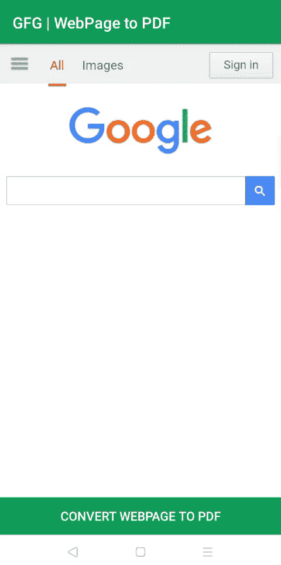

# 如何在安卓系统中将 WebView 转换为 PDF？

> 原文：[https://www.geeksforgeeks.org/how-to-convert-webview-to-pdf-in-android/](https://www.geeksforgeeks.org/how-to-convert-webview-to-pdf-in-android/)

有时需要以 PDF 文件的形式保存互联网上的一些文章。要做到这一点有很多方法，你可以使用任何浏览器扩展或任何软件或任何网站来做到这一点。但是为了在安卓应用中实现这个功能，不能依赖其他软件或网站来实现。因此，要在 android 应用程序中实现这一惊人的功能，请遵循本教程。下面给出了一个 GIF 示例，来了解一下在本文中要做什么。



### 将网页视图转换为 PDF 的步骤

**步骤 1:创建新项目**

要在安卓工作室创建新项目，请参考[如何在安卓工作室创建/启动新项目。](https://www.geeksforgeeks.org/android-how-to-create-start-a-new-project-in-android-studio/)注意，选择 [Java](https://www.geeksforgeeks.org/java/) 作为编程语言，虽然我们要用 Java 语言实现这个项目。

**第二步:去编码区之前先做一些前置任务**

*   转到 `app -> 清单 -> AndroidManifest.xml` 部分，允许“[互联网许可](https://www.geeksforgeeks.org/android-how-to-request-permissions-in-android-application/)”。

**第三步:设计 UI**

在 `activity_main.xml` 文件中，有一个 [**WebView**](https://www.geeksforgeeks.org/how-to-use-webview-in-android/) 用于加载网站，还有一个[按钮](https://www.geeksforgeeks.org/button-in-kotlin/)用于将加载的网页保存为 PDF 文件。下面是 `activity_main.xml` 文件的代码。

```xml
<?xml version="1.0" encoding="utf-8"?>
<RelativeLayout
    xmlns:android="http://schemas.android.com/apk/res/android"
    xmlns:tools="http://schemas.android.com/tools"
    android:layout_width="match_parent"
    android:layout_height="match_parent"
    tools:context=".MainActivity">

<!-- WebView to load webPage  -->
  <WebView
      android:id="@+id/webViewMain"
      android:layout_width="match_parent"
      android:layout_height="match_parent"/>

<!-- Button To save the Pdf file when clicked -->
  <Button
      android:layout_alignParentBottom="true"
      android:textColor="#ffffff"
      android:background="@color/colorPrimary"
      android:text="Convert WebPage To PDF"
      android:id="@+id/savePdfBtn"
      android:layout_width="match_parent"
      android:layout_height="wrap_content"/>

</RelativeLayout>
```

**第四步:使用 MainActivity.java 文件**

*   打开类内的 `MainActivity.java` 文件，首先创建 `WebView` 类的对象。

```java
//创建 WebView 的对象
WebView webView;
```

*   现在在 `onCreate()` 方法中，用在 `activity_main.xml` 文件中给出的各自的标识初始化网络视图和按钮。

```java
//初始化网络视图
WebView webView = (WebView) findViewById(R.id.webViewMain);
//初始化按钮
Button savePdfBtn = (Button) findViewById(R.id.savePdfBtn);
```

*   现在设置 `WebView` 的 `WebViewClient`，在 `onPageFinished()` 内部，用 `WebView` 初始化 `PrintWeb` 对象。

```java
//设置网络视图客户端
webView.setWebViewClient(new WebViewClient()
{
    @Override
    public void onPageFinished(WebView view, String url){
        super.onPageFinished(view, url);
        //初始化打印网页对象
        PrintWeb = webView;
    }
});
```

*   现在加载网址

```java
//正在加载网址
webView.loadUrl("https://www.google.com");
```

*   接下来，调用稍后创建的 `createWebPrintJob()` 方法，在 `onClick()` 中显示各自的[祝词](https://www.geeksforgeeks.org/android-what-is-toast-and-how-to-use-it-with-examples/)。

```java
//设置点击保存 Pdf 按钮的监听器
savePdfBtn.setOnClickListener(new View.OnClickListener() {
    @Override
    public void onClick(View view) {
        if(printWeb != null)
        {
            if (Build.VERSION.SDK_INT >= Build.VERSION_CODES.LOLLIPOP)
            {
                //调用 createWebPrintJob()
                printWebPage(printWeb);
            } else
            {
                //向用户显示祝酒词
                Toast.makeText(MainActivity.this, "不适用于安卓棒棒糖以下的设备",
                Toast.LENGTH_SHORT).show();
            }
        }
        else
        {
            //向用户显示祝酒词
            Toast.makeText(MainActivity.this, "网页未完全加载", Toast.LENGTH_SHORT).show();
        }
    }
});
```

*   创建一个 `PrintJob` 的对象，并创建一个 `布尔打印表达式`，用于检查打印网页的状态。

```java
//打印作业的对象
PrintJob printJob;
//检查打印状态的布尔值
boolean printBtnPressed = false;
```

*   现在在 `MainActivity.java` 类中创建一个 `printWebPage()` 方法，下面是 `printWebPage()` 方法的完整代码。

```java
@RequiresApi(api = Build.VERSION_CODES.LOLLIPOP)
private void printWebPage(WebView webView) {
    //将 printBtnPressed 设置为 true
    printBtnPressed = true;
    //创建打印管理器实例
    PrintManager printManager = (PrintManager) this
            .getSystemService(Context.PRINT_SERVICE);
    //设置作业名称
    String jobName = getString(R.string.app_name) + " 网页" + webView.getUrl();
    //创建打印文档适配器实例
    PrintDocumentAdapter printAdapter = webView.createPrintDocumentAdapter(jobName);
    //使用名称和适配器实例创建打印作业
    assert printManager != null;
    printJob = printManager.print(jobName, printAdapter,
            new PrintAttributes.Builder().build());
}
```

*   接下来，在 `onResume()` 方法中显示保存 PDF 的状态，并检查打印状态。下面是 `onResume()` 方法的完整代码。

```java
@Override
protected void onResume() {
    super.onResume();
    if (printJob != null && printBtnPressed) {
        if (printJob.isCompleted()) {
            //显示祝酒词
            Toast.makeText(this, "完成", Toast.LENGTH_SHORT).show();
        } else if (printJob.isStarted()) {
            //显示祝酒词
            Toast.makeText(this, "isStarted", Toast.LENGTH_SHORT).show();
        } else if (printJob.isBlocked()) {
            //显示祝酒词
            Toast.makeText(this, "被锁定", Toast.LENGTH_SHORT).show();
        } else if (printJob.isCancelled()) {
            //显示祝酒词
            Toast.makeText(this, "isCancelled", Toast.LENGTH_SHORT).show();
        } else if (printJob.isFailed()) {
            //显示祝酒词
            Toast.makeText(this, "失败了", Toast.LENGTH_SHORT).show();
        } else if (printJob.isQueued()) {
            //显示祝酒词
            Toast.makeText(this, "isQueued", Toast.LENGTH_SHORT).show();
        }
        //将 printBtnPressed 设置为 false
        printBtnPressed = false;
    }
}
```

*   以下是 `MainActivity.java` 文件的完整代码。

## Java 语言（一种计算机语言，尤用于创建网站）

```java
import android.content.Context;
import android.os.Build;
import android.os.Bundle;
import android.print.PrintAttributes;
import android.print.PrintDocumentAdapter;
import android.print.PrintJob;
import android.print.PrintManager;
import android.view.View;
import android.webkit.WebView;
import android.webkit.WebViewClient;
import android.widget.Button;
import android.widget.Toast;
import androidx.annotation.RequiresApi;
import androidx.appcompat.app.AppCompatActivity;

public class MainActivity extends AppCompatActivity {

    // creating object of WebView
    WebView printWeb;

    @Override
    protected void onCreate(Bundle savedInstanceState) {
        super.onCreate(savedInstanceState);
        setContentView(R.layout.activity_main);

        // Initializing the WebView
        final WebView webView = (WebView) findViewById(R.id.webViewMain);

        // Initializing the Button
        Button savePdfBtn = (Button) findViewById(R.id.savePdfBtn);

        // Setting we View Client
        webView.setWebViewClient(new WebViewClient() {
            @Override
            public void onPageFinished(WebView view, String url) {
                super.onPageFinished(view, url);
                // initializing the printWeb Object
                printWeb = webView;
            }
        });

        // loading the URL
        webView.loadUrl("https://www.google.com");

        // setting clickListener for Save Pdf Button
        savePdfBtn.setOnClickListener(new View.OnClickListener() {
            @Override
            public void onClick(View view) {
                if (printWeb != null) {
                    if (Build.VERSION.SDK_INT >= Build.VERSION_CODES.LOLLIPOP) {
                        // Calling createWebPrintJob()
                        PrintTheWebPage(printWeb);
                    } else {
                        // Showing Toast message to user
                        Toast.makeText(MainActivity.this, "Not available for device below Android LOLLIPOP", Toast.LENGTH_SHORT).show();
                    }
                } else {
                    // Showing Toast message to user
                    Toast.makeText(MainActivity.this, "WebPage not fully loaded", Toast.LENGTH_SHORT).show();
                }
            }
        });

    }

    // object of print job
    PrintJob printJob;

    // a boolean to check the status of printing
    boolean printBtnPressed = false;

    @RequiresApi(api = Build.VERSION_CODES.LOLLIPOP)
    private void PrintTheWebPage(WebView webView) {

        // set printBtnPressed true
        printBtnPressed = true;

        // Creating  PrintManager instance
        PrintManager printManager = (PrintManager) this
                .getSystemService(Context.PRINT_SERVICE);

        // setting the name of job
        String jobName = getString(R.string.app_name) + " webpage" + webView.getUrl();

        // Creating  PrintDocumentAdapter instance
        PrintDocumentAdapter printAdapter = webView.createPrintDocumentAdapter(jobName);

        // Create a print job with name and adapter instance
        assert printManager != null;
        printJob = printManager.print(jobName, printAdapter,
                new PrintAttributes.Builder().build());
    }

    @Override
    protected void onResume() {
        super.onResume();
        if (printJob != null && printBtnPressed) {
            if (printJob.isCompleted()) {
                // Showing Toast Message
                Toast.makeText(this, "Completed", Toast.LENGTH_SHORT).show();
            } else if (printJob.isStarted()) {
                // Showing Toast Message
                Toast.makeText(this, "isStarted", Toast.LENGTH_SHORT).show();
            } else if (printJob.isBlocked()) {
                // Showing Toast Message
                Toast.makeText(this, "isBlocked", Toast.LENGTH_SHORT).show();
            } else if (printJob.isCancelled()) {
                // Showing Toast Message
                Toast.makeText(this, "isCancelled", Toast.LENGTH_SHORT).show();
            } else if (printJob.isFailed()) {
                // Showing Toast Message
                Toast.makeText(this, "isFailed", Toast.LENGTH_SHORT).show();
            } else if (printJob.isQueued()) {
                // Showing Toast Message
                Toast.makeText(this, "isQueued", Toast.LENGTH_SHORT).show();
            }
            // set printBtnPressed false
            printBtnPressed = false;
        }
    }
}
```

### `输出:在仿真器上运行`

[](https://media.geeksforgeeks.org/wp-content/uploads/20200912005525/converting-webpage-to-pdf-file-in-android-studio-.mp4)

**资源：**

*   从 [github](https://github.com/olyklohan/converting-webpage-to-pdf-in-android-studio-app) 下载完整项目
*   下载 [apk 文件](https://github.com/olyklohan/converting-webpage-to-pdf-in-android-studio-app/blob/master/web%20page%20to%20pdf%20file%20android%20studio%20.apk)