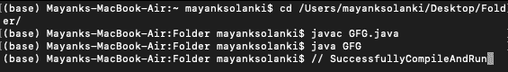
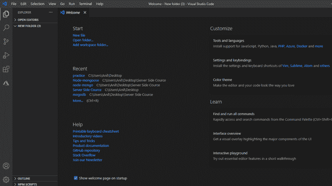
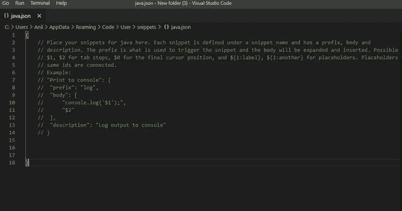
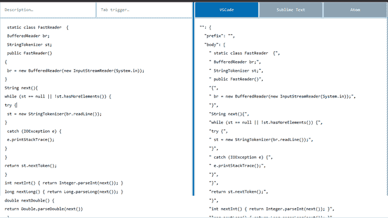
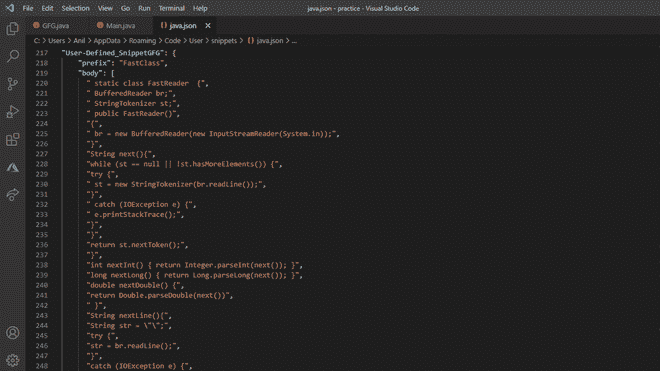
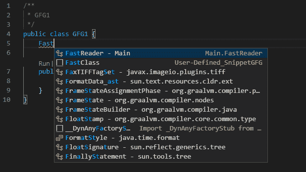
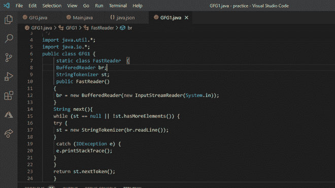

# 什么是代码片段，如何在VSCode中为竞争编程创建Java代码片段？

> 原文：[https://www.geeksforgeeks.org/how-to-create-java-snippets-in-vscode-for-competitive-programming/](https://www.geeksforgeeks.org/how-to-create-java-snippets-in-vscode-for-competitive-programming/)

代码片段是指一小部分可重复使用的源代码、机器代码或文本。借助代码片段，我们可以在程序中一次又一次地使用长代码。代码片段是快速编写程序的好工具。打字速度对于竞争性编程非常重要。一般来说，Java中有两个用于执行输入/输出操作的类：

*   `Scanner`类
*   `BufferedReader`类

[`Scanner`](https://www.geeksforgeeks.org/scanner-class-in-java/)类是`java.util`包中的一个类，用于获取`int`、`double`等原语类型以及字符串的输入。这是在Java程序中读取输入的最简单的方法，尽管如果您想要一种用于时间受限场景（比如在竞争性编程中）的输入法，它的效率不是很高。`Scanner`类使用了内置的解析操作，这使得它对于竞争性编程来说速度很慢。

[`BufferedReader`](https://www.geeksforgeeks.org/java-io-bufferedreader-class-java/)类：从字符输入流中读取文本，缓冲字符以提供字符、数组和行的高效读取。这个类在执行输入/输出操作方面比`Scanner`类快得多，但需要大量输入。

> `BufferedReader`比`Scanner`类效率更高、速度更快，但是与`Scanner`类操作相比，这个类的初始化和执行操作的语法要复杂得多。

**代码片段的组成部分**：每个代码片段包含四个组成部分：

1.  **名称**：在不同代码片段中唯一的名称。
2.  **前缀**：在程序中生成当前代码片段的关键字。
3.  **主体**：我们绑定到代码片段的实际代码包含在主体中。
4.  **描述**：关于代码片段的信息包含在描述中。

**代码片段的格式**：特定代码片段在使用[JSON](https://www.geeksforgeeks.org/json-data-types/)格式的`java.json`文件中实现。

## JSON格式

```json
"Name_of_the_snippet":
{
  "prefix": "prefix_of_the_snippet",
  "body": [
          // Actual code of the snippet
          ],
  "description": "description_about_the_snippet"
}
```

**程序**：涉及的步骤如下：

1.  在新的Java文件中创建和实现用户定义的类。
2.  现在，创建这个类的一个代码片段。

**实现**：对于用户定义的类，通过在我们的类中（使用[`BufferedReader`](https://www.geeksforgeeks.org/java-io-bufferedreader-class-java/)和[`StringTokenizer`](https://www.geeksforgeeks.org/stringtokenizer-class-java-example-set-1-constructors/)）将`BufferedReader`的所有输入/输出方法实现为用户定义的方法：该方法利用了`BufferedReader`和[`StringTokenizer`](https://www.geeksforgeeks.org/stringtokenizer-class-java-example-set-1-constructors/)的时间优势以及用户定义方法的优势，减少了输入，因此输入速度更快。这种方法以1.23秒的时间被接受，非常推荐使用这种方法，因为它容易记住，并且足够快，可以满足竞争性编码中大多数问题的需要。

## Java代码

```java
// Java Program to create Java snippets
// in VSCode for Competitive Programming

/* Code for user defined class */

// Importing generic java libraries
import java.util.*;
import java.util.Map.Entry;
import java.io.*;
import java.util.regex.Pattern;

public class GFG {

    static class FastReader {
        BufferedReader br;
        StringTokenizer st;

        public FastReader() {
            br = new BufferedReader(
                new InputStreamReader(System.in));
        }

        String next() {
            while (st == null || !st.hasMoreElements()) {
                try {
                    st = new StringTokenizer(br.readLine());
                } catch (IOException e) {
                    e.printStackTrace();
                }
            }
            return st.nextToken();
        }

        int nextInt() { return Integer.parseInt(next()); }

        long nextLong() { return Long.parseLong(next()); }

        double nextDouble() {
            return Double.parseDouble(next());
        }

        String nextLine() {
            String str = "";
            try {
                str = br.readLine();
            } catch (IOException e) {
                e.printStackTrace();
            }
            return str;
        }
    }

    public static void main(String[] args) {
        FastReader scan = new FastReader();
    }
}
```

**输出**：



## 步骤2：在VSCode中创建用户定义类的代码片段

VSCode是一个文本编辑器，为开发操作和版本控制系统提供支持。它为用户提供了构建简单代码的工具。可以从[visualstudio.com](https://code.visualstudio.com/)下载安装。现在跳到程序的第二步。

*   在要创建代码片段的文件夹中打开VSCode。
*   在设置中搜索“用户代码片段”，然后选择`java.json`。
*   搜索`SnippetGenerator`。
*   将代码片段粘贴到`java.json`文件中并进行检查。

为了更好地理解，下面用可视化表示详细显示了步骤：

### 2.1：在我们想要创建代码片段的文件夹中打开VSCode。



### 2.2：点击“设置”按钮，在“用户代码片段”后，在文本框中搜索`java.json`。文件如下所示。



### 2.3：现在搜索[代码片段生成器](https://snippet-generator.app/?description=&tabtrigger=&snippet=import+java.util.*%3B%0Aclass+Main%7B%0Apublic+static+void+main%28String+args%5B%5D%29%7B%0ASystem.out.println%28%22This+is+the+snippet+for+the+java%22%0A%7D%0A%7D&mode=vscode)。这个工具将Java代码转换成代码片段。从这个工具中复制JSON格式的代码片段。



### 2.4：将代码片段粘贴到程序目录中的`java.json`文件中。

## JSON代码

```json
{
  "User-Defined_SnippetGFG": {   // Name of the snippet
    "prefix": "FastClass",       // keyword to generate
    "body": [                    // code implemented in the snippet
      " static class FastReader  {",
      " BufferedReader br;",
      " StringTokenizer st;",
      " public FastReader()",
      "{",
      " br = new BufferedReader(new InputStreamReader(System.in));",
      "}",
      "String next(){",
      "while (st == null || !st.hasMoreElements()) {",
      "try {",
      " st = new StringTokenizer(br.readLine());",
      "}",
      " catch (IOException e) {",
      " e.printStackTrace();",
      "}",
      "}",
      "return st.nextToken();",
      "}",
      "int nextInt() { return Integer.parseInt(next()); }",
      "long nextLong() { return Long.parseLong(next()); }",
      "double nextDouble() {",
      "return Double.parseDouble(next())",
      " }",
      "String nextLine(){",
      "String str = \"\";",
      "try {",
      "str = br.readLine();",
      "}",
      "catch (IOException e) {",
      "e.printStackTrace();",
      "}",
      "return str;",
      "}",
      "}",
      "",
      " "
    ],
    "description": ""
  }
}
```

**输出**：`java.json`文件



### 2.5：检查代码片段：`FastClass`是启动代码片段的关键字。



### 2.6：`GFG1.java`文件

