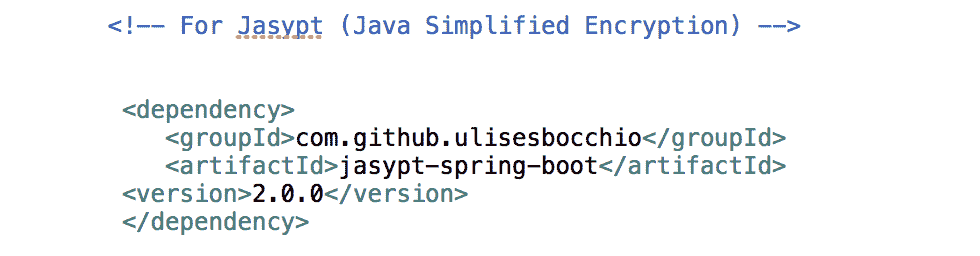
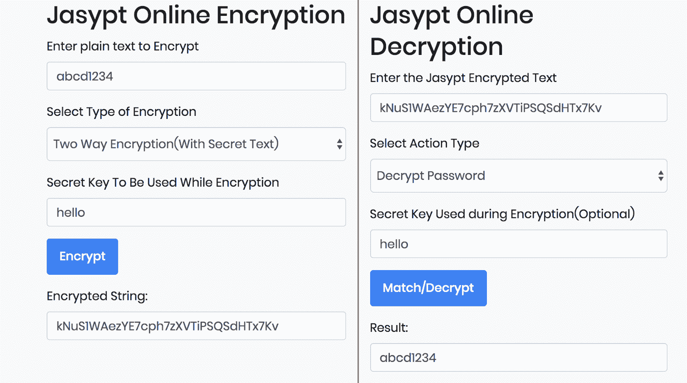
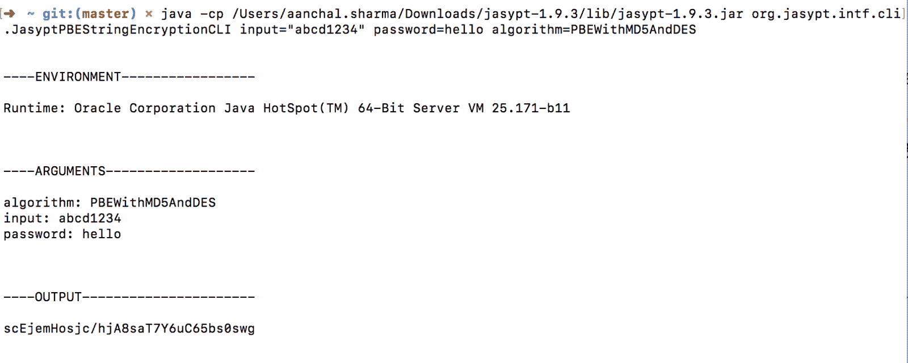
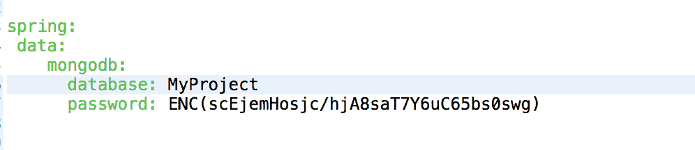

# 如何使用 Jasypt

在 Spring Boot 项目中加密密码

> 原文: [https://www.geeksforgeeks.org/how-to-encrypt-passwords-in-a-spring-boot-project-using-jasypt/](https://www.geeksforgeeks.org/how-to-encrypt-passwords-in-a-spring-boot-project-using-jasypt/)

[Spring Boot](https://www.geeksforgeeks.org/introduction-to-spring-boot/) 是一个基于 Java 的框架，用来开发[微服务](https://www.geeksforgeeks.org/microservices-introduction/)，以构建企业级应用。

您经常会遇到这样的开发项目，您必须连接到数据库，如 [MongoDB](https://www.geeksforgeeks.org/mongodb-an-introduction/) 等，并将数据库连接的真实密码存储在 Spring Boot 项目的配置文件(`application.yml` 或 `application.properties`)中。甚至授权进行其他应用编程接口调用所需的密码或令牌也以相同的方式存储。

实际上，您可以避免在配置文件中添加实际密码，而使用 Java 库 `jasypt-spring-boot`。

## 什么是 Jasypt？

[Jasypt](http://www.jasypt.org/) (Java 简化加密)，为 Spring Boot 应用中的属性来源提供加密支持。它将帮助您以非常少的工作量将基本的加密功能添加到您的项目中，并且不需要借助项目中的一些附加功能来编写任何代码。Spring Boot 是一个非常强大的框架，它将帮助您在不实现任何加密方法的情况下增加加密能力。Jasypt 是高度可配置的。

## 使用加密添加加密的步骤

### 1. 添加 Jasypt 的 Maven 依赖

在 `pom.xml` 文件中，添加 Maven 依赖，可以在 [Maven 仓库](https://mvnrepository.com/artifact/com.github.ulisesbocchio/jasypt-spring-boot-starter/2.0.0)轻松找到。

[](https://media.geeksforgeeks.org/wp-content/uploads/20200209230601/1406-3.png)

### 2. 在 Spring Boot 应用程序主配置类中添加注解

需要添加 `@EnableEncryptableProperties` 注解，以使应用程序理解整个 Spring 环境中的可加密属性。

[](https://media.geeksforgeeks.org/wp-content/uploads/20200209231418/223-1.png)

### 3. 决定一个密钥用于加密和解密

该密钥用于加密密码，之后可用于解密加密值以获得实际密码。您可以选择任何值作为密钥。

### 4. 生成加密密钥

加密密钥可以通过以下两种方法之一生成：

#### 4.1 使用 Jasypt 在线工具

这个[链接](https://www.devglan.com/online-tools/jasypt-online-encryption-decryption)可以通过传递选择的密钥来生成加密密钥。

[](https://media.geeksforgeeks.org/wp-content/uploads/20200209232148/3164-1.png)

*   **要加密的密码**: `abcd1234`
*   **选择加密类型**: 双向加密(默认使用 `PBEWithMD5AndDES` 和 `DES`)
*   **秘钥**: `你好` (可以是任意值)
*   **加密字符串**: `拥抱 1 个七个七个七个七个七个七个七个七个七个七个七个七个七个七个七个`

您实际上可以使用该工具通过解密来加密和检查加密的密钥。

#### 4.2 使用 Jasypt Jar

从 Maven 仓库下载 `jasypt` jar 文件，并通过以下命令运行：

```bash
java -cp //jasypt-1.9.3/lib/jasypt-1.9.3.jar org.jasypt.intf.cli.JasyptPBEStringEncryptionCLI input="XYZ123" password=secretkey algorithm=PBEWithMD5AndDES
```

[](https://media.geeksforgeeks.org/wp-content/uploads/20200209232355/4107.png)

以下是为运行 jar 而传递的命令行参数的重要性:

*   **input**: `abcd1234` (需要加密的实际密码)
*   **password**: `您好` (您选择的密匙)
*   **algorithm**: `PBEWithMD5AndDES` (使用默认算法)
*   **output**: `scejmhosjc/hja8 sat 7y 6uc 65 bs0 swg` (输入的加密值)

**注**: 虽然 4.1 和 4.2 中的加密值即加密字符串 & OUTPUT 分别不同，但由于密钥相同，解密后会得到相同的值(`abcd1234`)。

### 5. 在配置文件中添加加密后的密钥

现在，不是添加实际密码，即上面示例中的 “abcd1234”，而是需要添加由上述任一方法生成的加密值。但是 `jasypt` 依赖如何理解配置文件的特定属性需要被解密呢？因此，为了让 Jasypt 知道您的加密值，它使用了一种约定，您需要以以下格式添加：

> `加密属性名=ENC(加密值)`

例如：

> `数据库密码=ENC(scem JC/hja 8 sat 7 和 6uC65bs0swg)`

[](https://media.geeksforgeeks.org/wp-content/uploads/20200209232814/675.png)

在上图中，完成了数据库密码的加密。您可以在任何需要隐藏实际密码的情况下使用它。

### 6. 选择的密钥需要在运行时传递才能解密

让加密器知道您用来形成加密值的密钥。因此，以下是传递密钥的不同方法：

#### 6.1 将其作为属性传递到配置文件中

正常运行项目，解密就会发生。

[](https://media.geeksforgeeks.org/wp-content/uploads/20200209232944/746.png)

#### 6.2 使用以下命令运行项目

```bash
$ mvn -Djasypt.encryptor.password=secretkey spring-boot:run
```

#### 6.3 导出 Jasypt 加密器密码

```bash
jasypt_encryptor_password=hello
```