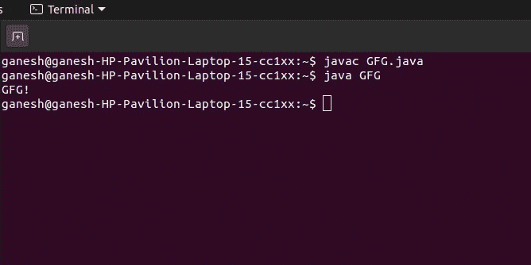

# 如何用 Java 执行一个 .class 文件？

> 原文：[https://www.geeksforgeeks.org/how-to-execute-a-class-file-in-java/](https://www.geeksforgeeks.org/how-to-execute-a-class-file-in-java/)

一个 [Java 类文件](https://www.geeksforgeeks.org/java-class-file/) 是一个编译好的 Java 文件。它由 Java 编译器编译成字节码，由 Java 虚拟机执行。

## 执行步骤

1.  编译你的 `.java` 文件，打开终端（Mac）或命令提示符（Windows）。
2.  导航到 java 文件所在的文件夹。
3.  要编译，请键入 `javac <java filename>`。
4.  点击回车后，每个类文件将出现在同一个文件夹中。
5.  要运行类文件，它必须有一个主方法，键入 `java <classname>`。
6.  结果将显示在终端或命令提示符下。

## 示例

### Java 代码

```java
// Run a class file in java

import java.io.*;

class GFG {
    public static void main(String[] args)
    {
        // prints GFG!
        System.out.println("GFG!");
    }
}
```

### 输出

```java
GFG!
```

