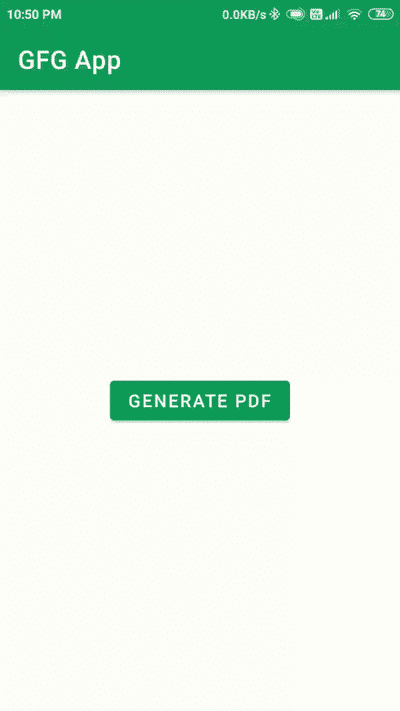

# 如何在安卓 App 中生成 PDF 文件？

> 原文：[https://www.geeksforgeeks.org/how-to-generate-a-pdf-file-in-android-app/](https://www.geeksforgeeks.org/how-to-generate-a-pdf-file-in-android-app/)

有许多应用程序将应用程序中的数据以可下载的 PDF 文件格式提供给用户。因此，在这种情况下，我们必须根据应用程序中的数据创建一个 PDF 文件，并在应用程序中适当地表示这些数据。因此，通过使用这种技术，我们可以很容易地根据我们的要求创建一个新的 PDF。在本文中，我们将研究如何从您的安卓应用程序中的数据创建一个新的 PDF 文件，并将该 PDF 文件保存在用户设备的外部存储中。因此，为了从安卓应用程序中的数据生成一个新的 PDF 文件，我们将使用画布。`Canvas` 是 Android 中的一个预定义类，用于在我们的屏幕上绘制不同对象的 2D 图。因此，在本文中，我们将使用画布在画布中绘制数据，然后以 PDF 的形式存储画布。现在我们将着手实施我们的项目。

### 生成 PDF 文件的示例

下面是示例 GIF，我们将在其中了解本文中要构建的内容。请注意，该应用程序是使用 `Java` 语言构建的。在这个项目中，我们将显示一个简单的按钮。点击按钮后，我们的 PDF 文件将被生成，我们可以看到这个 PDF 文件保存在我们的文件中。



### 逐步实施

#### 第一步：创建新项目

要在安卓工作室创建新项目，请参考[如何在安卓工作室创建/启动新项目](https://www.geeksforgeeks.org/android-how-to-create-start-a-new-project-in-android-studio/)。注意选择 `Java` 作为编程语言。

#### 步骤 2：使用 `activity_main.xml` 文件

转到 `activity_main.xml` 文件，参考以下代码。下面是 `activity_main.xml` 文件的代码。

```xml
<?xml version="1.0" encoding="utf-8"?>
<RelativeLayout
    xmlns:android="http://schemas.android.com/apk/res/android"
    xmlns:tools="http://schemas.android.com/tools"
    android:layout_width="match_parent"
    android:layout_height="match_parent"
    tools:context=".MainActivity">

    <!--Button for generating the PDF file-->
    <Button
        android:id="@+id/idBtnGeneratePDF"
        android:layout_width="wrap_content"
        android:layout_height="wrap_content"
        android:layout_centerInParent="true"
        android:text="Generate PDF" />

</RelativeLayout>
```

#### 第三步：在外存储器中添加读写权限

导航到 `应用程序` > `和` 文件，并添加以下权限。

```xml
<uses-permission android:name="android.permission.WRITE_EXTERNAL_STORAGE"/>
<uses-permission android:name="android.permission.READ_EXTERNAL_STORAGE"/>
```

#### 第四步：处理 `MainActivity.java` 文件

转到 `MainActivity.java` 文件，参考以下代码。以下是 `MainActivity.java` 文件的代码。代码中添加了注释，以更详细地理解代码。

```java
import android.content.pm.PackageManager;
import android.graphics.Bitmap;
import android.graphics.BitmapFactory;
import android.graphics.Canvas;
import android.graphics.Paint;
import android.graphics.Typeface;
import android.graphics.pdf.PdfDocument;
import android.os.Bundle;
import android.os.Environment;
import android.view.View;
import android.widget.Button;
import android.widget.Toast;

import androidx.annotation.NonNull;
import androidx.appcompat.app.AppCompatActivity;
import androidx.core.app.ActivityCompat;
import androidx.core.content.ContextCompat;

import java.io.File;
import java.io.FileOutputStream;
import java.io.IOException;

import static android.Manifest.permission.READ_EXTERNAL_STORAGE;
import static android.Manifest.permission.WRITE_EXTERNAL_STORAGE;

public class MainActivity extends AppCompatActivity {

    // variables for our buttons.
    Button generatePDFbtn;

    // declaring width and height for our PDF file.
    int pageHeight = 1120;
    int pagewidth = 792;

    // creating a bitmap variable for storing our images
    Bitmap bmp, scaledbmp;

    // constant code for runtime permissions
    private static final int PERMISSION_REQUEST_CODE = 200;

    @Override
    protected void onCreate(Bundle savedInstanceState) {
        super.onCreate(savedInstanceState);
        setContentView(R.layout.activity_main);

        // initializing our variables.
        generatePDFbtn = findViewById(R.id.idBtnGeneratePDF);
        bmp = BitmapFactory.decodeResource(getResources(), R.drawable.gfgimage);
        scaledbmp = Bitmap.createScaledBitmap(bmp, 140, 140, false);

        // below code is used for checking our permissions.
        if (checkPermission()) {
            Toast.makeText(this, "Permission Granted", Toast.LENGTH_SHORT).show();
        } else {
            requestPermission();
        }

        generatePDFbtn.setOnClickListener(new View.OnClickListener() {
            @Override
            public void onClick(View v) {
                // calling method to generate our PDF file.
                generatePDF();
            }
        });
    }

    private void generatePDF() {
        // creating an object variable for our PDF document.
        PdfDocument pdfDocument = new PdfDocument();

        // two variables for paint "paint" is used for drawing shapes and we will use "title" for adding text in our PDF file.
        Paint paint = new Paint();
        Paint title = new Paint();

        // we are adding page info to our PDF file in which we will be passing our pageWidth, pageHeight and number of pages and after that we are calling it to create our PDF.
        PdfDocument.PageInfo mypageInfo = new PdfDocument.PageInfo.Builder(pagewidth, pageHeight, 1).create();

        // below line is used for setting start page for our PDF file.
        PdfDocument.Page myPage = pdfDocument.startPage(mypageInfo);

        // creating a variable for canvas from our page of PDF.
        Canvas canvas = myPage.getCanvas();

        // below line is used to draw our image on our PDF file.
        // the first parameter of our drawbitmap method is our bitmap
        // second parameter is position from left
        // third parameter is position from top and last one is our variable for paint.
        canvas.drawBitmap(scaledbmp, 56, 40, paint);

        // below line is used for adding typeface for our text which we will be adding in our PDF file.
        title.setTypeface(Typeface.create(Typeface.DEFAULT, Typeface.NORMAL));

        // below line is used for setting text size which we will be displaying in our PDF file.
        title.setTextSize(15);

        // below line is sued for setting color of our text inside our PDF file.
        title.setColor(ContextCompat.getColor(this, R.color.purple_200));
```

以下是关于在Android中生成PDF文档的代码示例。代码展示了如何向PDF页面添加文本、设置文本样式、完成页面、保存文件以及处理运行时权限。

### 绘制与设置文本
使用`canvas.drawText()`方法在PDF页面上绘制文本。该方法的参数依次为文本内容、起始位置、顶部位置以及用于绘制的`Paint`对象（此处为`title`）。
```java
canvas.drawText("A portal for IT professionals.", 209, 100, title);
canvas.drawText("Geeks for Geeks", 209, 80, title);
```

创建另一个文本并将其居中对齐。通过`title.setTypeface()`设置字体样式，`title.setColor()`设置颜色，`title.setTextSize()`设置文本大小。
```java
title.setTypeface(Typeface.defaultFromStyle(Typeface.NORMAL));
title.setColor(ContextCompat.getColor(this, R.color.purple_200));
title.setTextSize(15);
```

使用`title.setTextAlign(Paint.Align.CENTER)`将文本对齐方式设置为居中，然后绘制文本。
```java
title.setTextAlign(Paint.Align.CENTER);
canvas.drawText("This is sample document which we have created.", 396, 560, title);
```

### 完成页面与保存文件
添加所有内容后，调用`pdfDocument.finishPage()`来完成当前页面。
```java
pdfDocument.finishPage(myPage);
```

设置PDF文件的名称和路径。这里使用`Environment.getExternalStorageDirectory()`获取外部存储目录，并创建名为`GFG.pdf`的文件。
```java
File file = new File(Environment.getExternalStorageDirectory(), "GFG.pdf");
```

将PDF文件写入指定位置。使用`pdfDocument.writeTo()`方法，并捕获可能发生的`IOException`。操作完成后，显示一条`Toast`消息提示生成成功，并调用`pdfDocument.close()`关闭文档。
```java
try {
    pdfDocument.writeTo(new FileOutputStream(file));
    Toast.makeText(MainActivity.this, "PDF file generated successfully.", Toast.LENGTH_SHORT).show();
} catch (IOException e) {
    e.printStackTrace();
}
pdfDocument.close();
```

### 权限检查与请求
`checkPermission()`方法用于检查是否已授予读写外部存储的权限。它通过`ContextCompat.checkSelfPermission()`获取权限状态，并返回一个布尔值表示是否所有权限都被授予。
```java
private boolean checkPermission() {
    int permission1 = ContextCompat.checkSelfPermission(getApplicationContext(), WRITE_EXTERNAL_STORAGE);
    int permission2 = ContextCompat.checkSelfPermission(getApplicationContext(), READ_EXTERNAL_STORAGE);
    return permission1 == PackageManager.PERMISSION_GRANTED && permission2 == PackageManager.PERMISSION_GRANTED;
}
```

`requestPermission()`方法用于请求必要的权限。它调用`ActivityCompat.requestPermissions()`来发起请求。
```java
private void requestPermission() {
    ActivityCompat.requestPermissions(this, new String[]{WRITE_EXTERNAL_STORAGE, READ_EXTERNAL_STORAGE}, PERMISSION_REQUEST_CODE);
}
```

重写`onRequestPermissionsResult()`方法来处理权限请求的结果。根据用户是授予还是拒绝了权限，显示相应的`Toast`消息。如果权限被拒绝，则调用`finish()`结束当前活动。
```java
@Override
public void onRequestPermissionsResult(int requestCode, @NonNull String[] permissions, @NonNull int[] grantResults) {
    if (requestCode == PERMISSION_REQUEST_CODE) {
        if (grantResults.length > 0) {
            boolean writeStorage = grantResults[0] == PackageManager.PERMISSION_GRANTED;
            boolean readStorage = grantResults[1] == PackageManager.PERMISSION_GRANTED;

            if (writeStorage && readStorage) {
                Toast.makeText(this, "Permission Granted..", Toast.LENGTH_SHORT).show();
            } else {
                Toast.makeText(this, "Permission Denined.", Toast.LENGTH_SHORT).show();
                finish();
            }
        }
    }
}
```