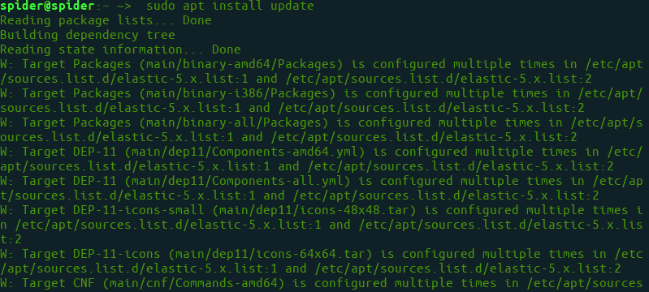
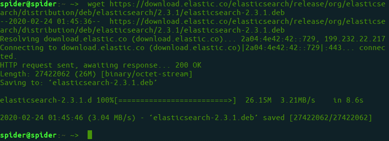
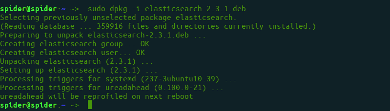
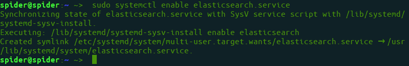
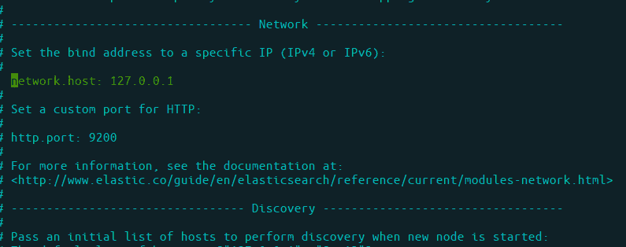

# 如何在 Ubuntu 上安装和配置 Elasticsearch？

> 原文：[https://www.geeksforgeeks.org/how-to-install-and-configure-elasticsearch-on-ubuntu/](https://www.geeksforgeeks.org/how-to-install-and-configure-elasticsearch-on-ubuntu/)

Elasticsearch 是一个基于 Apache 的 Lucene 库的跨平台搜索引擎。它提供了一个分布式、支持多租户的全文搜索引擎，具有 HTTP web 接口和无模式的 JSON 文档。是用 [Java](https://www.geeksforgeeks.org/java/) 写的。

## 先决条件
[Ubuntu 上的 Java 安装](https://www.geeksforgeeks.org/setting-environment-java/)

## 安装步骤

### 步骤 1：更新系统
首先，使用以下命令更新您的系统：

```
sudo apt install update
```



### 步骤 2：下载 Elasticsearch 的 .deb 文件
```
wget https://download.elasticsearch.org/elasticsearch/release/org/elasticsearch/distribution/deb/elasticsearch/2.3.1/elasticsearch-2.3.1.deb
```



### 步骤 3：安装 .deb 文件
使用 `dpkg` 命令安装下载的 `.deb` 文件。

```
sudo dpkg -i elasticsearch-2.3.1.deb
```



### 步骤 4：启用 Elasticsearch 服务
```
sudo systemctl enable elasticsearch.service
```



### 步骤 5：设置网络配置
打开配置文件：
```
sudo nano /etc/elasticsearch/elasticsearch.yml
```
并将 IP 设置为本地主机：
```
...
network.host: 127.0.0.1
...
```



### 步骤 6：重启服务
```
sudo systemctl restart elasticsearch
```

### 步骤 7：使用和测试 Elasticsearch
```
curl -X GET 'http://localhost:9200'
```

输出：
```
{
  "name" : "Node-1",
  "cluster_name" : "mycluster1",
  "version" : {
    "number" : "2.3.1",
    "build_hash" : "bd980929010aef404e7cb0843e61d0665269fc39",
    "build_timestamp" : "2016-04-04T12:25:05Z",
    "build_snapshot" : false,
    "lucene_version" : "5.5.0"
  }
}
```