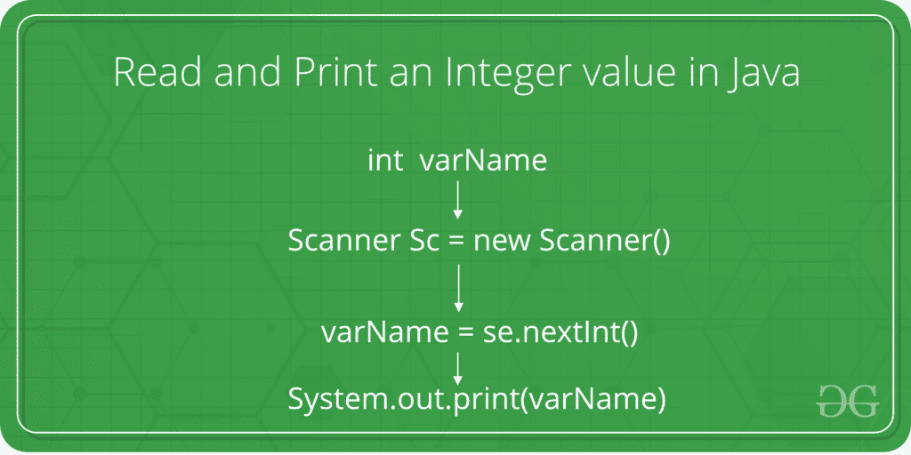

# 如何在 Java 中读取和打印整数值

> 原文：[https://www.geeksforgeeks.org/how-to-read-and-print-an-integer-value-in-java/](https://www.geeksforgeeks.org/how-to-read-and-print-an-integer-value-in-java/)

给定的任务是从用户那里获取一个整数作为输入，并用 Java 语言打印该整数。



在下面的程序中，将整数作为用户输入的语法和过程用 Java 语言显示。

## 步骤

1.  当被询问时，用户输入整数值。
2.  该值通过 `Scanner Class` 的 `nextInt()` 方法从用户处获取。`nextInt()` 方法在 Java 中从控制台读取下一个整数值到指定的变量中。

## 语法

```java
variableOfIntType = ScannerObject.nextInt();
```

其中 `variableOfIntType` 是要存储输入值的变量。而 `ScannerObject` 是事先创建的 `Scanner` 类对象。

3.  该输入值现在存储在 `variableOfIntType` 中。
4.  要打印此值，需使用 `System.out.println()` 或 `System.out.print()` 方法。`System.out.println()` 方法在 Java 中将作为参数传递的值打印到控制台屏幕，并将光标移动到控制台的下一行。而 `System.out.print()` 方法在 Java 中将作为参数传递的值打印到控制台屏幕，光标则停留在最后一个打印字符的下一个字符位置。

```java
System.out.println(variableOfXType);
```

5.  因此，整数值被成功读取和打印。

## 程序

```java
// Java program to take an integer
// as input and print it

import java.io.*;
import java.util.Scanner;

class GFG {
    public static void main(String[] args)
    {

// Declare the variables
        int num;

// Input the integer
        System.out.println("Enter the integer: ");

// Create Scanner object
        Scanner s = new Scanner(System.in);

// Read the next integer from the screen
        num = s.nextInt();

// Display the integer
        System.out.println("Entered integer is: "
                           + num);
    }
}
```

## 输出

```java
Enter the integer: 10
Entered integer is: 10
```