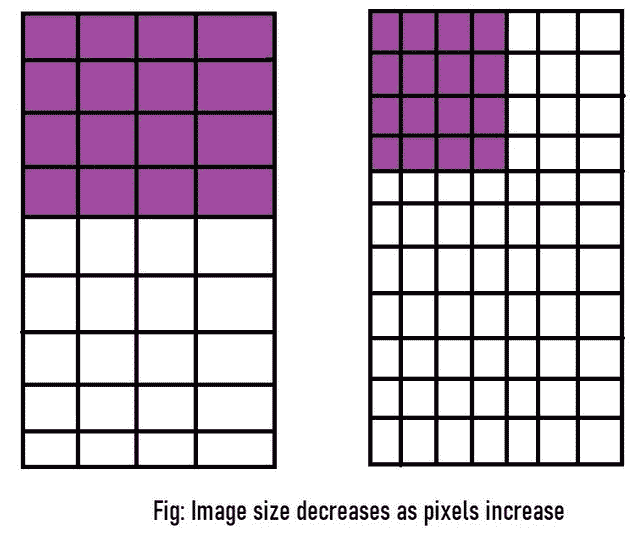
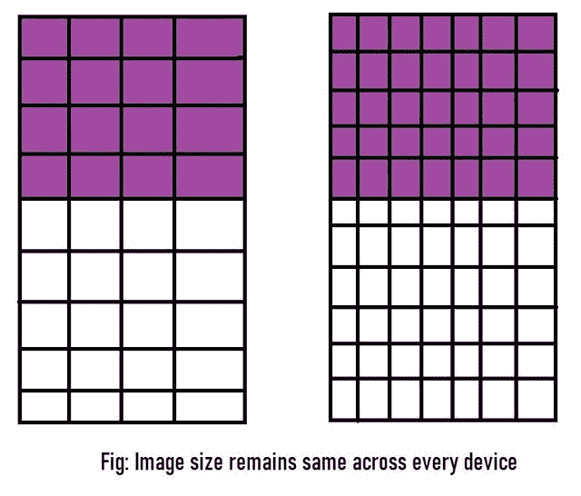
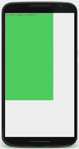
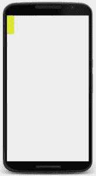
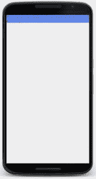
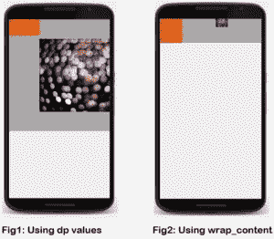
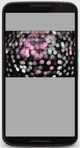
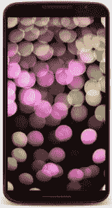

# 如何在 Android Studio 中将不同的视图缩放到所有屏幕大小？

> 原文：[https://www.geeksforgeeks.org/how-to-scale-different-views-to-all-screen-sizes-in-android-studio/](https://www.geeksforgeeks.org/how-to-scale-different-views-to-all-screen-sizes-in-android-studio/)

本文展示了如何在安卓应用程序开发中更改视图的大小（如文本视图等），以便他们可以修改屏幕上显示的内容。

**注：** 本文用 [XML 可视化工具](https://labs.udacity.com/android-visualizer/) 代替 [安卓工作室](https://www.geeksforgeeks.org/guide-to-install-and-set-up-android-studio/)。

## 以下是在安卓系统中改变视图大小的各种方法

### 1. 在 dp（密度像素）中硬编码数值

我们知道[像素](https://www.geeksforgeeks.org/image-processing-java-set-2-get-set-pixels/)是用于衡量图像或出现在计算机屏幕上的任何对象的单位。但是，如果我们以像素为单位指定视图的大小，就会出现一个非常大的问题，因为每个设备都有不同的像素屏幕比例。设备拥有的像素数量越多，可以看到的图像就越清晰、质量越好。

例如，如果我们将视图指定为 `4px * 4px`，它可能会根据相关设备以不同的大小显示。
[](https://media.geeksforgeeks.org/wp-content/uploads/20200129181630/and1.jpg)

我们可以通过在`密度-像素(dp)`而不是像素中指定视图来克服这个问题。当在 `dp` 中指定时，设备本身会调整视图，使视图占据其预期的空间。
[](https://media.geeksforgeeks.org/wp-content/uploads/20200129181634/and2.jpg)

既然我们知道了使用密度像素胜过像素的优势，让我们来看看这样做的代码：

```java
<TextView
    android:text="You are in GeeksforGeeks!"
    android:background="#66bb6a"
    android:layout_width="250dp"
    android:layout_height="450dp" />
```

**注意：** 要运行此代码，请从 [XML 可视化工具](https://labs.udacity.com/android-visualizer/) 中删除之前编写的任何代码，并粘贴上述代码。

**输出：**
[](https://media.geeksforgeeks.org/wp-content/uploads/20200129181638/and3.jpg)

我们在一个绿色的大矩形里看到一个非常小的字。长方形是我们规定的尺寸：`450dp * 250dp`。从代码中可以明显看出，在指定视图的大小时（在上面的例子中是一个文本视图），我们需要设置两个参数的值：高度和宽度。如果它们中的任何一个不存在，代码就不会运行。

### 2. 使用 `wrap_content`

通常，在 `dp` 中硬编码数值并不是一个好的做法。以上面的输出为例：我们的文本相当小，但我们使用了一个巨大的绿色框来包围它。这不仅看起来很奇怪，而且占用了大量不必要的空间。此外，很多时候我们不知道视图中会有多少内容；比如用户输入，如果是一个长输入，那么我们在 `dp` 中指定的大小可能太小而无法容纳内容，从而导致内容被截断；如果输入非常小，指定的视图内部会留下很多空间，从而导致设计不佳。

```java
<TextView
    android:text="This is a very very large input in a very very small view size!"
    android:background="#ffff00"
    android:layout_width="30dp"
    android:layout_height="80dp" />
```

**输出：**
[](https://media.geeksforgeeks.org/wp-content/uploads/20200129181641/and4.jpg)

为了解决这个问题，我们使用 `wrap_content` 函数。它使视图的大小受限于它所覆盖的内容。因此，视图大小将随着其覆盖的内容的增长或缩小而增长和缩小。让我们看看它的代码：

```java
<TextView
    android:text="This is a very very large input in a view size which will grow accordingly!"
    android:background="#42a5f5"
    android:layout_width="wrap_content"
    android:layout_height="wrap_content" />
```

**输出：**
[](https://media.geeksforgeeks.org/wp-content/uploads/20200129181643/and5.jpg)

然而，当我们处理多个视图时，还有一种方法会派上用场。

### 3. 使用 `match_parent`

当屏幕上有[**多于一个视图**](https://www.geeksforgeeks.org/android-ui-layouts/)时，我们使用布局来排列视图。我们使用的布局本身也是一个视图，被称为**父视图**，它包含的所有视图被称为**子视图**。

在指定布局的同时，我们还需要像指定任何其他视图一样指定它的大小。我们可以通过对 `dp` 中的值进行硬编码或使用 `wrap_content` 来做到这一点。然而，对布局使用 `wrap_content` 可能会使设计不佳，因为它有时会使子视图比预期的更小或更大。
[](https://media.geeksforgeeks.org/wp-content/uploads/20200129181645/and6.jpg)

如果我们想要布局尺寸与设备尺寸相匹配，我们需要使用 `match_parent`。它不仅可以用于布局（也就是父视图），还可以用于子视图。如果我们将它用于子视图，它将是父视图的大小。

下面是显示上述方法的代码：

```java
<LinearLayout
    xmlns:android="http://schemas.android.com/apk/res/android"
    android:orientation="horizontal"
    android:layout_width="match_parent"
    android:layout_height="match_parent"
    android:background="@android:color/darker_gray">

    <ImageView
        android:src="@drawable/rainbow"
        android:layout_width="wrap_content"
        android:layout_height="wrap_content"/>
</LinearLayout>
```

现在布局将延伸到整个显示屏。这里，我们在布局中使用了“深灰色”，这样我们就可以看到它覆盖了整个设备。如果没有指定颜色，布局将不可见。

**输出：**
[](https://media.geeksforgeeks.org/wp-content/uploads/20200129181647/and7.jpg)

如果我们在图像视图中使用 `match_parent`，它将采用整个设备显示的大小，从而创建一个全出血图像：

```java
<ImageView
    android:src="@drawable/rainbow"
    android:layout_width="match_parent"
    android:layout_height="match_parent"
    android:scaleType="centerCrop"/>
```

**输出：**
[](https://media.geeksforgeeks.org/wp-content/uploads/20200129181649/and8.jpg)