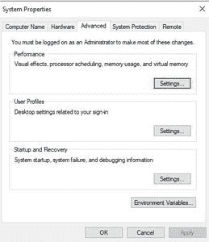
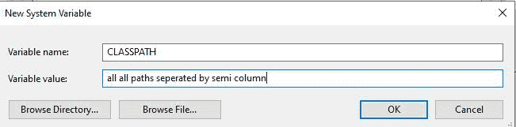

# 如何在Java中设置类路径（当类文件位于JAR文件中时）

> 原文：[https://www.geeksforgeeks.org/how-to-set-classpath-when-class-files-are-in-jar-file-in-java/](https://www.geeksforgeeks.org/how-to-set-classpath-when-class-files-are-in-jar-file-in-java/)

[类路径](https://www.geeksforgeeks.org/how-to-set-classpath-in-java/)是`JVM`或`java`编译器中的一个参数，它指定用户定义的类和包的位置。在用Java编程时，我们多次使用`import`语句。

插图：

```java
import java.util.ArrayList;
```

它使`ArrayList`类在当前类的包`java.util`中可用。

```java
ArrayList<Integer> list = new ArrayList<>();
```

这样当我们作为`JVM`调用时，就知道在哪里可以找到类`ArrayList`。现在，让它浏览系统上的每个文件夹并搜索它是不切实际的。因此，在Java中确实存在一个`CLASSPATH`变量，当我们向它提供我们希望它出现的位置时，它会被直接使用。目录和JAR直接放在`CLASSPATH`变量中。

我们可以在调用JDK工具（推荐的方法）或设置类路径环境变量时，使用`-classpath`选项来设置类路径。首选`-classpath`选项，因为您可以为每个应用程序独立设置它，而不会影响其他应用程序，也不会改变它对其他应用程序的意义。

## 方法

1.  将类路径设置为命令行
2.  将类路径设置为环境变量

### 方法1：将`CLASSPATH`设置为命令行

*   每个类路径都应该以文件名或目录结尾，这取决于您设置的类路径。
    *   为了一个JAR或者包含的ZIP文件，类路径以`.zip`或`.jar`文件结束。为了`.class`文件，类路径以包含`.class`文件的目录结束。
    *   为了`.class`文件在命名包中，类路径以包含“根”包（完整包名中的第一个包）的目录结束。

> 分号分隔多个路径条目。使用`set`命令时，省略等号（`=`）周围的空格非常重要。

#### 实施

下面的特定命令用于为任何由分号分隔的JAR文件设置类路径。

```java
C:> set CLASSPATH=classpath1;classpath2...
```

```java
1. C:> set CLASSPATH=.;C:\dependency\framework.jar

2. //Add multiple jars
$ set CLASSPATH=C:\dependency\framework.jar;C:\location\otherFramework.jar

3. //* means all the files with .jar extension
$ set CLASSPATH=C:\dependency\framework.jar;C:\location\*.jar
```

### 方法2：将类路径设置为环境变量

为了将类路径设置为环境变量，只需找到逐步讨论的用户环境变量窗口。

#### 程序

1.  在桌面上，右键单击“计算机”图标。
2.  从上下文菜单中选择“属性”。
3.  单击“高级系统设置”链接（将打开一个弹出框）。
4.  单击“环境变量”。在“系统变量”一节中，找到`CLASSPATH`环境变量并选择它。单击“编辑”。（如果`CLASSPATH`环境变量不存在，请单击“新建”并创建一个名为`CLASSPATH`的新变量）
5.  添加所有用分隔符分隔的文件夹。单击“确定”。
6.  单击“确定”关闭所有剩余窗口。

下面也用图片描述了在寻找用户环境变量窗口时清晰的思维导图。



