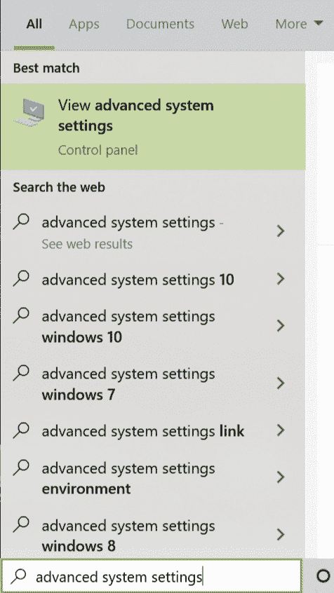
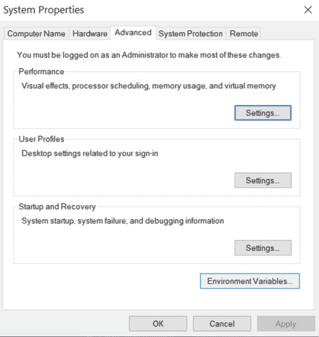
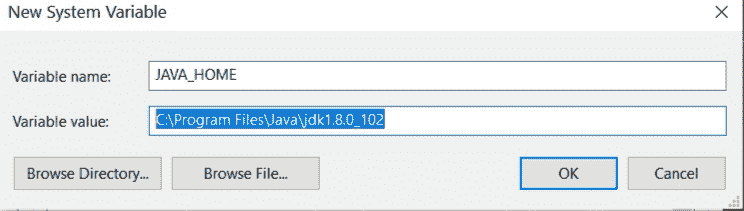
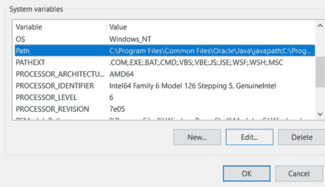
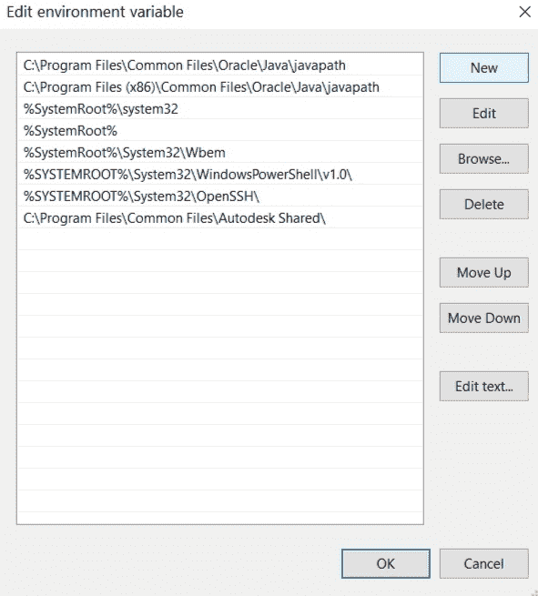
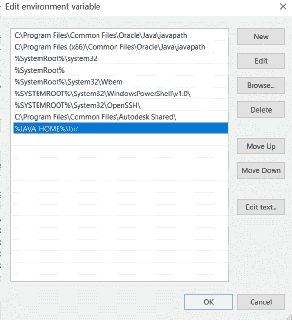

# 如何在 Windows 和 Linux 中设置 Java 路径？

> 原文：[https://www.geeksforgeeks.org/how-to-set-java-path-in-windows-and-linux/](https://www.geeksforgeeks.org/how-to-set-java-path-in-windows-and-linux/)

路径是操作系统用来定位可执行文件（`.exe`）或 Java 二进制文件（`java` 或 `javac` 命令）的环境变量。路径一旦设置，就不能被覆盖。`PATH` 变量防止我们每次运行程序时都必须在命令行界面上写出程序的整个路径。而且，路径只是一个存储了一堆快捷方式的变量。

为了在 Windows 或 Linux 环境中执行基于 Java 控制台的程序，我们必须使用 `java` 和 `javac` 命令。操作系统不知道 `java` 和 `javac` 这两个命令，因为我们没有指定可执行文件的位置。因此，我们需要指定可执行文件所在的路径。这就是我们设置路径并指定 `bin` 文件夹路径的原因，因为 `bin` 包含所有二进制可执行文件。设置路径后，它可以加载程序中所有必要的项目，包括编译器或解释器本身。

以下是为 Windows 和 Linux 设置路径的过程：

## 在 Windows 中设置 Java 路径

### 1. 打开高级系统设置
进入搜索框，输入“高级系统设置”。现在点击查看高级系统设置。



### 2. 打开环境变量
选择“高级”选项卡，然后单击“环境变量”。



### 3. 新建 JAVA_HOME 变量
在“系统变量”中，点击“新建”按钮。现在在“编辑系统变量”中，键入变量名为 `JAVA_HOME`，变量值为保存 JDK 文件夹的路径，然后点击“确定”按钮。通常 JDK 文件的路径是 `C:\Program Files\Java\jdk1.8.0_60`。



### 4. 编辑 Path 变量
现在在“系统变量”中找到 `Path` 变量并点击“编辑”按钮。



### 5. 添加新条目
点击“新建”按钮。



### 6. 添加 bin 目录路径
现在添加以下路径：`%JAVA_HOME%\bin`



## 在 Linux 中设置 Java 路径

### 打开终端
打开终端，输入以下命令：
```bash
sudo nano /etc/environment
```

### 编辑环境变量文件
将打开一个文件，并向该文件添加以下命令：
```bash
JAVA_HOME="/your/path/to/jdk"
```
用 JDK 的实际路径替换 `/your/path/to/jdk`。

### 使配置生效
现在重新启动您正在使用的计算机或虚拟机，或者重新加载文件：
```bash
source /etc/environment
```

### 测试路径
您可以通过执行以下命令来测试路径：
```bash
echo $JAVA_HOME
```
如果您没有任何错误地获得输出，那么您已经正确地设置了路径。如果出现任何错误，请尝试再次重复该过程。