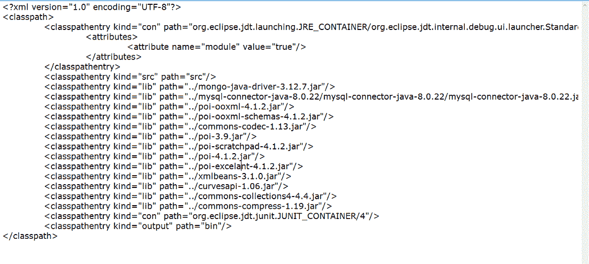
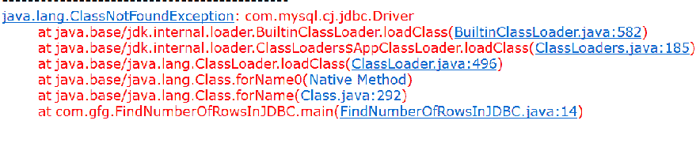
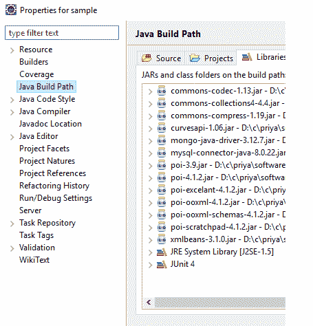

# 如何解决 Java 中的 `ClassNotFoundException`？

> 原文：[https://www.geeksforgeeks.org/how-to-solve-java-lang-classnotfoundexception-in-java/](https://www.geeksforgeeks.org/how-to-solve-java-lang-classnotfoundexception-in-java/)

`ClassNotFoundException` 是一个受检异常，当 Java 虚拟机（`JVM`）试图加载一个特定的类，而在类路径中找不到指定的类时，就会出现这个异常。

在过去，没有像 `Eclipse` 这样的编辑器可用。甚至在记事本中，人们已经完成了 Java 编码，并通过使用 `javac` 命令来编译 Java 文件，他们将创建一个 `.class` 文件。有时，意外生成的类文件可能会丢失或设置在不同的位置，因此很有可能会出现 `ClassNotFoundException`。`Eclipse`、`Netbeans` 等编辑器存在后，`IDE` 创建一个 `classpath` 文件类型的条目。



从上图中，我们可以看到许多 jar 文件都存在。如果 Java 代码想要与 `MySQL`、`MongoDB` 等数据库交互，它们是绝对必要的，而且很少有功能需要这些 jar 文件出现在构建路径中。如果没有添加，首先编辑器会显示错误本身，并提供更正选项。

**实现：** 连接 `MySQL` 数据库获取内容的程序

**例**

## Java 语言

```java
// Java Program to check for MySQL connectivity Issue

// Importing database (SQL) libraries
import java.sql.*;

// Main Class
public class MySQLConnectivityCheck {

    public static void main(String[] args)
    {

        // Display message for better readability
        System.out.println(
            "---------------------------------------------");

        // Initially setting connection object
        // and result set to null
        Connection con = null;
        ResultSet res = null;

        // Try block to check for exceptions
        try {

            // We need to have mysql-connector-java-8.0.22
            // or relevant jars in build path of project

            // Loading drivers
            // This driver is the latest one
            Class.forName("com.mysql.cj.jdbc.Driver");

            con = DriverManager.getConnection(
                "jdbc:mysql://localhost:3306/test?serverTimezone=UTC",
                "root", "");

            // Try block to check for exceptions
            try {

                // Set of statements to be checked
            }

            // Catch block 1
            catch (SQLException s) {

                // Display message when SQLException is
                // encountered
                System.out.println(
                    "SQL statement is not executed!");
            }
        }

        catch (Exception e) {

            // In case of general Exception
            // print and display the line number where the
            // exception occurred
            e.printStackTrace();
        }
        finally {

            // Finally for all cases indirectly closing the
            // connections & making the resultset and
            // connection object to null
            res = null;
            con = null;
        }
    }
}
```

**输出：**

**案例 1：** 在上面的代码中，我们使用的是 `com.mysql.cj.jdbc.Driver`，在这种情况下，如果我们没有 `mysql-connector-java-8.0.22.jar`，那么我们将得到 `ClassNotFoundException`。



**案例 2：** 所以，如下图所示，将 jar 保存在构建路径中。



> **注意：** 类似地，对于任何数据库连接，我们需要有连接到该数据库的相应 jar。下面以表格形式给出了 Java 克服 `ClassNotFoundException` 所需的数据库驱动程序 jar 列表。

| 数据库 | 命令行 |
| --- | --- |
| MySQL | `mysql-connector-java-8.0.22.jar` |
| MongoDB | `mongo-java-driver-3.12.7.jar` |
| SQL Server | `sqljdbc4.jar` |
| SQL Server | `sqljdbc.jar` |
| Oracle | `ojdbc.jar` |

> **注：**
> *   当我们开发基于网络的应用程序时，jar 必须存在于 `WEB-INF/lib` 目录中。
> *   在 `Maven` 项目中，jar 依赖应该出现在 `pom.xml` 中。
> *   `Spring Boot` 的 `pom.xml` 示例片段。

**例 1** 带 `Spring Boot`

## XML

```xml
<!-- Spring boot mongodb dependency -->
<dependency>
    <groupId>org.springframework.boot</groupId>
    <artifactId>spring-boot-starter-data-mongodb</artifactId>
</dependency>
```

**例 2** 无 `Spring Boot`

## XML

```xml
<!-- https://mvnrepository.com/artifact/org.mongodb/mongodb-driver -->
<dependency>
    <groupId>org.mongodb</groupId>
    <artifactId>mongodb-driver</artifactId>
    <version>3.6.3</version>
</dependency>
```

**示例 3** 基于 `Gradle` 的依赖关系（MongoDB）

## Gradle

```gradle
dependencies {
    compile 'org.mongodb:mongodb-driver:3.2.2'
}
```

同样，也可以用这种方式指定其他数据库驱动程序。这取决于项目的性质，依赖关系必须被修复。对于普通的类级项目，所有的类，即父类、子类等，都应该在类路径中可用。如果有错误，那么也不会创建导致 `ClassNotFoundException` 的类文件，因此，为了使整个代码正常工作，应该首先通过修复依赖项来纠正错误。集成开发环境对于克服这种排序场景非常有帮助，例如当程序抛出 `ClassNotFoundException` 时，它将向用户提供关于包含 jar 文件的必要性的建议（jar 文件包含必要的功能，如连接到数据库）。