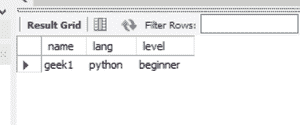

# 如何用 Java 中的 CallableStatement 调用存储过程？

> 原文：[https://www.geeksforgeeks.org/how-to-use-callable-statement-in-java-to-call-stored-procedure/](https://www.geeksforgeeks.org/how-to-use-callable-statement-in-java-to-call-stored-procedure/)

JDBC 应用编程接口的 `CallableStatement` 用于调用存储过程。可调用语句可以有输出参数和/或输入参数。`Connection` 接口的 `prepareCall()` 方法将用于创建 `CallableStatement` 对象。

以下是在 Java 中使用可调用语句调用存储过程的步骤：

## 1) 加载 MySQL 驱动程序并创建数据库连接

```java
import java.sql.*;

public class JavaApplication1 {
    public static void main(String[] args) throws Exception {
        Class.forName("com.mysql.jdbc.Driver");
        Connection con = DriverManager.getConnection("jdbc:mysql://localhost/root", "geek", "geek");
    }
}
```

## 2) 创建一个 SQL 字符串

我们需要将 SQL 查询存储在一个字符串中。

```java
String sql_string = "insert into students values(?,?,?)";
```

## 3) 创建 CallableStatement 对象

`Connection` 接口的 `prepareCall()` 方法将用于创建 `CallableStatement` 对象。`sql_string` 将作为参数传递给 `prepareCall()` 方法。

```java
CallableStatement cs = con.prepareCall(sql_string);
```

## 4) 设置输入参数

根据查询参数的数据类型，我们可以通过调用 `setInt()` 或 `setString()` 方法来设置输入参数。

```java
cs.setString(1, "geek1");
cs.setString(2, "python");
cs.setString(3, "beginner");
```

## 5) 调用存储过程

通过调用 `CallableStatement` 类的 `execute()` 方法来执行存储过程。

## 在 Java 中使用可调用语句调用存储过程的完整示例

```java
// Java program to use CallableStatement in Java to call Stored Procedure
package javaapplication1;

import java.sql.*;

public class JavaApplication1 {
    public static void main(String[] args) throws Exception {
        Class.forName("com.mysql.jdbc.Driver");

        // Getting the connection
        Connection con = DriverManager.getConnection("jdbc:mysql://localhost/root", "acm", "acm");

        String sql_string = "insert into students values(?,?,?)";

        // Preparing a CallableStatement
        CallableStatement cs = con.prepareCall(sql_string);

        cs.setString(1, "geek1");
        cs.setString(2, "python");
        cs.setString(3, "beginner");
        cs.execute();
        System.out.print("uploaded successfully\n");
    }
}
```

**输出：**



运行代码后的学生表