# 通过企业 Java Beans 在 Netbeans 中实现消息队列技术

> 原文：[https://www.geeksforgeeks.org/implementing-message-queuing-technique-in-netbeans-through-enterprise-java-beans/](https://www.geeksforgeeks.org/implementing-message-queuing-technique-in-netbeans-through-enterprise-java-beans/)

一个消息队列，允许一个或多个进程写一个消息供其他进程读取。消息队列被实现为消息的链接列表，并存储在内核中。每个消息队列由一个消息队列标识符标识。内核跟踪系统中创建的所有消息队列。

通过企业 Java Beans 在 Netbeans 中实现消息队列技术的过程步骤按顺序列出。只需按照以下步骤在 Netbeans 中实现消息驱动 bean，如下所示：

## 步骤 1：打开 Netbeans，选择 `Java EE->企业应用`

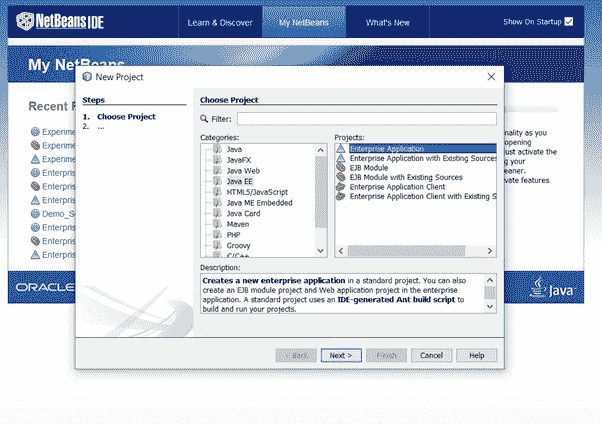

## 步骤 2：在对应的文本框中输入项目名称

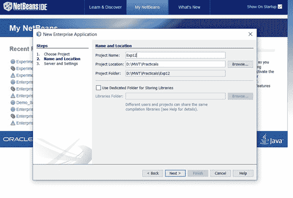

## 步骤 3：选择 `Glassfish` 服务器

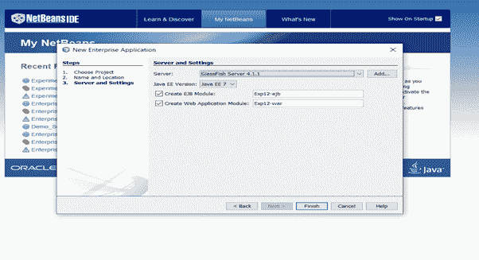

## 步骤 4：点击完成

将创建三个文件：1. 申请，2. `EJB` 和 3. 战争文件被创建。

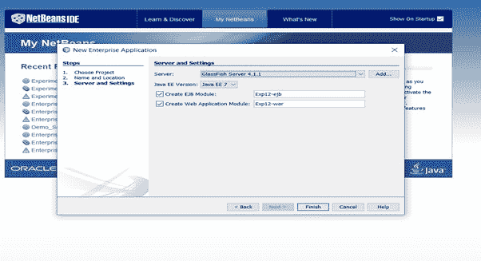
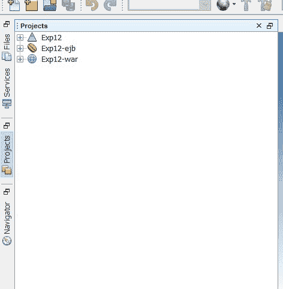

## 步骤 5：在 `EJB` 组件中创建一个消息驱动 Bean

## 步骤 6：右键单击 `EJB`，选择消息驱动 Beans 选项，输入 `EJB` 名称和包名称，然后单击外接程序项目目标，并创建目标资源

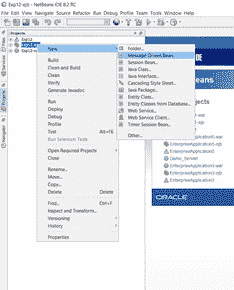
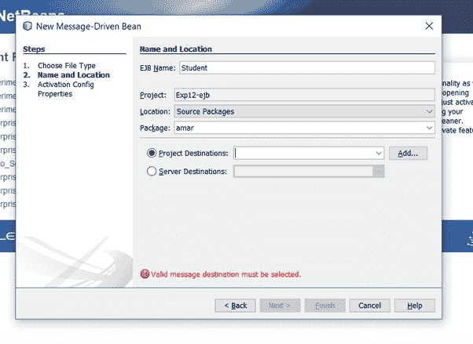

## 步骤 7：输入名称，选择队列，点击确定和下一步

> **注意：** 这里我们实现的是排队技术，所以目的地类型应该是 `Queue`。

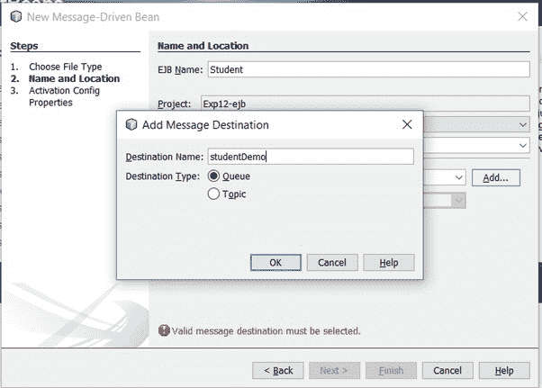
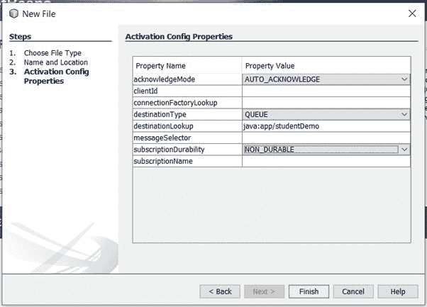

## 步骤 8：创建队列

### 实施

*   要更改此许可证头，请在项目属性中选择许可证头。
*   要更改此模板文件，请选择工具|模板并在编辑器中打开模板。

### 示例

```java
package amar;

import javax.ejb.ActivationConfigProperty;
import javax.ejb.MessageDriven;
import javax.jms.JMSDestinationDefinition;
import javax.jms.Message;
import javax.jms.MessageListener;
import javax.jms.TextMessage;

@JMSDestinationDefinition(name = "java:app/studentDemo", interfaceName = "javax.jms.Queue", 
                                resourceAdapter = "jmsra", destinationName = "studentDemo")

@MessageDriven(activationConfig = {

@ActivationConfigProperty(propertyName = "destinationLookup", propertyValue = "java:app/studentDemo")
,
@ActivationConfigProperty(propertyName = "destinationType", propertyValue = "javax.jms.Queue")
})

// Class implementing MessageListener interface
public class Student implements MessageListener {

// Constructor
    public Student() {}

// Method 1
    // @Override
    public void onMessage(Message message) {

// Try block to check for exceptions
        try {

TextMessage msg = (TextMessage) message;

System.out.println("This is the message retrieved from Queue:" + msg.getText());

if (msg.getText() == "Abhin")
{
                System.out.println("OK");
            } else {
                System.out.println("No");
            }
        }

// Catch block to handle the exceptions
        catch (Exception e) {
            System.out.println("Error Message:" + e.getMessage());
        }
    }
}
```

## 步骤 9：编辑 `index.html` 文件，创建与 bean 的交互

### 实施

要更改此许可证标题，请在项目属性中选择许可证标题。要更改此模板文件，请选择工具|模板并在编辑器中打开模板。

### 示例

```html
<!DOCTYPE html>
<html>
   <head>
       <title>TODO supply a title</title>
       <meta charset="UTF-8">
       <meta name="viewport" content="width=device-width, initial-scale=1.0">
   </head>
   <body>
       <div>Message Driven Bean Project</div>
       <form action="Student_Demo" method="POST">
           <input type="text" name="msg"><br><!-- comment -->
           <input type="submit" value="Add"/>
       </form>
   </body>
</html>
```

## 步骤 10：创建一个用于通信 bean 的 servlet

### 实施

*   要更改此许可证头，请在项目属性中选择许可证头。
*   要更改此模板文件，请选择工具|模板并在编辑器中打开模板。

### 示例

```java
package amar;

import java.io.IOException;
import java.io.PrintWriter;
import javax.annotation.Resource;
import javax.jms.Connection;
import javax.jms.ConnectionFactory;
import javax.jms.MessageProducer;
import javax.jms.Queue;
import javax.jms.Session;
import javax.jms.TextMessage;
import javax.servlet.ServletException;
import javax.servlet.annotation.WebServlet;
import javax.servlet.http.HttpServlet;
import javax.servlet.http.HttpServletRequest;
import javax.servlet.http.HttpServletResponse;

@WebServlet(name = "Student_Demo", urlPatterns = {"/Student_Demo"})
public class Student_Demo extends HttpServlet {

    @Resource(mappedName = "jms/__defaultConnectionFactory")
    ConnectionFactory cf;

    @Resource(mappedName = "java:app/studentDemo")
    Queue dest;

    // Processes requests for both HTTP GET and POST methods
    protected void processRequest(HttpServletRequest request, HttpServletResponse response)
            throws ServletException, IOException {
        response.setContentType("text/html;charset=UTF-8");
        try (PrintWriter out = response.getWriter()) {
            String msg = request.getParameter("msg");
            out.println("<!DOCTYPE html>");
            out.println("<html>");
            out.println("<head>");
            out.println("<title>Servlet Student_Demo</title>");
            out.println("</head>");
            out.println("<body>");
            send(msg);
            out.println("<h1>Message Queued</h1>");
            out.println("</body>");
            out.println("</html>");
        }
    }

    // Method
    private void send(String message) {
        try {
            // Creating object of Connection class
            Connection con = cf.createConnection();
            // Creating object of Session class
            Session ses = con.createSession();
            // Creating object of MessageProducer class
            MessageProducer mp = ses.createProducer(dest);
            // Creating object of TextMessage class
            TextMessage tm = ses.createTextMessage();
            tm.setText(message);
            mp.send(tm);
        }
        // Catch block to handle the exception
        catch (Exception e) {
            System.out.println("Error" + e.getMessage());
        }
    }

    // Handles the HTTP GET method.
    @Override
    protected void doGet(HttpServletRequest request, HttpServletResponse response)
            throws ServletException, IOException {
        processRequest(request, response);
    }

    // Handles the HTTP POST method.
    @Override
    protected void doPost(HttpServletRequest request, HttpServletResponse response)
            throws ServletException, IOException {
        processRequest(request, response);
    }

    // Returns a short description of the servlet.
    @Override
    public String getServletInfo() {
        return "Short description";
    }
}
```

## 步骤 11：右键单击应用程序并选择清理和构建选项

它将清理项目并成功构建。构建成功后，选择部署。如果部署中有任何错误，它会显示所有这些错误。一旦部署成功，点击**测试**执行过程的运行按钮。

### 输出

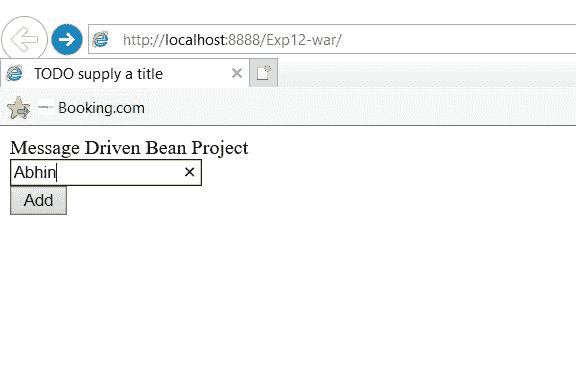
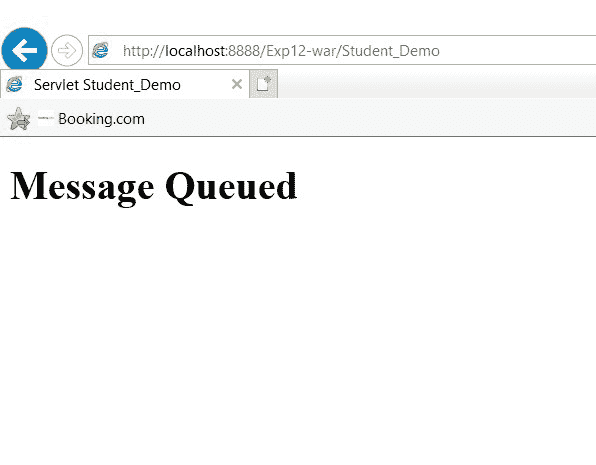
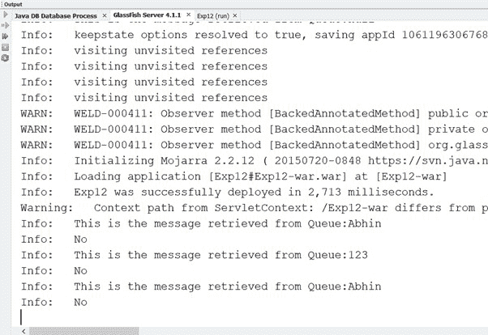