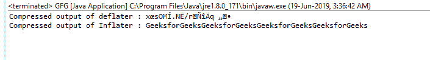
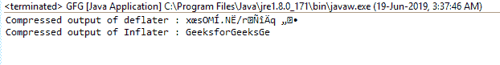

# Java 中的充气()函数，示例

> 原文：[https://www.geeksforgeeks.org/inflater-inflate-function-in-java-with-examples/](https://www.geeksforgeeks.org/inflater-inflate-function-in-java-with-examples/)

`Inflater`类的`inflate()`功能用于解压缩输入数据，并用未压缩的数据填充给定的缓冲区。该函数返回未压缩数据的字节数。

## 功能签名

```java
public int inflate(byte[] b)
public int inflate(byte[] b, int offset, int length)
```

## 语法

```java
i.inflate(byte[])
i.inflate(byte[], int, int )
```

## 参数

这些重载函数接受的各种参数有：

*   `byte[] b`：这是要膨胀的输入数组
*   `int offset`：这是给定数组中读取值的起始偏移量
*   `int length`：这是从起始偏移量开始压缩的最大长度。

## 返回类型

该函数返回一个`int`值，即未压缩数据的大小。

## 异常

如果压缩数据格式无效，函数抛出`DataFormatException`。

## 示例 1：`inflate(byte[] b)`功能的使用

```java
// Java program to describe the use
// of inflate function

import java.util.zip.*;
import java.io.UnsupportedEncodingException;

class GFG {
    public static void main(String args[])
        throws UnsupportedEncodingException,
               DataFormatException
    {

// compress the data

// deflater
        Deflater d = new Deflater();

// get the text
        String pattern = "GeeksforGeeks", text = "";

// generate the text
        for (int i = 0; i < 4; i++)
            text += pattern;

// set the input for deflator
        d.setInput(text.getBytes("UTF-8"));

// finish
        d.finish();

// output bytes
        byte output[] = new byte[1024];

// compress the data
        int size = d.deflate(output);

// end
        d.end();

// end of compression

// use Inflater to get back the original data

// Inflater
        Inflater i = new Inflater();

// set the input for inflator
        i.setInput(output);

// output bytes
        byte inflater_output[] = new byte[1024];

// uncompress the data
        int org_size = i.inflate(inflater_output);

// output of inflater and deflater
        System.out.println("Compressed output of deflater : "
                           + new String(output));
        System.out.println("Compressed output of Inflater : "
                           + new String(inflater_output, "UTF-8"));

// end
        i.end();
    }
}
```

**输出：**


## 示例 2：使用`inflate(byte[] b, int offset, int length)`函数

```java
// Java program to describe the use
// of inflate function

import java.util.zip.*;
import java.io.UnsupportedEncodingException;

class GFG {
    public static void main(String args[])
        throws UnsupportedEncodingException,
               DataFormatException
    {

// compress the data

// deflater
        Deflater d = new Deflater();

// get the text
        String pattern = "GeeksforGeeks", text = "";

// generate the text
        for (int i = 0; i < 4; i++)
            text += pattern;

// set the input for deflator
        d.setInput(text.getBytes("UTF-8"));

// finish
        d.finish();

// output bytes
        byte output[] = new byte[1024];

// compress the data
        int size = d.deflate(output);

// end
        d.end();

// end of compression

// use Inflater to get back the original data

// Inflater
        Inflater i = new Inflater();

// set the input for inflator
        i.setInput(output);

// output bytes
        byte inflater_output[] = new byte[1024];

// uncompress the data
        int org_size = i.inflate(inflater_output, 0, 15);

// output of inflater and deflater
        System.out.println("Compressed output of deflater : "
                           + new String(output));
        System.out.println("Compressed output of Inflater : "
                           + new String(inflater_output, "UTF-8"));

// end
        i.end();
    }
}
```

**输出：**


**参考：**[https://docs.oracle.com/javase/7/docs/api/java/util/zip/Inflater.html#inflate(byte[])](https://docs.oracle.com/javase/7/docs/api/java/util/zip/Inflater.html#inflate(byte[]))