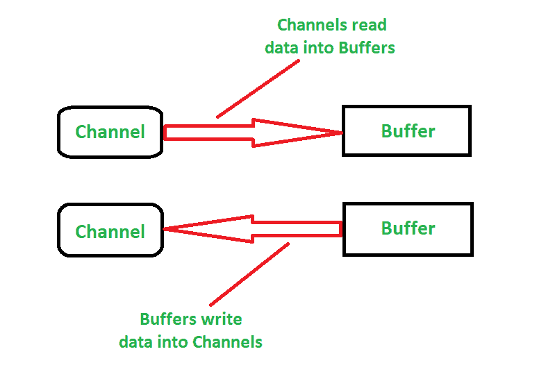
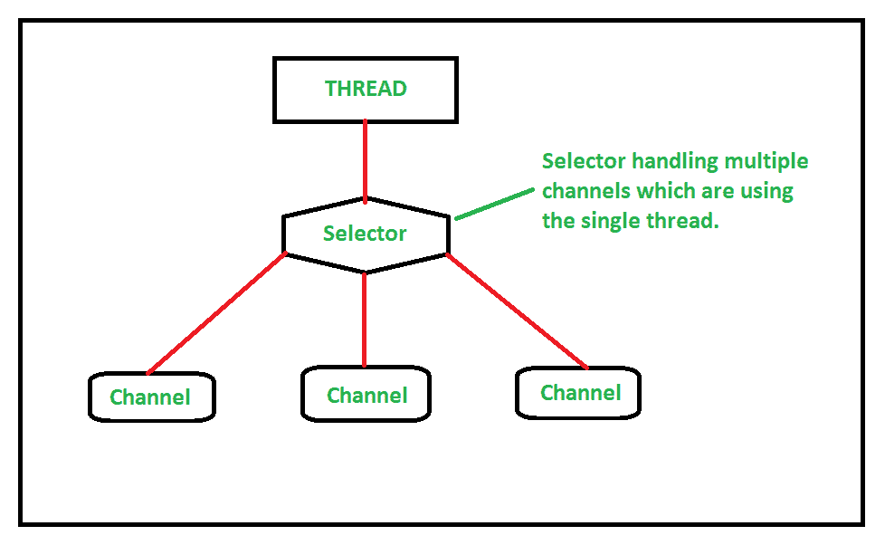

# Java NIO 介绍及示例

> 原文: [https://www.geeksforgeeks.org/introduction-to-java-nio-with-examples/](https://www.geeksforgeeks.org/introduction-to-java-nio-with-examples/)

[Java IO](https://www.geeksforgeeks.org/java-io-packag/) (输入/输出)用于执行读写操作。`java.io` 包包含输入输出操作所需的所有类。而 Java NIO(新 IO)是从 JDK 4 引入的，用于实现高速 IO 操作。它是标准输入输出应用编程接口的替代品。

在本文中，我们将更多地了解 Java NIO。

## Java NIO(New Input/Output)

Java NIO 是一个高性能的网络和文件处理 API 和结构，作为 Java 的替代 IO API。它是从 JDK 引进的。Java NIO 作为继标准 Java IO 之后的第二个 I/O 系统，增加了一些高级特性。它提供了与标准输入输出不同的输入输出工作方式。像包含 Java 输入和输出操作所需的所有类的 `java.io` 包一样，[`java.nio` 包](https://www.geeksforgeeks.org/tag/java-nio-package/) 定义了在整个 NIO APIs 中使用的缓冲类。我们使用 Java NIO 主要有以下两个原因:

1.  **非阻塞 IO 操作:** Java NIO 执行非阻塞 IO 操作。这意味着它会读取准备好的数据。例如，一个线程可以请求一个通道从一个缓冲区中读取数据，并且该线程可以在这段时间内进行其他工作，并从它离开的前一点继续。同时，读取操作完成，这提高了整体效率。
2.  **面向缓冲区的方法:** Java NIO 的面向缓冲区的方法允许我们根据需要在缓冲区中来回移动。数据被读入缓冲区并缓存在那里。无论何时需要数据，都会从缓冲区中进一步处理。

## Java NIO 包的主要工作

Java NIO 包的主要工作是基于一些核心组件。它们是:

1.  **缓冲区:** 缓冲区在此包中可用于[原始数据类型](https://www.geeksforgeeks.org/data-types-in-java/)。Java NIO 是一个面向缓冲区的包。这意味着数据可以被写入缓冲器/从缓冲器读取，该缓冲器使用通道进一步处理。这里，缓冲区充当数据的容器，因为它保存原始数据类型，并提供其他 NIO 包的概述。这些缓冲区可以被填充、排空、翻转、倒带等。
2.  **通道:** 通道是新的原始 I/O [抽象](https://www.geeksforgeeks.org/abstraction-in-java-2/)。通道有点像用于与外界通信的流。从通道，我们可以将数据读入缓冲区或从缓冲区写入。Java NIO 执行非阻塞 IO 操作，而通道可用于这些 IO 操作。与不同实体的连接由各种通道表示，这些通道能够执行非阻塞 I/O 操作。通道充当媒介或网关。下图说明了通道和缓冲区的交互：

3.  **选择器:** 选择器可用于非阻塞 I/O 操作。选择器是一个监视多个通道以获取事件的对象。由于 Java NIO 执行非阻塞 IO 操作，选择器和具有可选择通道的选择键定义了多路复用 IO 操作。所以，简单地说，我们可以说选择器用于选择准备进行 I/O 操作的通道。下图说明了选择器处理通道的方式：

Java NIO 提供了一种新的基于通道、缓冲区和选择器的 I/O 模型。因此，这些模块被认为是应用编程接口的核心。下表说明了用于 nio 系统的 `java.nio` 包的列表以及使用它们的原因:

| 包 | 目的 |
| --- | --- |
| [`java.nio` 包](https://www.geeksforgeeks.org/tag/java-nio-package/) | 它提供了其他 NIO 包的概述。不同类型的缓冲区由这个 NIO 系统封装，在整个 NIO 应用编程接口中使用。 |
| `java.nio.channels` 包 | 它支持通道和选择器，这些通道和选择器代表到实体的连接，这些实体本质上是打开输入/输出连接的，并选择准备输入/输出的通道 |
| `java.nio.channels.spi` 包 | 它支持 `java.nio.channel` 包的服务提供程序类。 |
| [`java.nio.file` 包](https://www.geeksforgeeks.org/tag/java-nio-file-package/) | 它为文件提供支持。 |
| `java.nio.file.spi` 包 | 它支持 `java.nio.file` 包的服务提供程序类。 |
| `java.nio.file.attribute` 包 | 它提供对文件属性的支持。 |
| [`java.nio.charset` 包](https://www.geeksforgeeks.org/tag/java-nio-charset-package/) | 它定义字符集，并为新算法提供编码和解码操作。 |
| `java.nio.charset.spi` 包 | 它支持 `java.nio.charset` 包的服务提供程序类。 |

## 为什么是 Java.nio.File，而 Java.io.File 已经存在了？

当 `java.io.File` 已经存在的情况下，为什么还要迁移到 `java.nio.File`，这是一个很常见的问题。旧的 `java.io.File` 中缺少了一些东西，这导致了新的 `java.nio.File` 的使用。以下是旧包中缺少的一些东西以及使用新包的原因:

1.  旧模块为符号链接提供了有限的支持。
2.  旧模块对文件属性和性能问题的支持有限。
3.  旧模块不能在所有平台上一致工作。
4.  文件复制、移动等基本操作缺少旧模块。

参考本文[了解 Java-IO 和 Java-NIO](https://www.geeksforgeeks.org/difference-between-java-io-and-java-nio/) 的区别