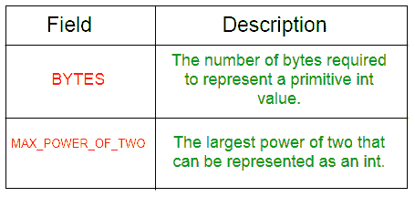
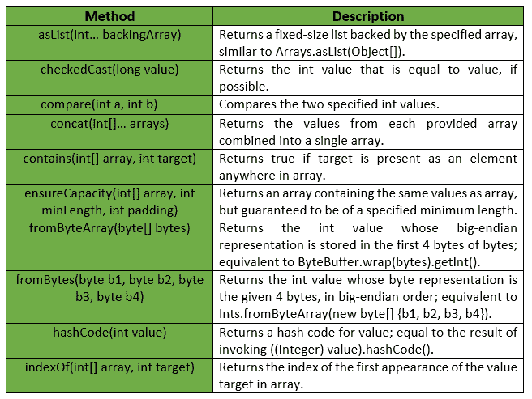
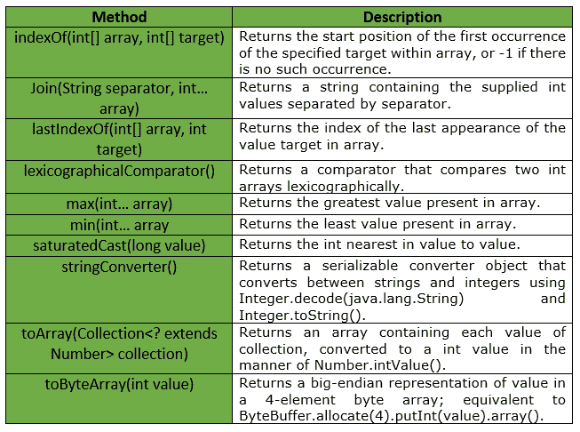

# Guava Ints 类

> 原文: [https://www.geeksforgeeks.org/ints-class-guava-java/](https://www.geeksforgeeks.org/ints-class-guava-java/)

`Ints` 是一个用于图元类型 `int` 的实用程序类。它提供了与 `int` 原语相关的静态实用方法，这些方法在 `Integer` 或 `Arrays` 中都找不到。

## 声明

```java
@GwtCompatible(emulated=true)
public final class Ints
extends Object 
```

## 字段摘要

下表显示了番石榴 `Ints` 类的字段摘要:


## 方法摘要

`Ints` 类提供的一些方法有:


## 异常

*   `check cast`: 如果值大于 `Integer.MAX_VALUE` 或小于 `Integer.MIN_VALUE`，则抛出 `IllegalArgumentException`。
*   `min`: 若数组为空，则抛出 `IllegalArgumentException`。
*   `max`: 如果数组为空，则抛出 `IllegalArgumentException`。
*   `from bytearray`: 如果字节少于 4 个元素，则抛出 `IllegalArgumentException`。
*   `ensure capacity`: 如果最小长度或填充值为负，则抛出异常。
*   `to array`: 如果集合或其任何元素为 `null`，则抛出 `NullPointerException`。

下表显示了番石榴 `Ints` 类提供的一些其他方法:


## 示例

下面给出了一些示例，显示了番石榴 `Ints` 类的方法的实现:

### 示例 1

```java
// Java code to show implementation
// of Guava Ints.asList() method

import com.google.common.primitives.Ints;
import java.util.*;

class GFG {
    // Driver method
    public static void main(String[] args)
    {
        int arr[] = { 5, 10, 15, 20, 25 };

        // Using Ints.asList() method which wraps
        // the primitive integer array as List of
        // integer Type
        List<Integer> myList = Ints.asList(arr);

        // Displaying the elements
        System.out.println(myList);
    }
}
```

**输出:**

```java
[5, 10, 15, 20, 25] 
```

### 示例 2

```java
// Java code to show implementation
// of Guava Ints.toArray() method

import com.google.common.primitives.Ints;
import java.util.*;

class GFG {
    // Driver method
    public static void main(String[] args)
    {
        List<Integer> myList = Arrays.asList(5, 10, 15, 20, 25);

        // Using Ints.toArray() method which
        // converts a List of Integer to an
        // array of int
        int[] arr = Ints.toArray(myList);

        // Displaying the elements
        System.out.println(Arrays.toString(arr));
    }
}
```

**输出:**

```java
[5, 10, 15, 20, 25] 
```

### 示例 3

```java
// Java code to show implementation
// of Guava Ints.concat() method

import com.google.common.primitives.Ints;
import java.util.*;

class GFG {
    // Driver method
    public static void main(String[] args)
    {
        int[] arr1 = { 5, 10, 15 };
        int[] arr2 = { 20, 25 };

        // Using Ints.concat() method which
        // combines arrays from specified
        // arrays into a single array
        int[] arr = Ints.concat(arr1, arr2);

        // Displaying the elements
        System.out.println(Arrays.toString(arr));
    }
}
```

**输出:**

```java
[5, 10, 15, 20, 25] 
```

### 示例 4

```java
// Java code to show implementation
// of Guava Ints.contains() method

import com.google.common.primitives.Ints;

class GFG {
    // Driver method
    public static void main(String[] args)
    {
        int[] arr = { 5, 10, 15, 20 };

        // Using Ints.contains() method which
        // checks if element is present in array
        // or not
        System.out.println(Ints.contains(arr, 10));
        System.out.println(Ints.contains(arr, 17));
    }
}
```

**输出:**

```java
true
false 
```

### 示例 5

```java
// Java code to show implementation
// of Guava Ints.min() method

import com.google.common.primitives.Ints;

class GFG {
    // Driver method
    public static void main(String[] args)
    {
        int[] arr = { 5, 10, 15, 20 };

        // Using Ints.min() method
        System.out.println(Ints.min(arr));
    }
}
```

**输出:**

```java

```

### 示例 6

```java
// Java code to show implementation
// of Guava Ints.max() method

import com.google.common.primitives.Ints;

class GFG {
    // Driver method
    public static void main(String[] args)
    {
        int[] arr = { 5, 10, 15, 20 };

        // Using Ints.max() method
        System.out.println(Ints.max(arr));
    }
}
```

**输出:**

```java

```