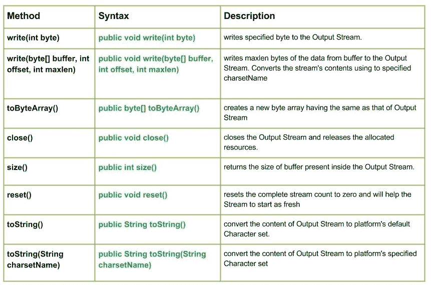

# Java 中的 `ByteArrayOutputStream` 类

> 哎哎哎:# t0]https://www . geeksforgeeks . org/io-bytearray output stream-class-Java/

[](https://media.geeksforgeeks.org/wp-content/uploads/io.ByteArrayOutputStream-Class-in-Java.jpg)

`java.io.ByteArrayOutputStream` 类创建一个输出流，用于将数据写入字节数组。当数据写入缓冲区时，缓冲区的大小会自动增长。关闭字节数组输出流对其方法的工作没有影响。他们甚至可以在关闭课程后被调用。因此，没有方法抛出 IO 异常。

## 声明

```java
public class ByteArrayOutputStream
   extends OutputStream
```

## 字段

*   受保护的 `byte[] buf` – 存储数据的缓冲区。
*   受保护的 `int count` – 缓冲区中有效字节的数量。

## 构造方法

*   `ByteArrayOutputStream()`: 创建一个新的 `ByteArrayOutputStream` 来写入字节。
*   `ByteArrayOutputStream(int bufferSize)`: 用指定的 `bufferSize` 创建一个新的 `ByteArrayOutputStream` 来写入字节。

## 方法

### `write(int byte)`

`java.io.ByteArrayOutputStream.write(int byte)` 将指定的字节写入输出流。

**语法:**

```java
public void write(int byte)
Parameters : 
byte : byte to be written
Return :                                               
void
```

### `write(byte[] buffer, int offset, int maxlen)`

`java.io.ByteArrayOutputStream.write(byte[] buffer, int offset, int maxlen)` 从缓冲区向输出流写入 `maxlen` 字节的数据。它使用指定的**字符集名称**(十六位 Unicode 代码单元序列和字节序列之间的命名映射)转换流的内容。

**语法:**

```java
public void write(byte[] buffer, int offset, int maxlen)
Parameters : 
buffer : data of the buffer
offset : starting in the destination array - 'buffer'.
maxlen : maximum length of array to be read
Return :                                               
void
```

### `toByteArray()`

`java.io.ByteArrayOutputStream.toByteArray()` 创建一个与输出流内容相同的新字节数组。

**语法:**

```java
public byte[] toByteArray()
Parameters : 
----------
Return :                                               
new byte array having the same as that of Output Stream
```

**Java 程序解释 `write(byte[] buffer, int offset, int maxlen)` 和 `toByteArray()` 方法的使用:**

```java
// Java program illustrating the working of ByteArrayOutputStream
// write(byte[] buffer, int offset, int maxlen), toByteArray()

import java.io.*;
public class NewClass
{
    public static void main(String[] args) throws IOException
    {
        ByteArrayOutputStream geek_output = new ByteArrayOutputStream();

        byte[] buffer = {'J', 'A', 'V', 'A'};

        // Use of write(byte[] buffer, int offset, int maxlen)
        geek_output.write(buffer, 0, 4);
        System.out.print("Use of write(buffer, offset, maxlen) by toByteArray() : ");

        // Use of toByteArray() :
        for (byte b: geek_output.toByteArray())
        {
            System.out.print(" " + b);
        }
    }
}
```

**输出:**

```java
Use of write(buffer, offset, maxlen) by toByteArray() :  74 65 86 65
```

### `close()`

`java.io.ByteArrayOutputStream.close()` 关闭输出流并释放分配的资源。

**语法:**

```java
public void close()
Parameters : 
--------------
Return :                                               
void
```

### `size()`

`java.io.ByteArrayOutputStream.size()` 返回输出流内存在的缓冲区大小。

**语法:**

```java
public int size()
Parameters : 
--------------
Return :                                               
size of buffer present inside the Output Stream.
```

### `reset()`

`java.io.ByteArrayOutputStream.reset()` 将完整的流计数重置为零，并将帮助流重新开始。

**语法:**

```java
public void reset()
Parameters : 
--------------
Return :                                               
void.
```

### `toString()`

`java.io.ByteArrayOutputStream.toString()` 将输出流的内容转换为平台的默认字符集。

**语法:**

```java
public String toString()
Parameters : 
--------------
Return :                                               
the content of Output Stream by converting it to platform's default Character set
```

### `toString(String charsetName)`

`java.io.ByteArrayOutputStream.toString(String charsetName)` 将输出流的内容转换为平台的指定字符集。

**语法:**

```java
public String toString(String charsetName)
Parameters : 
--------------
Return :                                               
the content of Output Stream by converting it to platform's default Character set
```

**演示使用 `ByteArrayOutputStream` 类方法的 Java 程序:**

```java
// Java program illustrating the working of ByteArrayOutputStream
// write(), size(), toString(String charsetName),
// close(), toString(), reset()

import java.io.*;
public class NewClass
{
    public static void main(String[] args) throws IOException
    {
        ByteArrayOutputStream geek_output = new ByteArrayOutputStream();

        byte[] buffer = {'J', 'A', 'V', 'A'};

        for (byte a : buffer)
        {
            // Use of write(int byte) :
            geek_output.write(a);
        }

        // Use of size() :
        int size = geek_output.size();
        System.out.println("Use of size() : " + size);

        // Use of reset() :
        System.out.println("Use of reset()");

        // Use of toString() :
        String geek = geek_output.toString();
        System.out.println("Use of toString() : "+ geek);

        // Use of toString(String charsetName)
        String geek1 = geek_output.toString("UTF-8");
        System.out.println("Use of toString(String charsetName) : "+ geek1);

        // Closing the stream
        geek_output.close();

    }
}
```

**输出:**

```java
Use of size() : 4
Use of reset()
Use of toString() : JAVA
Use of toString(String charsetName) : JAVA
```

**下一篇:** [io。Java 中的 `ByteArrayInputStream` 类](https://www.geeksforgeeks.org/io-bytearrayinputstream-class-java/)
本文由 **Mohit Gupta 供稿🙂** 。如果你喜欢 GeeksforGeeks 并想投稿，你也可以使用 [contribute.geeksforgeeks.org](http://www.contribute.geeksforgeeks.org) 写一篇文章或者把你的文章邮寄到 contribute@geeksforgeeks.org。看到你的文章出现在极客博客主页上，帮助其他极客。

如果你发现任何不正确的地方，或者你想分享更多关于上面讨论的话题的信息，请写评论。