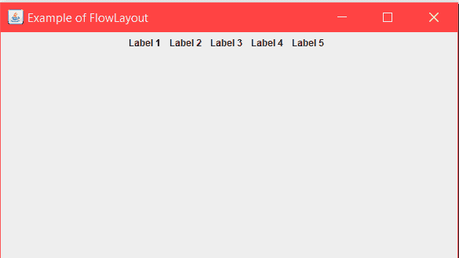
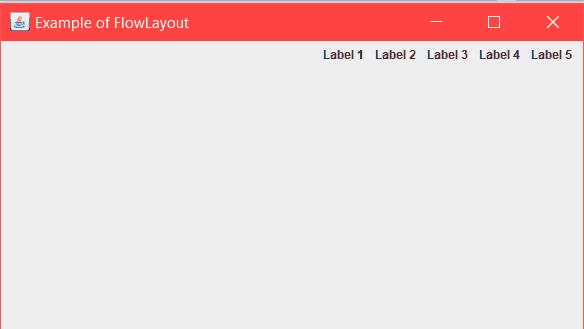

# Java AWT FlowLayout

> 哎哎哎:# t0]https://www . geeksforgeeks . org/Java-awt-flow layout/

FlowLayout 用于按顺序一个接一个地排列组件。小程序和面板的默认布局是 `FlowLayout`。

## 构造方法

1.  `FlowLayout()`: 将构建一个居中对齐的新 `FlowLayout`。水平和垂直间隙将为 5 像素。
2.  `FlowLayout(int align)`: 它将以给定的对齐方式构建一个新的 `FlowLayout`。水平和垂直间隙将为 5 像素。
3.  `FlowLayout(int align, int HorizontalGap, int VerticalGap)`: 它将构建一个新的 `FlowLayout`，给定组件之间的对齐、给定水平和垂直间隙。
4.  `JLabel(String text)`: 它将用指定的文本创建一个 `JLabel` 实例。

## 常用方法

1.  `setTitle(String text)`: 此方法用于设置 `JFrame` 的标题。您要设置的标题作为字符串传递。
2.  `getAlignment()`: 返回此布局的对齐方式。
3.  `setAlignment(int align)`: 用于设置该布局的对齐方式。
4.  `removeLayoutComponent(Component comp)`: 用于从布局中移除作为参数传递的组件。

下面的程序将说明 Java 中的 `FlowLayout` 示例。

## Program 1

以下程序通过在一个名为 `Example` 的 `JFrame` 实例类中排列几个 `JLabel` 组件来说明 `FlowLayout` 的用法。我们创建 5 个名为 `l1`、`l2`... `l5` 的 `JLabel` 组件，然后通过 `this.add()` 方法将它们添加到 `JFrame` 中。我们通过 `setTitle` 和 `setBounds` 方法设置框架的标题和边界。
布局由 `setLayout()` 方法设置。

```java
// Java program to show Example of FlowLayout.
// in java. Importing different Package.
import java.awt.*;
import java.awt.event.*;
import javax.swing.*;

class Example extends JFrame {
    // Declaration of objects of JLabel class.
    JLabel l1, l2, l3, l4, l5;

    // Constructor of Example class.
    public Example() {
        // Creating Object of "FlowLayout" class
        FlowLayout layout = new FlowLayout();

        // this Keyword refers to current object.
        // Function to set Layout of JFrame.
        this.setLayout(layout);

        // Initialization of object "l1" of JLabel class.
        l1 = new JLabel("Label 1  ");

        // Initialization of object "l2" of JLabel class.
        l2 = new JLabel("Label 2  ");

        // Initialization of object "l3" of JLabel class.
        l3 = new JLabel("Label 3  ");

        // Initialization of object "l4" of JLabel class.
        l4 = new JLabel("Label 4  ");

        // Initialization of object "l5" of JLabel class.
        l5 = new JLabel("Label 5  ");

        // this Keyword refers to current object.
        // Adding Jlabel "l1" on JFrame.
        this.add(l1);

        // Adding Jlabel "l2" on JFrame.
        this.add(l2);

        // Adding Jlabel "l3" on JFrame.
        this.add(l3);

        // Adding Jlabel "l4" on JFrame.
        this.add(l4);

        // Adding Jlabel "l5" on JFrame.
        this.add(l5);
    }
}

class MainFrame {
    // Driver code
    public static void main(String[] args) {
        // Creating Object of Example class.
        Example f = new Example();

        // Function to set title of JFrame.
        f.setTitle("Example of FlowLayout");

        // Function to set Bounds of JFrame.
        f.setBounds(200, 100, 600, 400);

        // Function to set visible status of JFrame.
        f.setVisible(true);
    }
}
```

**输出**:


通过使用这些 `FlowLayout` 字段，我们可以控制 `FlowLayout` 排列中组件的对齐。
1) `FlowLayout.RIGHT`: 每排组件向右移动。
2) `FlowLayout.LEFT`: 每行部件向左移动。

## Program 2

以下程序通过在 `FlowLayout` 的构造函数中传递参数 `FlowLayout.RIGHT` 来说明使用右对齐的 `FlowLayout`。我们创建 5 个名为 `l1`、`l2`... `l5` 的 `JLabel` 组件，然后通过 `this.add()` 方法将它们添加到 `JFrame` 中。我们通过 `setTitle` 和 `setBounds` 方法设置框架的标题和边界。
布局由 `setLayout()` 方法设置。

```java
// Java program to show example of
// FlowLayout and using RIGHT alignment
import java.awt.*;
import java.awt.event.*;
import javax.swing.*;

class Example extends JFrame {
    // Declaration of objects of JLabel class.
    JLabel l1, l2, l3, l4, l5;

    // Constructor of Example class.
    public Example() {
        // Creating Object of "FlowLayout" class, passing
        // RIGHT alignment through constructor.
        FlowLayout layout = new FlowLayout(FlowLayout.RIGHT);

        // this Keyword refers to current object.
        // Function to set Layout of JFrame.
        this.setLayout(layout);

        // Initialization of object "l1" of JLabel class.
        l1 = new JLabel("Label 1  ");

        // Initialization of object "l2" of JLabel class.
        l2 = new JLabel("Label 2  ");

        // Initialization of object "l3" of JLabel class.
        l3 = new JLabel("Label 3  ");

        // Initialization of object "l4" of JLabel class.
        l4 = new JLabel("Label 4  ");

        // Initialization of object "l5" of JLabel class.
        l5 = new JLabel("Label 5  ");

        // this Keyword refers to current object.
        // Adding Jlabel "l1" on JFrame.
        this.add(l1);

        // Adding Jlabel "l2" on JFrame.
        this.add(l2);

        // Adding Jlabel "l3" on JFrame.
        this.add(l3);

        // Adding Jlabel "l4" on JFrame.
        this.add(l4);

        // Adding Jlabel "l5" on JFrame.
        this.add(l5);
    }
}

class MainFrame {
    // Driver code
    public static void main(String[] args) {
        // Creating Object of Example class.
        Example f = new Example();

        // Function to set title of JFrame.
        f.setTitle("Example of FlowLayout");

        // Function to set Bounds of JFrame.
        f.setBounds(200, 100, 600, 400);

        // Function to set visible status of JFrame.
        f.setVisible(true);
    }
}
```

**输出**:


**参考**: [https://www.geeksforgeeks.org/message-dialogs-java-gui/](https://www.geeksforgeeks.org/message-dialogs-java-gui/)