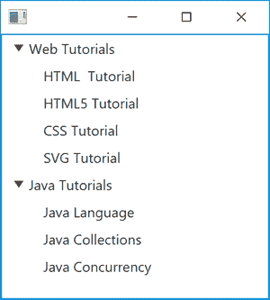

# Java 图形用户界面编程——基于 JavaFX 的树形视图的实现

> 原文：[https://www.geeksforgeeks.org/java-gui-programming-implementation-of-javafx-based-treeview/](https://www.geeksforgeeks.org/java-gui-programming-implementation-of-javafx-based-treeview/)

`TreeView` 是最重要的控件之一，它使用 JavaFX 在基于 GUI 的 Java 编程中以树状格式实现数据的分层视图。“分层”意味着一些项目被放置为其他项目的从属项目，例如，树通常用于显示文件系统的内容，其中各个文件从属于它们所属的目录。`TreeView` 是使用树数据结构的 Java GUI 程序的简单概念实现。

树用单个根节点表示，表示树的起点，在根节点下连接一个或多个子节点，子节点有两种类型：
*   叶节点
*   分支节点

**叶节点**是没有子节点的节点，也称为终端节点，而分支节点是形成子树根节点的节点。从根节点到特定节点的节点序列称为路径。

`TreeView` 最有用的特性是，只要树的大小超过视图的维度，它就会自动提供滚动条。

## 如何使用 JavaFX 类实现 TreeView

### 1. 导入必要的库

我们调用必要的库来激活 JavaFX 控件，并收集所有资源来使用 `TreeView`，如下所示：

```java
import javafx.application.Application;
import javafx.scene.Scene;
import javafx.scene.control.TreeItem;
import javafx.scene.control.TreeView;
import javafx.scene.layout.VBox;
import javafx.stage.Stage;
```

### 2. 创建树形视图

首先，我们通过调用 `TreeView` 类的新实例来创建一个 `TreeView` 对象，下面演示的示例显示了如何为 `TreeView` 类设置对象的示例：

```java
TreeView tV = new TreeView();
```

### 3. 将树形视图添加到场景图中

我们的下一个任务是将 `TreeView` 添加到 JavaFX 场景图中，以便可以看到它，下面的代码片段用于强制执行此操作：

```java
public void start(Stage primaryStage) {
    TreeView tV = new TreeView();
    VBox vb = new VBox(tV);
    Scene s = new Scene(vb);
    primaryStage.setScene(s);
    primaryStage.show();
}
```

### 4. 将树项目附加到树视图

将由 JavaFX 树视图显示的项目由 `TreeItem` 类 (`javafx.scene.control.TreeItem`) 表示。

```java
TreeItem rootItem = new TreeItem("Tutorials");
TreeItem webItem = new TreeItem("Web Tutorials");
webItem.getChildren().add(new TreeItem("HTML Tutorial"));
webItem.getChildren().add(new TreeItem("HTML5 Tutorial"));
webItem.getChildren().add(new TreeItem("CSS Tutorial"));
webItem.getChildren().add(new TreeItem("SVG Tutorial"));
rootItem.getChildren().add(webItem);
TreeItem javaItem = new TreeItem("Java Tutorials");
javaItem.getChildren().add(new TreeItem("Java Language"));
javaItem.getChildren().add(new TreeItem("Java Collections"));
javaItem.getChildren().add(new TreeItem("Java Concurrency"));
rootItem.getChildren().add(javaItem);
TreeView tV = new TreeView();
tV.setRoot(rootItem);
```

### 5. 向树形视图添加子视图

在 `TreeView` 中，元素之间的父子关系以递归方式运行，即 `TreeItem` 可以有其他 `TreeItem` 实例作为子对象，我们使用方法 `getChildren()` 从 `javaItem` 中获取元素，并通过使用方法 `add()` 将其添加到 `TreeView` 中，如下面的代码片段所示：

```java
TreeItem javaItem = new TreeItem("Java Tutorials");
javaItem.getChildren().add(new TreeItem("Java Language"));
javaItem.getChildren().add(new TreeItem("Java Collections"));
javaItem.getChildren().add(new TreeItem("Java Concurrency"));
TreeItem rootItem = new TreeItem("Tutorials");
rootItem.getChildren().add(javaItem);
```

### 6. 隐藏树形视图的根项目

最后也是最重要的一步是隐藏根项目，即 JavaFX 树形视图的根节点。我们通过调用 `setShowRoot()` 方法来实现，该方法使用布尔参数 `false` 进行初始化。

```java
tV.setShowRoot(false);
```

## 完整 Java 代码示例

```java
// Java Program to implement javaFx based TreeView

// Importing all necessary libraries
import javafx.application.Application;
import javafx.scene.Scene;
import javafx.scene.control.TreeItem;
import javafx.scene.control.TreeView;
import javafx.scene.layout.VBox;
import javafx.stage.Stage;

// Main class
// This class is extending Application class
public class GFG extends Application {

    // Main driver method
    public static void main(String[] args) { launch(args); }

    // @Override
    public void start(Stage primaryStage) {
        // Initializing variable to TreeItem element
        // All arguments are custom entries
        TreeItem rootItem = new TreeItem("Tutorials");

        // Initializing variable for TreeItem variable
        TreeItem webItem = new TreeItem("Web Tutorials");

        // Adding labels for elements to TreeItem
        // Custom entries
        webItem.getChildren().add(new TreeItem("HTML Tutorial"));
        webItem.getChildren().add(new TreeItem("HTML5 Tutorial"));
        webItem.getChildren().add(new TreeItem("CSS Tutorial"));
        webItem.getChildren().add(new TreeItem("SVG Tutorial"));
        rootItem.getChildren().add(webItem);

        // Initializing new TreeItem
        TreeItem javaItem = new TreeItem("Java Tutorials");
        javaItem.getChildren().add(new TreeItem("Java Language"));
        javaItem.getChildren().add(new TreeItem("Java Collections"));
        javaItem.getChildren().add(new TreeItem("Java Concurrency"));
        rootItem.getChildren().add(javaItem);

        // Creating an object of TreeView class
        TreeView tV = new TreeView();
        tV.setRoot(rootItem);
        tV.setShowRoot(false);

        // Creating an object of VBox class
        VBox vb = new VBox(tV);

        // Creating an object of Scene class
        Scene s = new Scene(vb);

        // Now, setting the scene for primaryStage
        primaryStage.setScene(s);

        // Finally, display all the elements
        // using show() method
        primaryStage.show();
    }
}
```

**输出：**



> **注意：** 上图中输入的元素仅作为示例展示，您可以根据情境在 `TreeView` 中标记项目。