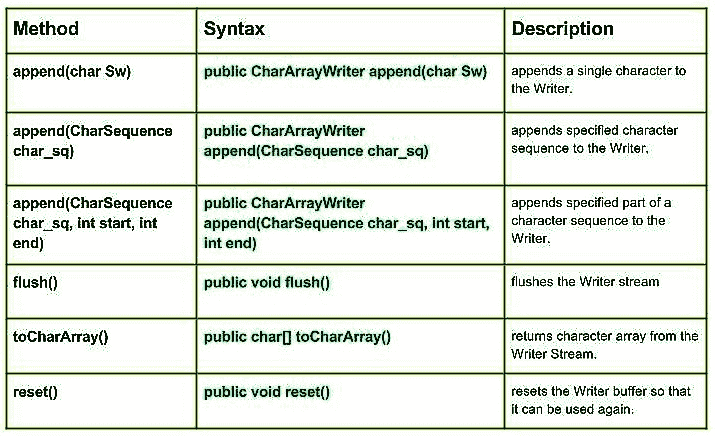

# Java 中的 Java.io.CharArrayWriter 类| Set 2

> 原文: [https://www.geeksforgeeks.org/java-io-chararraywriter-class-java-set-2/](https://www.geeksforgeeks.org/java-io-chararraywriter-class-java-set-2/)

[Java 中的 CharArrayWriter 类| Set 1](https://www.geeksforgeeks.org/java-io-chararraywriter-class-java-set-1/)

[](https://media.geeksforgeeks.org/wp-content/uploads/CharArrayWriter-class-in-Java-Set-2.jpg)

## 方法

*   **`append(char Sw)`**: `java.io.CharArrayWriter.append(char Sw)` 向 Writer 追加一个字符。
    **语法:**
    ```java
    public CharArrayWriter append(char Sw)
    Parameters : 
    Sw : character to be append
    Return  :
    CharArrayWriter
    ```

*   **`append(CharSequence char_sq)`**: `java.io.CharArrayWriter.append(CharSequence char_sq)` 向 Writer 追加指定的字符序列。
    **语法:**
    ```java
    public CharArrayWriter append(CharSequence char_sq)
    Parameters : 
    char_sq : Character sequence to append. 
    Return  :
    CharArrayWriter, if char sequence is null, then NULL appends to the Writer. 
    ```

*   **`append(CharSequence char_sq, int start, int end)`**: `java.io.CharArrayWriter.append(CharSequence char_sq, int start, int end)` 将字符序列的指定部分追加到 Writer。
    **语法:**
    ```java
    public CharArrayWriter append(CharSequence char_sq, int start, int end)
    Parameters : 
    char_sq : Character sequence to append.
    start : start of character in the Char Sequence
    end : end of character in the Char Sequence
    Return  :
    void
    ```

*   **`flush()`**: `java.io.CharArrayWriter.flush()` 刷新编写器流。
    **语法:**
    ```java
    public void flush()
    Parameters : 
    -----
    Return  :
    void
    ```

*   **`toCharArray()`**: `java.io.CharArrayWriter.toCharArray()` 从 Writer Stream 返回字符数组。
    **语法:**
    ```java
    public char[] toCharArray()
    Parameters : 
    -----
    Return  :
    void
    ```

*   **`reset()`**: `java.io.CharArrayWriter.reset()` 重置 Writer 缓冲区，以便可以再次使用。
    **语法:**
    ```java
    public void reset()
    Parameters : 
    -----
    Return  :
    void
    ```

## 演示 CharArrayWriter 类方法使用的 Java 程序

```java
// Java program illustrating the working of CharArrayWriter class methods
// append(CharSequence char_sq), append(char Sw)
// append(CharSequence char_sq, int start,int end)
// flush(), reset(), toCharArray

import java.io.*;

public class NewClass
{
    public static void main(String[] args) throws IOException
    {
        // Initializing String Witer
        CharArrayWriter geek_writer1 = new CharArrayWriter();
        CharArrayWriter geek_writer2 = new CharArrayWriter();
        CharArrayWriter geek_writer3 = new CharArrayWriter();

        char[] Sw = {'G','E','E','K','S'};

        for(char c: Sw)
        {
            // Use of append(char Sw) :
            geek_writer1.append(c);

            System.out.println("append(char Sw) :" + geek_writer1.toString());
        }

        // Using flush() method
        geek_writer1.flush();
        System.out.println("\nUsing flush() : "+ geek_writer1.toString());
        System.out.println("");

        // Initializing Character Sequence
        CharSequence char_sq1 = "1 Hello 1";
        CharSequence char_sq2 = " : 2 Geeks 2";

        // Use of append(CharSequence char_sq)
        geek_writer2.append(char_sq1);
        geek_writer2.append(char_sq2);

        System.out.println("append(char_sq) : " + geek_writer2.toString());

        // Use of append(CharSequence char_sq,int start,int end)
        geek_writer3.append(char_sq1, 0, 3);
        geek_writer3.append(char_sq2, 3, 6);

        System.out.println("append(char_sq,start,end) : " + geek_writer3.toString());
        System.out.println("");

        // Use of toCharArray() :
        char[] toChar1 = geek_writer1.toCharArray();
        for (char c1 : toChar1)
        {
            System.out.println("toCharArray : "+ c1);
        }

        geek_writer1.reset();
        System.out.println("\nReset is invoked");

        char[] toChar2 = geek_writer1.toCharArray();
        for (char c2 : toChar2)
        {
            System.out.println("toCharArray : "+ c2);
        }

        System.out.println("\ntoCharArray not working as reset is invoked");
    }
}
```

## 输出

```java
append(char Sw) :G
append(char Sw) :GE
append(char Sw) :GEE
append(char Sw) :GEEK
append(char Sw) :GEEKS

Using flush() : GEEKS

append(char_sq) : 1 Hello 1 : 2 Geeks 2
append(char_sq,start,end) : 1 H2 G

toCharArray : G
toCharArray : E
toCharArray : E
toCharArray : K
toCharArray : S

Reset is invoked

toCharArray not working as reset is invoked
```

本文由 **莫希特·古普塔供稿🙂** 。如果你喜欢 GeeksforGeeks 并想投稿，你也可以使用 [contribute.geeksforgeeks.org](http://www.contribute.geeksforgeeks.org) 写一篇文章或者把你的文章邮寄到 contribute@geeksforgeeks.org。看到你的文章出现在极客博客主页上，帮助其他极客。

如果你发现任何不正确的地方，或者你想分享更多关于上面讨论的话题的信息，请写评论。