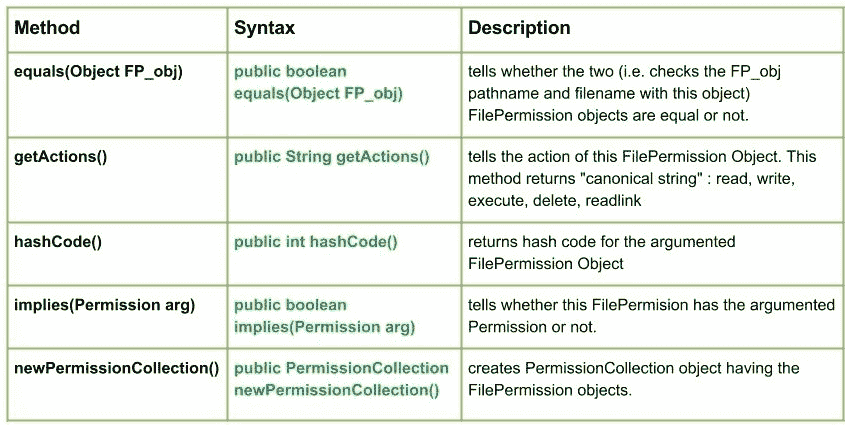

# Java 中的 Java.io.FilePermission 类

> 原文: [https://www.geeksforgeeks.org/java-io-filepermission-class-java/](https://www.geeksforgeeks.org/java-io-filepermission-class-java/)

[](https://media.geeksforgeeks.org/wp-content/uploads/io.FilePermission-Class-in-Java.jpg)

## 类介绍

`java.io.FilePermission` 类用于表示对文件或目录的访问。这些访问是以路径名和与路径名相关联的一组操作的形式进行的（指定打开哪个文件以及扩展名和路径）。

例如在 `FilePermission("GEEKS.txt", "read")` 中，`"GEEKS.txt"` 是路径，`"read"` 是正在执行的动作。

这些行动如下：

*   **读取:** 对文件的读取权限
*   **写入:** 对文件的写入权限
*   **删除:** 通过调用 `File.delete` 删除对文件的权限
*   **读取链接:** 读取链接权限
*   **执行:** 执行了权限

## 声明

```java
public final class FilePermission
   extends Permission
      implements Serializable
```

## 构造函数

```java
FilePermission(String p, String a) : Creates a new file permission object with "a" action.
```

## FilePermission 类的方法

### equals

`java.io.FilePermission.equals(Object FP_obj)` 告诉我们两个 `FilePermission` 对象（即检查 `FP_obj` 的路径名和文件名与此对象）是否相等。

**语法:**

```java
public boolean equals(Object FP_obj)
```

**参数:**
*   `FP_obj` : 要与此对象验证的 `FilePermission` 对象

**返回值:**
*   `true` : 如果两个对象相等
*   `false` : 否则

**异常:**
*   ----------

**实现:**

```java
// Java Program illustrating equals() method
import java.io.*;
public class NewClass
{
    public static void main(String[] args) throws IOException
    {
        boolean bool = false;

        // Creating new FilePermissions("Path", "action")
        FilePermission FP_obj1 = new FilePermission("GEEKS", "read");
        FilePermission FP_obj2 = new FilePermission("ABC", "write");
        FilePermission FP_obj3 = new FilePermission("GEEKS", "read");

        // Use of equals method
        bool = FP_obj2.equals(FP_obj1);
        System.out.println("Whether FP_obj1 equals FP_obj2 : " + bool);

        bool = FP_obj2.equals(FP_obj3);
        System.out.println("Whether FP_obj2 equals FP_obj2 : " + bool);

        bool = FP_obj1.equals(FP_obj3);
        System.out.println("Whether FP_obj3 equals FP_obj1 : " + bool);
    }
}
```

**输出:**

```
Whether FP_obj1 equals FP_obj2 : false
Whether FP_obj2 equals FP_obj2 : false
Whether FP_obj3 equals FP_obj1 : true
```

### getActions

`java.io.FilePermission.getActions()` 告诉我们此 `FilePermission` 对象的操作。如果对象有两个操作，例如 `delete` 和 `read`，则该方法将返回 `"read, delete"`。

在这种情况下，此方法返回 **规范字符串**：`read, write, execute, delete, readlink`。

**语法:**

```java
public String getActions()
```

**参数:**
*   ----------

**返回值:**
*   表示与对象关联的操作的规范字符串。

**异常:**
*   ----------

**实现:**

```java
// Java Program illustrating getActions() method
import java.io.*;
public class NewClass
{
    public static void main(String[] args) throws IOException
    {
        // Creating new FilePermissions
        FilePermission FP_obj1 = new FilePermission("GEEKS", "read, delete, write");
        FilePermission FP_obj2 = new FilePermission("ABC", "write, read, execute");
        FilePermission FP_obj3 = new FilePermission("GEEKS", "delete, readlink, read");

        // Use of getActions() method
        String str = FP_obj1.getActions();
        System.out.println("Actions with FP_obj1 : " + str);

        str = FP_obj2.getActions();
        System.out.println("Actions with FP_obj2 : " + str);

        str = FP_obj3.getActions();
        System.out.println("Actions with FP_obj3 : " + str);
    }
}
```

**输出:**

```
Actions with FP_obj1 : read,write,delete
Actions with FP_obj2 : read,write,execute
Actions with FP_obj3 : read,delete,readlink
```

### hashCode

`java.io.FilePermission.hashCode()` 返回参数化 `FilePermission` 对象的哈希码。

**语法:**

```java
public int hashCode()
```

**参数:**
*   --------

**返回值:**
*   参数化对象的哈希码值

**异常:**
*   ----------

**实现:**

```java
// Java Program illustrating hashCode() method
import java.io.*;
public class NewClass
{
    public static void main(String[] args) throws IOException
    {
        // Creating new FilePermissions
        FilePermission FP_obj1=new FilePermission("GEEKS", "read, delete, write");

        // Use of hashCode() method
        int i = FP_obj1.hashCode();
        System.out.println("hashCode value for FP_obj1 : " + i);
    }
}
```

**输出:**

```
hashCode value for FP_obj1 : 0
```

### implies

`java.io.FilePermission.implies(Permission arg)` 告诉我们此 `FilePermission` 是否具有参数化的权限。

**语法:**

```java
public boolean implies(Permission arg)
```

**参数:**
*   `arg` : 要检查的权限

**返回值:**
*   `true` : 如果 `FilePermission` 对象具有参数化的权限
*   `false` : 否则

**异常:**
*   ----------

**实现:**

```java
// Java Program illustrating implies() method
import java.io.*;
public class NewClass
{
    public static void main(String[] args) throws IOException
    {
        // Creating new FilePermissions
        FilePermission FP_obj1 = new FilePermission("GEEKS", "read");
        FilePermission FP_obj2 = new FilePermission("ABC", "write");
        FilePermission FP_obj3 = new FilePermission("GEEKS", "delete");

        // Use of implies() method
        boolean check = FP_obj1.implies(FP_obj2);
        System.out.println("Using implies() for FP_obj1 : " + check);

        // Checked here with the same FilePermission object
        check = FP_obj2.implies(FP_obj2);
        System.out.println("Using implies() for FP_obj2 : " + check);
    }
}
```

**输出:**

```
Using implies() for FP_obj1 : false
Using implies() for FP_obj2 : true
```

### newPermissionCollection

`java.io.FilePermission.newPermissionCollection()` 创建包含 `FilePermission` 对象的 `PermissionCollection` 对象。

**语法:**

```java
public PermissionCollection newPermissionCollection()
```

**参数:**
*   `arg` : 要检查的权限

**返回值:**
*   包含 `FilePermission` 对象的新 `PermissionCollection` 对象。

**异常:**
*   ----------

**实现:**

```java
// Java Program illustrating newPermissionCollection() method
import java.io.*;
import java.security.PermissionCollection;
public class NewClass
{
    public static void main(String[] args) throws IOException
    {
        // Creating new FilePermissions
        FilePermission FP_obj1 = new FilePermission("GEEKS.txt", "read");

        // Creating new PermissionCollection
        // Use of newPermissionCollection()
        PermissionCollection FP = FP_obj1.newPermissionCollection();

        // Collecting the Permissions of FP_obj1 for FP
        FP.add(FP_obj1);

        boolean check = FP.implies(new FilePermission("GEEKS.txt", "read"));
        System.out.println("Is newPermissionCollection() working : " + check);
    }
}
```

**输出:**

```
Is newPermissionCollection() working : true
```

本文由 **莫希特·古普塔供稿🙂** 。如果你喜欢 GeeksforGeeks 并想投稿，你也可以使用 [contribute.geeksforgeeks.org](http://www.contribute.geeksforgeeks.org) 写一篇文章或者把你的文章邮寄到 `contribute@geeksforgeeks.org`。看到你的文章出现在极客博客主页上，帮助其他极客。

如果你发现任何不正确的地方，或者你想分享更多关于上面讨论的话题的信息，请写评论。