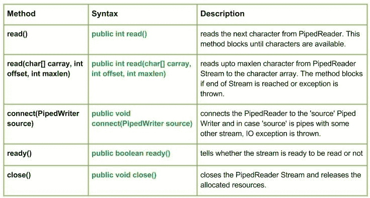

# Java 中的 `PipedReader` 类

> 原文：[https://www.geeksforgeeks.org/java-io-pipedreader-class-java/](https://www.geeksforgeeks.org/java-io-pipedreader-class-java/)

[](https://media.geeksforgeeks.org/wp-content/uploads/io.PipedReader-Class-in-Java.jpg)

这个类基本上是一个管道字符输入流。在输入/输出**管道**中，只是指同时在 JVM 中运行的两个线程之间的链接。因此，管道既可以用作源，也可以用作目标。
如果向连接的管道输出流提供数据字节的线程不再活动，则称管道断开。

## 声明 (Declaration)

```java
public class PipedReader extends Reader
```

## 构造方法 (Constructors)

*   `PipedReader()`: 创建一个没有连接的 `PipedReader`。
*   `PipedReader(int pSize)`: 创建一个 `PipedReader`，它没有与指定的管道尺寸连接。
*   `PipedReader(PipedWriter src)`: 创建一个 `PipedReader`，它连接到 `PipedWriter`——“`src`”。
*   `PipedReader(PipedWriter src, int pSize)`: 创建一个 `PipedReader`，该读取器连接到具有指定管道大小的 `PipedWriter`。

## 方法 (Methods)

### `read()`

`java.io.PipedReader.read()` 从 `PipedReader` 读取下一个字符。此方法会阻塞直到有字符可用。如果检测到流结束或抛出异常，则返回 -1。

**语法 (Syntax):**

```java
public int read()
```

**参数 (Parameters):**
无

**返回值 (Return):**
从 `PipedReader` 读取下一个字符。
否则，如果检测到流结束则返回 -1。

**异常 (Exception):**
*   `IOException`: 如果发生 I/O 错误。

**示例 (Implementation):**

```java
// Java program illustrating the working of read() method
import java.io.*;

public class NewClass {
    public static void main(String[] args) throws IOException {
        PipedReader geek_reader = new PipedReader();
        PipedWriter geek_writer = new PipedWriter();

        geek_reader.connect(geek_writer);

        // Use of read() method
        geek_writer.write(71);
        System.out.println("using read() : " + (char) geek_reader.read());
        geek_writer.write(69);
        System.out.println("using read() : " + (char) geek_reader.read());
        geek_writer.write(75);
        System.out.println("using read() : " + (char) geek_reader.read());
    }
}
```

**输出 (Output):**

```
using read() : G
using read() : E
using read() : K
```

### `read(char[] cbuf, int off, int len)`

`java.io.PipedReader.read(char[] cbuf, int off, int len)` 从 `PipedReader` 流读取最多 `len` 个字符到字符数组。如果到达流的末尾或引发异常，该方法将阻塞。

**语法 (Syntax):**

```java
public int read(char[] cbuf, int off, int len)
```

**参数 (Parameters):**
*   `cbuf`: 数据要读入的缓冲区。
*   `off`: 目标数组 `cbuf` 中的起始偏移量。
*   `len`: 要读取的最大字符数。

**返回值 (Return):**
读取的字符数，如果已到达流的末尾则返回 -1。

**异常 (Exception):**
*   `IOException`: 如果发生 I/O 错误。

### `close()`

`java.io.PipedReader.close()` 关闭 `PipedReader` 流并释放分配的资源。

**语法 (Syntax):**

```java
public void close()
```

**参数 (Parameters):**
无

**返回值 (Return):**
`void`

**异常 (Exception):**
*   `IOException`: 如果发生 I/O 错误。

### `connect(PipedWriter src)`

`java.io.PipedReader.connect(PipedWriter src)` 将 `PipedReader` 连接到“`src`”管道写入器。如果“`src`”是与其他流连接的管道，则会引发 I/O 异常。

**语法 (Syntax):**

```java
public void connect(PipedWriter src)
```

**参数 (Parameters):**
*   `src`: 要连接到的 `PipedWriter`。

**返回值 (Return):**
`void`

**异常 (Exception):**
*   `IOException`: 如果发生 I/O 错误。

### `ready()`

`java.io.PipedReader.ready()` 判断流是否准备好被读取。

**语法 (Syntax):**

```java
public boolean ready()
```

**参数 (Parameters):**
无

**返回值 (Return):**
`true`: 如果流准备好被读取；否则返回 `false`。

**异常 (Exception):**
*   `IOException`: 如果发生 I/O 错误。

## 演示 `PipedReader` 类方法工作的 Java 程序

```java
// Java program illustrating the working of PipedReader
// connect(), read(char[] cbuf, int off, int len), close(), ready()
import java.io.*;

public class NewClass {
    public static void main(String[] args) throws IOException {
        PipedReader geek_reader = new PipedReader();
        PipedWriter geek_writer = new PipedWriter();

        // Use of connect() : connecting geek_reader with geek_writer
        geek_reader.connect(geek_writer);

        geek_writer.write(71);
        geek_writer.write(69);
        geek_writer.write(69);
        geek_writer.write(75);
        geek_writer.write(83);

        // Use of ready() method
        System.out.print("Stream is ready to be read : " + geek_reader.ready());

        // Use of read(char[] cbuf, int off, int len)
        System.out.print("\nUse of read(cbuf, off, len) : ");
        char[] cbuf = new char[5];
        geek_reader.read(cbuf, 0, 5);

        for (int i = 0; i < 5; i++) {
            System.out.print(cbuf[i]);
        }

        // Use of close() method :
        System.out.println("\nClosing the stream");
        geek_reader.close();
    }
}
```

**输出 (Output):**

```
Stream is ready to be read : true
Use of read(cbuf, off, len) : GEEKS
Closing the stream
```

**下一篇:** [Java 中的 `PipedWriter` 类](https://www.geeksforgeeks.org/java-io-pipedwriter-class-java/)

本文由 **莫希特·古普塔供稿🙂**。如果你喜欢 GeeksforGeeks 并想投稿，你也可以使用 [contribute.geeksforgeeks.org](http://www.contribute.geeksforgeeks.org) 写一篇文章或者把你的文章邮寄到 contribute@geeksforgeeks.org。看到你的文章出现在极客博客主页上，帮助其他极客。
如果发现有不正确的地方，或者想分享更多关于上述话题的信息，请写评论。
如果你喜欢 GeeksforGeeks 并想投稿，你也可以写一篇文章，把你的文章邮寄到 contribute@geeksforgeeks.org。看到你的文章出现在极客博客主页上，帮助其他极客。