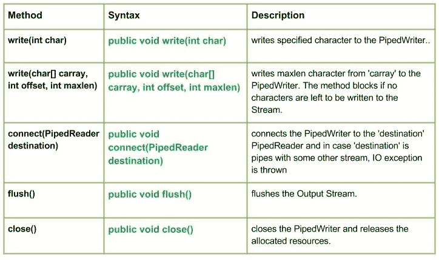

# Java 中的 `PipedWriter` 类

> 原文: [https://www.geeksforgeeks.org/java-io-pipedwriter-class-java/](https://www.geeksforgeeks.org/java-io-pipedwriter-class-java/)

[](https://media.geeksforgeeks.org/wp-content/uploads/io.PipedWriter-Class-in-Java.jpg)

这个类基本上是一个管道字符输出流。在输入/输出管道中，只是指同时在 JVM 中运行的两个线程之间的链接。因此，管道既可以用作源，也可以用作目标。
如果向连接的管道输出流提供数据字节的线程不再活动，则称管道断开。

## 声明

```java
public class PipedWriter extends Writer
```

## 构造方法

*   `PipedWriter()`: 创建一个管道写入器，表示它没有连接。
*   `PipedWriter(PipedReader inStream)`: 创建一个管道写入器，它连接到管道写入器 `inStream`。

## 方法

### `write(int char)`

`java.io.PipedWriter.write(int char)` 将指定的字符写入 `PipedWriter`。

**语法:**

```java
public void write(int char)
```

**参数:**
*   `char`: 要写入的字符。

**返回:**
*   `void`

**异常:**
*   `IOException`: 如果发生 IO 错误。

### `write(char[] carray, int offset, int maxlen)`

`java.io.PipedWriter.write(char[] carray, int offset, int maxlen)` 从 `carray` 写入 `maxlen` 个字符到 `PipedWriter`。如果没有字符可写入流，该方法会阻塞。

**语法:**

```java
public void write(char[] carray, int offset, int maxlen)
```

**参数:**
*   `carray`: 字符数组数据。
*   `offset`: 目标数组 `carray` 中的起始位置。
*   `maxlen`: 要读取的最大数组长度。

**返回:**
*   `void`

**异常:**
*   `IOException`: 如果发生 IO 错误。

### `close()`

`java.io.PipedWriter.close()` 关闭 `PipedWriter` 并释放分配的资源。

**语法:**

```java
public void close()
```

**参数:**
*   无。

**返回:**
*   `void`

**异常:**
*   `IOException`: 如果发生 IO 错误。

### `connect(PipedReader destination)`

`java.io.PipedWriter.connect(PipedReader destination)` 将 `PipedWriter` 连接到 `destination` `PipedReader`。如果 `destination` 是具有其他流的管道，则会引发 IO 异常。

**语法:**

```java
public void connect(PipedReader destination)
```

**参数:**
*   `destination`: 要连接到的 `PipedReader`。

**返回:**
*   `void`

**异常:**
*   `IOException`: 如果发生 IO 错误。

### `flush()`

`java.io.PipedWriter.flush()` 刷新输出流。

**语法:**

```java
public void flush()
```

**参数:**
*   无。

**返回:**
*   `void`

**异常:**
*   `IOException`: 如果发生 IO 错误。

## 实现示例

### 示例 1：`write(char[] carray, int offset, int maxlen)` 方法

```java
// Java program illustrating the working of PipedWriter
// write(char[] carray, int offset, int maxlen)

import java.io.*;

public class NewClass {
    public static void main(String[] args) throws IOException {
        PipedReader geek_reader = new PipedReader();
        PipedWriter geek_writer = new PipedWriter();

        // Use of connect() : connecting geek_reader with geek_writer
        geek_reader.connect(geek_writer);

        char[] carray = {'J', 'A', 'V', 'A'};

        // Use of write(char[] carray, int offset, int maxlen)
        geek_writer.write(carray, 0, 4);
        int a = 5;
        System.out.print("Use of write(carray, offset, maxlen) : ");
        while (a > 0) {
            System.out.print(" " + (char) geek_reader.read());
            a--;
        }
    }
}
```

**输出:**

```
Use of write(carray, offset, maxlen) :  J A V A
```

### 示例 2：`write()`, `connect()`, `close()`, `flush()` 方法

```java
// Java program illustrating the working of PipedWriter
// write(), connect, close(), flush()

import java.io.*;

public class NewClass {
    public static void main(String[] args) throws IOException {
        PipedReader geek_reader = new PipedReader();
        PipedWriter geek_writer = new PipedWriter();
        try {
            // Use of connect() : connecting geek_reader with geek_writer
            geek_reader.connect(geek_writer);

            // Use of write(int byte) :
            geek_writer.write(71);
            geek_writer.write(69);
            geek_writer.write(69);
            geek_writer.write(75);
            geek_writer.write(83);

            // Use of flush() method :
            geek_writer.flush();
            System.out.println("Use of flush() method : ");

            int i = 5;
            while (i > 0) {
                System.out.print(" " + (char) geek_reader.read());
                i--;
            }

            // Use of close() method :
            System.out.println("\nClosing the Writer stream");
            geek_writer.close();

        } catch (IOException excpt) {
            excpt.printStackTrace();
        }
    }
}
```

**输出:**

```
Use of flush() method : 
 G E E K S
Closing the Writer stream
```

**下一篇:** [Java 中的 `PipedReader` 类](https://www.geeksforgeeks.org/java-io-pipedreader-class-java/)

本文由 **莫希特·古普塔供稿🙂** 。如果你喜欢 GeeksforGeeks 并想投稿，你也可以使用 [contribute.geeksforgeeks.org](http://www.contribute.geeksforgeeks.org) 写一篇文章或者把你的文章邮寄到 contribute@geeksforgeeks.org。看到你的文章出现在极客博客主页上，帮助其他极客。
如果发现有不正确的地方，或者想分享更多关于上述话题的信息，请写评论。