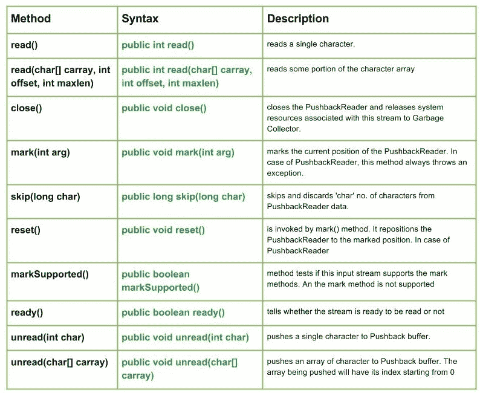

# Java中的java.io.PushbackReader类

> 原文：[https://www.geeksforgeeks.org/java-io-pushbackreader-class-java/](https://www.geeksforgeeks.org/java-io-pushbackreader-class-java/)

[](https://media.geeksforgeeks.org/wp-content/uploads/io.PushbackReader-Class-in-Java.jpg)

`java.io.PushbackReader`是一个字符流读取器类，允许将字符推回到流中。

## 声明

```java
public class PushbackReader extends FilterReader
```

## 构造方法

*   `PushbackReader(Reader push)`: 创建一个新的`PushbackReader`——“推送”带有字符推送缓冲区。
*   `PushbackReader(Reader push, int size)`: 创建一个新的`PushbackReader`，具有特定大小的推回缓冲区。

## PushbackReader类的方法

### `read()`

`java.io.PushbackReader.read()`读取单个字符。

**语法：**

```java
public int read()
```

**参数：**
-----------
**返回值：**
从`Pushback`缓冲区读取单个字符，否则返回-1（即到达文件末尾时）。
**异常：**
-> `IOException`：如果发生I/O错误。

### `read(char[] carray, int offset, int maxlen)`

`java.io.PushbackReader.read(char[] carray, int offset, int maxlen)`读取字符数组的某个部分。

**语法：**

```java
public int read(char[] carray, int offset, int maxlen)
```

**参数：**
`carray`：要读入的目标缓冲区
`offset`：`carray`的起始位置
`maxlen`：要读取的最大字符数
**返回值：**
读取字符数组的某一部分，否则返回-1（即到达文件末尾时）。
**异常：**
-> `IOException`：如果发生I/O错误。

### `close()`

`java.io.PushbackReader.close()`关闭`PushbackReader`，并将与此流相关联的系统资源释放给垃圾收集器。

**语法：**

```java
public void close()
```

**参数：**
------
**返回值：**
`void`
**异常：**
-> `IOException`：如果发生I/O错误。

### `mark(int arg)`

`java.io.PushbackReader.mark(int arg)`标记`PushbackReader`的当前位置。在推回阅读器的情况下，这个方法总是抛出一个异常。

**语法：**

```java
public void mark(int arg)
```

**参数：**
`arg`：指定流读取限制的整数
**返回值：**
`void`

### `skip(long char)`

`java.io.PushbackReader.skip(long char)`跳过并丢弃`PushbackReader`数据中的“字符”数量。

**语法：**

```java
public long skip(long char)
```

**参数：**
`char`：要跳过的`PushbackReader`数据的字节数。
**返回值：**
要跳过的字节数
**异常：**
-> `IOException`：如果发生I/O错误。

### `reset()`

`java.io.PushbackReader.reset()`由`mark()`方法调用。它将推回阅读器重新定位到标记位置。在推回阅读器的情况下，这个方法总是抛出一个异常。

**语法：**

```java
public void reset()
```

**参数：**
----
**返回值：**
`void`
**异常：**
-> `IOException`：如果发生I/O错误。

### `markSupported()`

`java.io.PushbackReader.markSupported()`告诉这个流是否支持`mark()`操作，它不支持。

**语法：**

```java
public boolean markSupported()
```

**参数：**
**返回值：**
如果`PushbackReader`支持`mark()`方法则返回`true`，否则返回`false`。

### `ready()`

`java.io.PushbackReader.ready()`告知流是否准备好被读取。

**语法：**

```java
public boolean ready()
```

**参数：**
-------
**返回值：**
如果流准备好被读取则返回`true`，否则返回`false`。

### `unread(int char)`

`java.io.PushbackReader.unread(int char)`将单个字符推送到`Pushback`缓冲区。在此方法返回后，下一个要读取的字符将具有`(char)char`值。

**语法：**

```java
public void unread(int char)
```

**参数：**
`char`：要推回的字符的`int`值
**返回值：**
`void`
**异常：**
-> `IOException`：如果发生I/O错误或`Pushback`缓冲区已满。

### `unread(char[] carray)`

`java.io.PushbackReader.unread(char[] carray)`将一个字符数组推送到`Pushback`缓冲区。被推送的数组索引将从0开始。

**语法：**

```java
public void unread(char[] carray)
```

**参数：**
`carray`：要推回的字符数组
**返回值：**
`void`
**异常：**
-> `IOException`：如果发生I/O错误或`Pushback`缓冲区已满。

## 解释PushbackReader方法的Java代码

`read(char[] carray)`、`close()`、`markSupported()`、`read()`、`mark()`、`ready()`、`skip()`、`unread()`

```java
// Java program illustrating the working of PushbackReader
// read(char[] carray), close(), markSupported()
// read(), mark(), ready(), skip(), unread()

import java.io.*;
public class NewClass
{
    public static void main(String[] args) throws IOException
    {
        try
        {
            // Initializing a StringReader and PushbackReader
            String s = "GeeksForGeeks";
            StringReader str_reader = new StringReader(s);
            PushbackReader geek_pushReader1 = new PushbackReader(str_reader);
            PushbackReader geek_pushReader2 = new PushbackReader(str_reader);

            // Use of ready() method :
            System.out.println("Is stream1 ready : " + geek_pushReader1.ready());
            System.out.println("Is stream2 ready : " + geek_pushReader2.ready());

            // Use of read() :
            System.out.println("\nWe have used skip() method in 1 : ");
            System.out.print("\nUse of read() in 1 : ");
            for (int i = 0; i < 6; i++)
            {
                char c = (char) geek_pushReader1.read();
                System.out.print(c);

                // Use of skip() :
                geek_pushReader1.skip(1);
            }
            System.out.println("");

            // Using read() :
            char[] carray = new char[20];
            System.out.println("Using read() in 2 : " + geek_pushReader2.read(carray));

            // Use of markSupported() :
            System.out.println("\nIs mark supported in 1  : " + geek_pushReader1.markSupported());

            geek_pushReader2.unread('F');

            // read the next char, which is the one we unread
            char c3 = (char) geek_pushReader2.read();
            System.out.println("Use of unread() : " + c3);

            // Use of mark() :
            geek_pushReader1.mark(5);

            // Use of close() :
            geek_pushReader1.close();
        }
        catch (IOException excpt)
        {
            System.out.println("mark not supported in 1");
        }
    }
}
```

## 输出

```java
Is stream1 ready : true
Is stream2 ready : true

We have used skip() method in 1 :

Use of read() in 1 : GesoGe
Using read() in 2 : 1

Is mark supported in 1 : false
Use of unread() : F
mark not supported in 1
```

本文由 **莫希特·古普塔供稿🙂** 。如果你喜欢GeeksforGeeks并想投稿，你也可以使用[contribute.geeksforgeeks.org](http://www.contribute.geeksforgeeks.org)写一篇文章或者把你的文章邮寄到`contribute@geeksforgeeks.org`。看到你的文章出现在极客博客主页上，帮助其他极客。

如果你发现任何不正确的地方，或者你想分享更多关于上面讨论的话题的信息，请写评论。