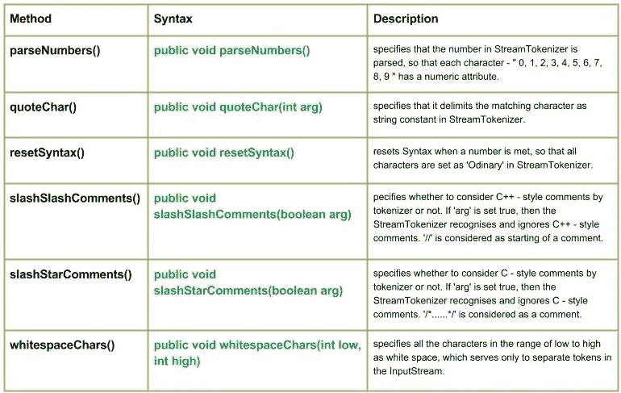

# Java 中的 Java.io.StreamTokenizer 类|集合 2

> 原文:[https://www.geeksforgeeks.org/java-io-streamtokenizer-class-java-set-2/](https://www.geeksforgeeks.org/java-io-streamtokenizer-class-java-set-2/)

[Java 中的 StringTokenizer 类|集合 1](https://www.geeksforgeeks.org/java-io-streamtokenizer-class-java/)

[](https://media.geeksforgeeks.org/wp-content/uploads/StreamTokenizer-Class-Set-2.jpg)

## 方法:

### 1. `parseNumbers()`

`java.io.StreamTokenizer.parseNumbers()` 指定分析 `StreamTokenizer` 中的数字，这样每个字符–“0、1、2、3、4、5、6、7、8、9”都有一个数字属性。
当解析器遇到具有双精度浮点数格式的单词标记时，它会将标记视为数字而不是单词，方法是将 `ttype` 字段设置为值 `TT_NUMBER`，并将标记的数值放入 `nval` 字段。

### 语法:

```java
public void parseNumbers()
Parameters :

Return :
void
```

### 实施:

```java
// Java Program  illustrating use of parseNumbers() method

import java.io.*;
public class NewClass
{
    public static void main(String[] args) throws InterruptedException,
    FileNotFoundException, IOException
    {
        FileReader reader = new FileReader("ABC.txt");
        BufferedReader bufferread = new BufferedReader(reader);
        StreamTokenizer token = new StreamTokenizer(bufferread);

        // Use of parseNumbers() method
        // specifies that the number in StreamTokenizer is parsed
        token.parseNumbers();

        int t;
        while ((t = token.nextToken()) != StreamTokenizer.TT_EOF)
        {
            switch (t)
            {
                case StreamTokenizer.TT_NUMBER:
                    System.out.println("Number : " + token.nval);
                    break;
                case StreamTokenizer.TT_WORD:
                    System.out.println("Word : " + token.sval);
                    break;
            }
        }
    }
}
```

### 注意:
这个程序不会在这里运行，因为没有‘ABC’文件存在。您可以在系统的 Java 编译器上检查这些代码。
要检查此代码，请在您的系统上创建一个文件“ABC”。
《ABC》文件包含:

```
你好极客 1
这个 2
3 是
关于 4
解析数字()
```

### 输出:

```java
Word : Hello
Word : Geeks
Number : 1.0
Word : This
Number : 2.0
Number : 3.0
Word : is
Word : about
Number : 4.0
Word : parseNumbers
```

### 2. `quoteChar()`

`java.io.StreamTokenizer.quoteChar(int arg)` 指定它将匹配字符作为 `StreamTokenizer` 中的字符串常量分隔符。
当 `nextToken` 方法遇到字符串常量时，`ttype` 字段被设置为字符串分隔符，`sval` 字段被设置为字符串的主体。

### 语法:

```java
public void quoteChar(int arg)
Parameters :
arg : the character to be dilimit
Return :
void
```

### 实施:

```java
// Java Program  illustrating use of quoteChar() method

import java.io.*;
public class NewClass
{
    public static void main(String[] args) throws InterruptedException,
                                FileNotFoundException, IOException
    {
        FileReader reader = new FileReader("ABC.txt");
        BufferedReader bufferread = new BufferedReader(reader);
        StreamTokenizer token = new StreamTokenizer(bufferread);

        // specify o as a quote char
        token.quoteChar('o');

        int t;
        while ((t = token.nextToken()) != StreamTokenizer.TT_EOF)
        {
            switch (t)
            {
                case StreamTokenizer.TT_WORD:
                    System.out.println("Word : " + token.sval);
                    break;
                case StreamTokenizer.TT_NUMBER:
                    System.out.println("Number : " + token.nval);
                    break;
                default:
                    System.out.println((char) t + " encountered.");
            }
        }
    }
}
```

### 注意:
这个程序不会在这里运行，因为没有‘ABC’文件存在。您可以在系统的 Java 编译器上检查这些代码。
要检查此代码，请在您的系统上创建一个文件“ABC”。
《ABC》文件包含:

```
大家好
极客
这里
是
关于
quoteChar()
```

### 输出:

```java
Word : Hell
o encountered.
Word : Geeks
Word : This
Word : is
Word : ab
o encountered.
Word : qu
o encountered.
```

### 3. `resetSyntax()`

`java.io.StreamTokenizer.resetSynatx()` 在遇到数字时重置语法，以便在 `StreamTokenizer` 中将所有字符设置为‘Ordinary’。

### 语法:

```java
public void resetSyntax()
Parameters :
---------
Return :
void
```

### 实施:

```java
// Java Program  illustrating use of resetSyntax() method

import java.io.*;
public class NewClass
{
    public static void main(String[] args) throws InterruptedException,
                                FileNotFoundException, IOException
    {
        FileReader reader = new FileReader("ABC.txt");
        BufferedReader bufferread = new BufferedReader(reader);
        StreamTokenizer token = new StreamTokenizer(bufferread);

        int t;
        while ((t = token.nextToken()) != StreamTokenizer.TT_EOF)
        {
            switch (t)
            {
                case StreamTokenizer.TT_WORD:
                    System.out.println("Word : " + token.sval);
                    break;
                case StreamTokenizer.TT_NUMBER:
                    // Use of resetSyntax()
                    token.resetSyntax();
                    System.out.println("Number : " + token.nval);
                    break;
                default:
                    System.out.println((char) t + " encountered.");
            }
        }
    }
}
```

### 注意:
这个程序不会在这里运行，因为没有‘ABC’文件存在。您可以在系统的 Java 编译器上检查这些代码。
要检查此代码，请在您的系统上创建一个文件“ABC”。
《ABC》文件包含:

```
你好
这里是
resetSyntax()
1 xmpl
2🙂
```

### 输出:

```java
Word : Hello
Word : This
Word : is
Word : resetSyntax
( encountered.
) encountered.
Number : 1.0
  encountered.
x encountered.
m encountered.
p encountered.
l encountered.
 encountered.

encountered.
2 encountered.
  encountered.
: encountered.
) encountered.
 encountered.

encountered.
3 encountered.
```

### 4. `slashSlashComments()`

`java.io.StreamTokenizer.slashSlashComments(boolean arg)` 指定分词器是否考虑 C++ 风格的注释。如果 `arg` 设置为 `true`，则 `StreamTokenizer` 识别并忽略 C++ 风格的注释。`//` 被视为注释的开始。
如果标志参数为 `false`，则 C++ 风格的注释不会被特殊处理。

### 语法:

```java
public void slashSlashComments(boolean arg)
Parameters :
arg : tells whether to recognise and ignore C++ - style comments or not.
Return :
void
```

### 实施:

```java
// Java Program  illustrating use of slashSlashComments() method

import java.io.*;
public class NewClass
{
    public static void main(String[] args) throws InterruptedException,
                                  FileNotFoundException, IOException
    {
        FileReader reader = new FileReader("ABC.txt");
        BufferedReader bufferread = new BufferedReader(reader);
        StreamTokenizer token = new StreamTokenizer(bufferread);

        // Use of slashSlashComments()
        // Here 'arg' is set to true i.e. to recognise and ignore C++style Comments
        boolean arg = true;
        token.slashSlashComments(arg);

        int t;
        while ((t = token.nextToken()) != StreamTokenizer.TT_EOF)
        {
            switch (t)
            {
                case StreamTokenizer.TT_WORD:
                    System.out.println("Word : " + token.sval);
                    break;
                case StreamTokenizer.TT_NUMBER:
                    System.out.println("Number : " + token.nval);
                    break;
            }
        }
    }
}
```

### 注意:
这个程序不会在这里运行，因为没有‘ABC’文件存在。您可以在系统的 Java 编译器上检查这些代码。
要检查此代码，请在您的系统上创建一个文件“ABC”。
《ABC》文件包含:

```
这个程序是关于 SlashComments //方法的

此方法将 ABC.txt 文件中的“方法”视为注释，因此忽略它。
```

### 输出:

```java
Word : This
Word : program
Word : is
Word : about
Word : slashSlashComments
```

## `slashStarComments()`

`java.io.StreamTokenizer.slashStarComments(boolean arg)` 指定分词器是否考虑 C 风格注释。如果 `arg` 设置为 `true`，则 `StreamTokenizer` 会识别并忽略 C 风格注释。`/*……*/` 被视为注释。

### 语法

```java
public void slashStarComments(boolean arg)
```

**参数：**
`arg`：指示是否识别并忽略 C 风格注释。

**返回值：**
`void`

### 实施

```java
// Java Program illustrating use of slashStarComments() method

import java.io.*;
public class NewClass
{
    public static void main(String[] args) throws InterruptedException,
                                                  FileNotFoundException, IOException
    {
        FileReader reader = new FileReader("ABC.txt");
        BufferedReader bufferread = new BufferedReader(reader);
        StreamTokenizer token = new StreamTokenizer(bufferread);

        // Use of slashStarComments()
        // Here 'arg' is set to true i.e. to recognise and ignore Cstyle Comments
        boolean arg = true;
        token.slashStarComments(true);

        int t;
        while ((t = token.nextToken()) != StreamTokenizer.TT_EOF)
        {
            switch (t)
            {
            case StreamTokenizer.TT_WORD:
                System.out.println("Word : " + token.sval);
                break;
            case StreamTokenizer.TT_NUMBER:
                System.out.println("Number : " + token.nval);
                break;
            }
        }
    }
}
```

### 注意

这个程序不会在这里运行，因为没有 `ABC` 文件存在。您可以在系统的 Java 编译器上检查这些代码。
要检查此代码，请在您的系统上创建一个文件 `ABC`。
`ABC` 文件包含：

这个程序是关于 slashStarComments /*方法*/ 123 的

此方法将 `ABC.txt` 文件中的“方法”视为注释，因此忽略它。

### 输出

```java
Word : This
Word : program
Word : is
Word : about
Word : slashStarComments
Number : 123.0
```

## `whitespaceChars()`

`java.io.StreamTokenizer.whitespaceChars(int low, int high)` 将 `low` 到 `high` 范围内的所有字符指定为空白字符，这些字符仅用于在 `InputStream` 中分隔词法单元。

### 语法

```java
public void whitespaceChars(int low, int high)
```

**参数：**
`low`：要设为空白字符的字符范围下限。
`high`：要设为空白字符的字符范围上限。

**返回值：**
`void`

### 实施

```java
// Java Program illustrating use of whitespaceChars() method

import java.io.*;
public class NewClass
{
    public static void main(String[] args) throws InterruptedException,
                                                  FileNotFoundException, IOException
    {
        FileReader reader = new FileReader("ABC.txt");
        BufferedReader bufferread = new BufferedReader(reader);
        StreamTokenizer token = new StreamTokenizer(bufferread);

        // Use of whitespaceChars() method
        // Here range is low = 'a' to high = 'c'
        token.whitespaceChars('a','d');

        int t;
        while ((t = token.nextToken()) != StreamTokenizer.TT_EOF)
        {
            switch (t)
            {
            case StreamTokenizer.TT_WORD:
                System.out.println("Word : " + token.sval);
                break;
            case StreamTokenizer.TT_NUMBER:
                System.out.println("Number : " + token.nval);
                break;
            }
        }
    }
}
```

### 注意

这个程序不会在这里运行，因为没有 `ABC` 文件存在。您可以在系统的 Java 编译器上检查这些代码。
要检查此代码，请在您的系统上创建一个文件 `ABC`。
`ABC` 文件包含：

这个程序是关于 whitespaceChars()

### 输出

```java
Word : This
Word : progr
Word : m
Word : is
Word : out
Word : whitesp
Word : eCh
Word : rs
```

本文由 **莫希特·古普塔供稿🙂** 。如果你喜欢 GeeksforGeeks 并想投稿，你也可以使用 [contribute.geeksforgeeks.org](http://www.contribute.geeksforgeeks.org) 写一篇文章或者把你的文章邮寄到 contribute@geeksforgeeks.org。看到你的文章出现在极客博客主页上，帮助其他极客。

如果你发现任何不正确的地方，或者你想分享更多关于上面讨论的话题的信息，请写评论。