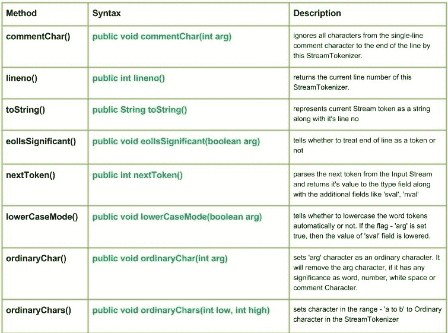

# Java 中的 Java.io.StreamTokenizer 类|集合 1

> 原文：[https://www.geeksforgeeks.org/java-io-streamtokenizer-class-java/](https://www.geeksforgeeks.org/java-io-streamtokenizer-class-java/)

[](https://media.geeksforgeeks.org/wp-content/uploads/StreamTokenizer-Class-Set-1.jpg)

`Java.io.StreamTokenizer` 类将输入流解析为“令牌”。它允许一次读取一个令牌。流标记器可以识别数字、带引号的字符串和各种注释样式。

## 声明

```java
public class StreamTokenizer
  extends Object
```

## 构造函数

`StreamTokenizer(Reader arg)`：创建一个标记器，用于解析给定的字符流。

## 方法

### `commentChar(int arg)`

**语法：**

```java
public void commentChar(int arg)
```

**参数：**
`arg`：在此字符之后，该行中的所有字符都将被忽略。

**返回值：**
不返回任何值。

**实现：**

```java
// Java Program illustrating use of commentChar() method

import java.io.*;
public class NewClass
{
    public static void main(String[] args) throws InterruptedException,
                                                 FileNotFoundException, IOException
    {
        FileReader reader = new FileReader("ABC.txt");
        BufferedReader bufferread = new BufferedReader(reader);
        StreamTokenizer token = new StreamTokenizer(bufferread);
        // Use of commentChar() method
        token.commentChar('a');
        int t;
        while ((t = token.nextToken()) != StreamTokenizer.TT_EOF)
        {
            switch (t)
            {
            case StreamTokenizer.TT_NUMBER:
                System.out.println("Number : " + token.nval);
                break;
            case StreamTokenizer.TT_WORD:
                System.out.println("Word : " + token.sval);
                break;
            }
        }
    }
}
```

**注意：**
这个程序不会在这里运行，因为没有‘ABC’文件存在。您可以在系统的 Java 编译器上检查这些代码。
要检查此代码，请在您的系统上创建一个文件“ABC”。

**【ABC】文件包含：**

```
Programmers
1
2
3
Geeks
Hello
Friends, here is a program explained.
```

**输出：**

```
Word : Progr
Number : 1.0
Number : 2.0
Number : 3.0
Word : Geeks
Word : Hello
```

### `lineno()`

`java.io.StreamTokenizer.lineno()` 返回此 `StreamTokenizer` 的当前行号。

**语法：**

```java
public int lineno()
```

**参数：**
`arg`：在此字符之后，该行中的所有字符都将被忽略。

**返回值：**
返回此 `StreamTokenizer` 的当前行号。

**实现：**

```java
// Java Program illustrating use of lineno() method

import java.io.*;
public class NewClass
{
    public static void main(String[] args) throws InterruptedException,
                                                 FileNotFoundException, IOException
    {
        FileReader reader = new FileReader("ABC.txt");
        BufferedReader bufferread = new BufferedReader(reader);
        StreamTokenizer token = new StreamTokenizer(bufferread);

        token.eolIsSignificant(true);
        // Use of lineno() method
        // to get current line no.
        System.out.println("Line Number:" + token.lineno());

        token.commentChar('a');
        int t;
        while ((t = token.nextToken()) != StreamTokenizer.TT_EOF)
        {
            switch (t)
            {
            case StreamTokenizer.TT_EOL:
                System.out.println("");
                System.out.println("Line No. : " + token.lineno());
                break;
            case StreamTokenizer.TT_NUMBER:
                System.out.println("Number : " + token.nval);
                break;
            case StreamTokenizer.TT_WORD:
                System.out.println("Word : " + token.sval);
                break;
            }
        }
    }
}
```

**输出：**

```
Line Number:1
Word : Progr

Line No. : 2
Number : 1.0

Line No. : 3
Number : 2.0

Line No. : 4
Number : 3.0

Line No. : 5
Word : Geeks

Line No. : 6
Word : Hello

Line No. : 7
Word : This
Word : is
```

### `toString()`

`java.io.StreamTokenizer.toString()` 将当前流令牌及其行号表示为字符串。

**语法：**

```java
public String toString()
```

**返回值：**
将当前流令牌及其行号表示为字符串。

**实现：**

```java
// Java Program illustrating use of toString() method

import java.io.*;
public class NewClass
{
    public static void main(String[] args) throws InterruptedException,
                                                 FileNotFoundException, IOException
    {
        FileReader reader = new FileReader("ABC.txt");
        BufferedReader bufferread = new BufferedReader(reader);
        StreamTokenizer token = new StreamTokenizer(bufferread);

        int t;
        while ((t = token.nextToken()) != StreamTokenizer.TT_EOF)
        {
            switch (t)
            {
            case StreamTokenizer.TT_NUMBER:
                // Value of ttype field returned by nextToken()
                System.out.println("Number : " + token.nval);
                break;
                // Value of ttype field returned by nextToken()
            case StreamTokenizer.TT_WORD:
                // Use of toString() method
                System.out.println("Word : " + token.toString());
                break;
            }
        }
    }
}
```

**输出：**

```
Word : Token[Programmers], line 1
Number : 1.0
Number : 2.0
Number : 3.0
Word : Token[Geeks], line 5
Word : Token[Hello], line 6
Word : Token[a], line 7
Word : Token[Program], line 7
Word : Token[is], line 7
Word : Token[explained], line 7
Word : Token[here], line 7
Word : Token[my], line 7
Word : Token[friends.], line 7
```

### `eolIsSignificant(boolean arg)`

`java.io.StreamTokenizer.eolIsSignificant(boolean arg)` 告知是否将行尾视为令牌。如果 `arg` 为 `true`，则将行尾视为令牌。如果为 `true`，则当到达行尾时，该方法返回 `TT_EOL` 并设置 `ttype` 字段。
如果 `arg` 为 `false`，则行尾仅被视为空白。

**语法：**

```java
public void eolIsSignificant(boolean arg)
```

**参数：**
`arg`：布尔值，指示是将 EOL 视为令牌还是空白。

**返回值：**
不返回任何值。

**实现：**

```java
// Java Program illustrating use of eolIsSignificant() method

import java.io.*;
public class NewClass
{
    public static void main(String[] args) throws InterruptedException,
                                                 FileNotFoundException, IOException
    {
        FileReader reader = new FileReader("ABC.txt");
        BufferedReader bufferread = new BufferedReader(reader);
        StreamTokenizer token = new StreamTokenizer(bufferread);

        boolean arg = true;
        // Use of eolIsSignificant() method
        token.eolIsSignificant(arg);
        // Here the 'arg' is set true, so EOL is treated as a token

        int t;
        while ((t = token.nextToken()) != StreamTokenizer.TT_EOF)
        {
            switch (t)
            {
            case StreamTokenizer.TT_EOL:
                System.out.println("End of Line encountered.");
                break;
            case StreamTokenizer.TT_NUMBER:
                System.out.println("Number : " + token.nval);
                break;
            case StreamTokenizer.TT_WORD:
                System.out.println("Word : " + token.sval);
                break;
            }
        }
    }
}
```

**注意：**
这个程序不会在这里运行，因为没有‘ABC’文件存在。您可以在系统的 Java 编译器上检查这些代码。
要检查此代码，请在您的系统上创建一个文件“ABC”。

**【ABC】文件包含：**

```
Geeks
for
Geeks
```

**输出：**

```
Word : Geeks
End of Line encountered.
Word : for
End of Line encountered.
Word : Geeks
End of Line encountered.
```

## nextToken()

`java.io.StreamTokenizer.nextToken()` 解析输入流中的下一个令牌，并将其值返回给 `ttype` 字段，同时还会填充 `sval`、`nval` 等附加字段。

### 语法

```java
public int nextToken()
```

**参数：** 无

**返回值：** 返回给 `ttype` 字段的值。

### 实现

```java
// Java Program illustrating use of nextToken() method
import java.io.*;
public class NewClass {
    public static void main(String[] args) throws InterruptedException,
            FileNotFoundException, IOException {
        FileReader reader = new FileReader("ABC.txt");
        BufferedReader bufferread = new BufferedReader(reader);
        StreamTokenizer token = new StreamTokenizer(bufferread);

        // Use of nextToken() method to parse Next Token from the Input Stream
        int t = token.nextToken();
        while ((t = token.nextToken()) != StreamTokenizer.TT_EOF) {
            switch (t) {
                case StreamTokenizer.TT_NUMBER:
                    System.out.println("Number : " + token.nval);
                    break;
                case StreamTokenizer.TT_WORD:
                    System.out.println("Word : " + token.sval);
                    break;
            }
        }
    }
}
```

### 注意

这个程序不会在这里运行，因为没有 `ABC.txt` 文件存在。您可以在系统的 Java 编译器上检查这些代码。要检查此代码，请在您的系统上创建一个文件 `ABC.txt`。

**`ABC.txt` 文件包含：**

```
This program tells about nextToken() method use
```

### 输出

```
Word : This
Word : program
Word : tells
Number : 2.0
Word : about
Word : use
Word : of
Number : 3.0
Word : next
Word : token
Word : method
```

## lowerCaseMode()

`java.io.StreamTokenizer.lowerCaseMode(boolean arg)` 指示是否自动将单词令牌转换为小写。如果标志 `arg` 设置为 `true`，则 `sval` 字段的值会被转换为小写。

### 语法

```java
public void lowerCaseMode(boolean arg)
```

**参数：**
- `arg`：指示是否自动将单词令牌转换为小写。

**返回值：** `void`

### 实现

```java
// Java Program illustrating use of lowerCaseMode() method
import java.io.*;
public class NewClass {
    public static void main(String[] args) throws InterruptedException,
            FileNotFoundException, IOException {
        FileReader reader = new FileReader("ABC.txt");
        BufferedReader bufferread = new BufferedReader(reader);
        StreamTokenizer token = new StreamTokenizer(bufferread);

        /* Use of lowerCaseMode() method to
           Here, the we have set the Lower Case Mode ON
        */
        boolean arg = true;
        token.lowerCaseMode(arg);

        int t;
        while ((t = token.nextToken()) != StreamTokenizer.TT_EOF) {
            switch (t) {
                case StreamTokenizer.TT_NUMBER:
                    System.out.println("Number : " + token.nval);
                    break;
                case StreamTokenizer.TT_WORD:
                    System.out.println("Word : " + token.sval);
                    break;
            }
        }
    }
}
```

### 注意

这个程序不会在这里运行，因为没有 `ABC.txt` 文件存在。您可以在系统的 Java 编译器上检查这些代码。要检查此代码，请在您的系统上创建一个文件 `ABC.txt`。

**`ABC.txt` 文件包含：**

```
Hello Geeks
This is about lowerCaseMode()
```

### 输出

```
Word : hello
Word : geeks
Word : this
Word : is
Word : about
Word : lowercasemode
```

## ordinaryChar()

`java.io.StreamTokenizer.ordinaryChar(int arg)` 将字符 `arg` 设置为普通字符。如果 `arg` 字符之前具有单词、数字、空白或注释字符的特殊意义，此方法将移除该特殊意义。

### 语法

```java
public void ordinaryChar(int arg)
```

**参数：**
- `arg`：要设置为普通字符的字符。

**返回值：** `void`

### 实现

```java
// Java Program illustrating use of ordinaryChar() method
import java.io.*;
public class NewClass {
    public static void main(String[] args) throws InterruptedException,
            FileNotFoundException, IOException {
        FileReader reader = new FileReader("ABC.txt");
        BufferedReader bufferread = new BufferedReader(reader);
        StreamTokenizer token = new StreamTokenizer(bufferread);

        // Use of ordinaryChar() method
        // Here we have taken 's' as an ordinary character
        token.ordinaryChar('s');

        int t;
        while ((t = token.nextToken()) != StreamTokenizer.TT_EOF) {
            switch (t) {
                case StreamTokenizer.TT_NUMBER:
                    System.out.println("Number : " + token.nval);
                    break;
                case StreamTokenizer.TT_WORD:
                    System.out.println("Word : " + token.sval);
                    break;
            }
        }
    }
}
```

### 注意

这个程序不会在这里运行，因为没有 `ABC.txt` 文件存在。您可以在系统的 Java 编译器上检查这些代码。要检查此代码，请在您的系统上创建一个文件 `ABC.txt`。

**`ABC.txt` 文件包含：**

```
Hello, Geeks
This is about ordinaryChar()
This method has been removed from the whole stream
```

### 输出

```
Word : Hello
Word : Geek
Word : Thi
Word : I
Word : zz
Word : About
Word : ordinaryChar
```

## ordinaryChars()

`java.io.StreamTokenizer.ordinaryChars(int low, int high)` 将 `low` 到 `high` 范围内的字符在 `StreamTokenizer` 中设置为普通字符。

### 语法

```java
public void ordinaryChars(int low, int high)
```

**参数：**
- `low`：范围的下限。
- `high`：范围的上限。

**返回值：** `void`

### 实现

```java
// Java Program illustrating use of ordinaryChars() method
import java.io.*;
public class NewClass {
    public static void main(String[] args) throws InterruptedException,
            FileNotFoundException, IOException {
        FileReader reader = new FileReader("ABC.txt");
        BufferedReader bufferread = new BufferedReader(reader);
        StreamTokenizer token = new StreamTokenizer(bufferread);

        // Use of ordinaryChars() method
        // Here we have taken low = 'a' and high = 'c'
        token.ordinaryChars('a', 'c');

        int t;
        while ((t = token.nextToken()) != StreamTokenizer.TT_EOF) {
            switch (t) {
                case StreamTokenizer.TT_NUMBER:
                    System.out.println("Number : " + token.nval);
                    break;
                case StreamTokenizer.TT_WORD:
                    System.out.println("Word : " + token.sval);
                    break;
            }
        }
    }
}
```

### 注意

这个程序不会在这里运行，因为没有 `ABC.txt` 文件存在。您可以在系统的 Java 编译器上检查这些代码。要检查此代码，请在您的系统上创建一个文件 `ABC.txt`。

**`ABC.txt` 文件包含：**

```
Hello Geeks
This is about ordinaryChars()
```

### 输出

```
Word : Hello
Word : Geeks
Word : This
Word : is
Word : out
Word : ordin
Word : ryCh
Word : rs
```

**下一篇文章** – [Java.io.StreamTokenizer Java Class | Set 2](https://www.geeksforgeeks.org/java-io-streamtokenizer-class-java-set-2/)

本文由 **Mohit Gupta** 供稿。如果您喜欢 GeeksforGeeks 并想投稿，您也可以使用 [contribute.geeksforgeeks.org](http://www.contribute.geeksforgeeks.org) 写一篇文章，或者把您的文章邮寄到 contribute@geeksforgeeks.org。看到您的文章出现在 GeeksforGeeks 主页上，帮助其他极客。

如果您发现任何不正确的地方，或者您想分享更多关于上面讨论的话题的信息，请写评论。