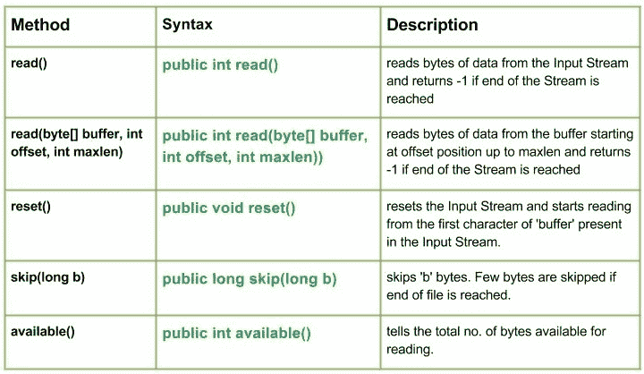

# Java 中的 `StringBufferInputStream` 类

> 原文：[https://www.geeksforgeeks.org/java-io-stringbufferinputstream-class-java/](https://www.geeksforgeeks.org/java-io-stringbufferinputstream-class-java/)

[](https://media.geeksforgeeks.org/wp-content/uploads/io.StringBufferInputStream-class-in-Java.jpg)

`StringBufferInputStream` 类有助于创建一个输入流，在该流中可以从字符串中读取字节。如果我们使用这个类，我们只能读取字符串中每个字符的低 8 位。
但是如果我们使用 `ByteArrayInputStream`，则不限制只读取字符串中每个字符的低 8 位。
此类已被 Oracle 弃用，不应再使用。

## 声明

```java
public class StringBufferInputStream
   extends InputStream
```

## 构造方法

*   `StringBufferInputStream(String string)`：创建一个字符串输入流，从指定的字符串中读取数据。

## 方法

### `read()`

`StringBufferInputStream.read()` 从输入流中读取字节的数据，如果到达流的末尾，则返回 -1。

**语法：**

```java
public int read()
Parameters : 
-----------
Return  :
Returns read character as an integer ranging from range 0 to 65535.
-1 : when end of file is reached.
```

### `read(byte[] buffer, int offset, int maxlen)`

`StringBufferInputStream.read(byte[] buffer, int offset, int maxlen)` 从缓冲区中的偏移量位置开始读取字节数据，直到 `maxlen`，如果到达 Stream 的末尾，则返回 -1。

**语法：**

```java
public int read(byte[] buffer, int offset, int maxlen)
Parameters : 
buffer : destination buffer to be read into  
offset : starting position from where to store characters
maxlen : maximum no. of characters to be read
Return  :
Returns all the characters read
-1 : when end of file is reached.
```

### `reset()`

`StringBufferInputStream.reset()` 重置输入流，并从输入流中出现的“buffer”的第一个字符开始读取。

**语法：**

```java
public void reset()
Parameters : 
-----------
Return  :
void
```

### `skip(long b)`

`StringBufferInputStream.skip(long b)` 跳过“b”字节。如果到达文件结尾，将跳过几个字节。

**语法：**

```java
public long skip(long b)
Parameters : 
b : no. of bytes to be skipped
Return  :
no. of bytes skipped
```

### `available()`

`StringBufferInputStream.available()` 表示可供读取的字节总数。

**语法：**

```java
public int available()
Parameters : 
----------------
Return  :
total no. of bytes that can be read
```

## 示例代码

```java
// Java program illustrating the working of StringBufferInputStream class methods
// read(), skip(), available(), reset()
// read(char[] char_array, int offset, int maxlen)

import java.io.*;
public class NewClass
{
    public static void main(String[] args) throws IOException
    {
        String str1 = "Hello Geeks";
        String str2 = "GeeksForGeeks";
        StringBufferInputStream Geek_buffer1 = new StringBufferInputStream(str1);
        StringBufferInputStream Geek_buffer2 = new StringBufferInputStream(str2);

        // Use of available() : to count total bytes to be read
        System.out.println("Use of available() 1 : "+ Geek_buffer1.available());

        int a = 0;
        System.out.print("Use of read() method : ");

        // Use of read() method : reading each byte one by one
        while((a = Geek_buffer1.read()) != -1)
        {
            // Converting byte to char
            char c1 = (char)a;
            System.out.println(c1);

            // Use of skip() method
            long char_no = Geek_buffer1.skip(1);
            System.out.println("Characters Skipped : "+ (c1+1));
        }
        System.out.println("");

        // Use of available() : to count total bytes to be read
        System.out.println("Use of available() 2 : "+ Geek_buffer2.available());

        byte[] buffer = new byte[15];

        // Use of read(char[] char_array, int offset, int maxlen):
        // reading a part of array
        Geek_buffer2.read(buffer, 1, 2);
        int b = 0;

        System.out.print("read(char[] char_array, int offset, int maxlen): ");
        while((b = Geek_buffer2.read()) != -1)
        {
            char c2 = (char)b;
            System.out.print(c2);
        }
        System.out.println("");

        // Use of reset() : to reset str1 for reading again
        Geek_buffer1.reset();
        int i = 0;
        System.out.print("\nUse of read() method again after reset() : ");

        // Use of read() method : reading each character one by one
        while((i = Geek_buffer1.read()) != -1)
        {
            char c3 = (char)i;
            System.out.print(c3);
        }
    }
}
```

## 输出

```java
Use of available() 1 : 11
Use of read() method : H
Characters Skipped : 73
l
Characters Skipped : 109
o
Characters Skipped : 112
G
Characters Skipped : 72
e
Characters Skipped : 102
s
Characters Skipped : 116

Use of available() 2 : 13
Use of read(char[] char_array, int offset, int maxlen) method : eksForGeeks

Use of read() method again after reset() : Hello Geeks
```

本文由 **莫希特·古普塔供稿🙂** 。如果你喜欢 GeeksforGeeks 并想投稿，你也可以使用 [contribute.geeksforgeeks.org](http://www.contribute.geeksforgeeks.org) 写一篇文章或者把你的文章邮寄到 `contribute@geeksforgeeks.org`。看到你的文章出现在极客博客主页上，帮助其他极客。

如果你发现任何不正确的地方，或者你想分享更多关于上面讨论的话题的信息，请写评论。