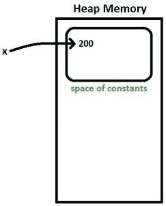
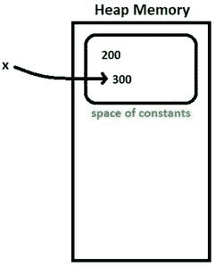
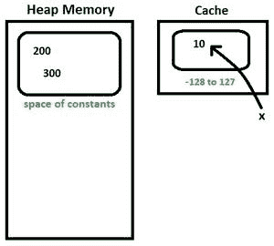
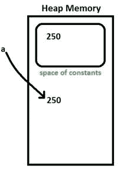
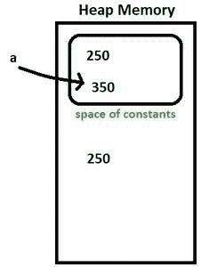

# Java 中的 Java.lang.Integer 类

> 原文: [https://www.geeksforgeeks.org/java-lang-integer-class-java/](https://www.geeksforgeeks.org/java-lang-integer-class-java/)

`Integer`类是一个用于原语类型`int`的[包装类](https://www.geeksforgeeks.org/wrapper-classes-java/)，它包含几个有效处理`int`值的方法，比如将其转换为字符串表示，反之亦然。`Integer`类的对象可以保存一个整数值。

## 构造函数

*   **`Integer(int b)`:** 创建一个用提供的值初始化的`Integer`对象。

**语法:**
```java
public Integer(int b)
```

**参数:**
```java
b : value with which to initialize
```

*   **`Integer(String s)`:** 创建一个用字符串表示提供的`int`值初始化的`Integer`对象。默认基数为 10。

**语法:**
```java
public Integer(String s) throws NumberFormatException
```

**参数:**
```java
s : string representation of the int value 
```

**抛出:**
```java
NumberFormatException : 
If the string provided does not represent any int value.
```

## 方法

### `toString()`

返回`int`值对应的字符串。

**语法:**
```java
public String toString(int b)
```

**参数:**
```java
b : int value for which string representation required.
```

### `toHexString()`

以十六进制形式返回`int`值对应的字符串，即返回以十六进制字符-[0-9][a-f]表示`int`值的字符串。

**语法:**
```java
public String toHexString(int b)
```

**参数:**
```java
b : int value for which hex string representation required.
```

### `toOctalString()`

以八进制形式返回`int`值对应的字符串，即返回一个以八进制字符表示`int`值的字符串-[0-7]。

**语法:**
```java
public String toOctalString(int b)
```

**参数:**
```java
b : int value for which octal string representation required.
```

### `toBinaryString()`

以二进制数字返回`int`值对应的字符串，即返回以二进制字符表示`int`值的字符串-[0/1]。

**语法:**
```java
public String toBinaryString(int b)
```

**参数:**
```java
b : int value for which binary string representation required.
```

### `valueOf()`

返回用提供的值初始化的`Integer`对象。

**语法:**
```java
public static Integer valueOf(int b)
```

**参数:**
```java
b : a int value
```

*   **`valueOf(String val, int radix)`:** 另一个重载函数，提供类似于`new Integer(Integer.parseInt(val, radix))`的函数。

**语法:**
```java
public static Integer valueOf(String val, int radix)
throws NumberFormatException
```

**参数:**
```java
val : String to be parsed into int value
radix : radix to be used while parsing
```

**抛出:**
```java
NumberFormatException : if String cannot be parsed to a int value in given radix.
```

*   **`valueOf(String val)`:** 另一个重载函数，它提供了类似于`new Integer(Integer.parseInt(val, 10))`的函数。

**语法:**
```java
public static Integer valueOf(String s)
throws NumberFormatException
```

**参数:**
```java
s : a String object to be parsed as int
```

**抛出:**
```java
NumberFormatException : if String cannot be parsed to a int value in given radix.
```

### `parseInt()`

通过解析提供的基数字符串返回`int`值。不同于`valueOf()`，因为它返回一个基元`int`值，而`valueOf()`返回一个`Integer`对象。

**语法:**
```java
public static int parseInt(String val, int radix)
throws NumberFormatException
```

**参数:**
```java
val : String representation of int 
radix : radix to be used while parsing
```

**抛出:**
```java
NumberFormatException : if String cannot be parsed to a int value in given radix.
```

*   另一个重载方法只包含字符串作为参数，默认情况下基数设置为 10。

**语法:**
```java
public static int parseInt(String val)
throws NumberFormatException
```

**参数:**
```java
val : String representation of int 
```

**抛出:**
```java
NumberFormatException : if String cannot be parsed to a int value in given radix.
```

### `getInteger()`

返回`Integer`对象，表示与给定系统属性关联的值，如果不存在，则返回`null`。

**语法:**
```java
public static Integer getInteger(String prop)
```

**参数:**
```java
prop : System property
```

*   另一个重载方法，如果属性不存在，则返回第二个参数，也就是说，它不返回`null`，而是返回用户提供的默认值。

**语法:**
```java
public static Integer getInteger(String prop, int val)
```

**参数:**
```java
prop : System property
val : value to return if property does not exist.
```

*   另一种根据返回值解析值的重载方法，即如果返回值以“#”开头，则解析为十六进制，如果以“0”开头，则解析为八进制，否则解析为十进制。

**语法:**
```java
public static Integer getInteger(String prop, Integer val)
```

**参数:**
```java
prop : System property
val : value to return if property does not exist.
```

### `decode()`

返回一个`Integer`对象，保存所提供字符串的解码值。提供的字符串必须是以下形式否则将引发`NumberFormatException`：
十进制 - (符号)十进制_数字
十六进制 - (符号)`0x`十六进制_数字
十六进制 - (符号)`0X`十六进制_数字
八进制 - (符号)`0`八进制_数字

**语法:**
```java
public static Integer decode(String s)
throws NumberFormatException
```

**参数:**
```java
s : encoded string to be parsed into int val
```

**抛出:**
```java
NumberFormatException : If the string cannot be decoded into a int value
```

### `rotateLeft()`

通过旋转给定值的二进制补码形式中给定距离留下的位，返回一个基元`int`。向左旋转时，最高有效位移至右侧，或最低有效位，即发生位的循环移动。负距离表示向右旋转。

**语法:**
```java
public static int rotateLeft(int val, int dist)
```

**参数:**
```java
val : int value to be rotated
dist : distance to rotate
```

### `rotateRight()`

通过将给定值的二进制补码形式的位向右旋转给定距离，返回一个基元`int`。当向右旋转时，最低有效位移动到左手边，或者最高有效位置，即发生位的循环移动。负距离表示向左旋转。

**语法:**
```java
public static int rotateRight(int val, int dist)
```

**参数:**
```java
val : int value to be rotated
dist : distance to rotate
```

## 示例代码

```java
// Java program to illustrate
// various Integer methods
public class Integer_test {
    public static void main(String args[])
    {
        int b = 55;
        String bb = "45";

        // Construct two Integer objects
        Integer x = new Integer(b);
        Integer y = new Integer(bb);

        // toString()
        System.out.println("toString(b) = "
                           + Integer.toString(b));

        // toHexString(),toOctalString(),toBinaryString()
        // converts into hexadecimal, octal and binary
        // forms.
        System.out.println("toHexString(b) ="
                           + Integer.toHexString(b));
        System.out.println("toOctalString(b) ="
                           + Integer.toOctalString(b));
        System.out.println("toBinaryString(b) ="
                           + Integer.toBinaryString(b));

        // valueOf(): return Integer object
        // an overloaded method takes radix as well.
        Integer z = Integer.valueOf(b);
        System.out.println("valueOf(b) = " + z);
        z = Integer.valueOf(bb);
        System.out.println("ValueOf(bb) = " + z);
        z = Integer.valueOf(bb, 6);
        System.out.println("ValueOf(bb,6) = " + z);

        // parseInt(): return primitive int value
        // an overloaded method takes radix as well
        int zz = Integer.parseInt(bb);
        System.out.println("parseInt(bb) = " + zz);
        zz = Integer.parseInt(bb, 6);
        System.out.println("parseInt(bb,6) = " + zz);

        // getInteger(): can be used to retrieve
        // int value of system property
        int prop
            = Integer.getInteger("sun.arch.data.model");
        System.out.println(
            "getInteger(sun.arch.data.model) = " + prop);
        System.out.println("getInteger(abcd) ="
                           + Integer.getInteger("abcd"));

        // an overloaded getInteger() method
        // which return default value if property not found.
        System.out.println(
            "getInteger(abcd,10) ="
            + Integer.getInteger("abcd", 10));

        // decode() : decodes the hex,octal and decimal
        // string to corresponding int values.
        String decimal = "45";
        String octal = "005";
        String hex = "0x0f";

        Integer dec = Integer.decode(decimal);
        System.out.println("decode(45) = " + dec);
        dec = Integer.decode(octal);
        System.out.println("decode(005) = " + dec);
        dec = Integer.decode(hex);
        System.out.println("decode(0x0f) = " + dec);
    }
}
```

## Java Integer类方法

### 代码示例与输出

```java
// rotateLeft and rotateRight can be used
// to rotate bits by specified distance
int valrot = 2;
System.out.println(
    "rotateLeft(0000 0000 0000 0010 , 2) ="
    + Integer.rotateLeft(valrot, 2));
System.out.println(
    "rotateRight(0000 0000 0000 0010,3) ="
    + Integer.rotateRight(valrot, 3));
}
}
```

**输出:**

```java
toString(b) = 55
toHexString(b) =37
toOctalString(b) =67
toBinaryString(b) =110111
valueOf(b) = 55
ValueOf(bb) = 45
ValueOf(bb,6) = 29
parseInt(bb) = 45
parseInt(bb,6) = 29
getInteger(sun.arch.data.model) = 64
getInteger(abcd) =null
getInteger(abcd,10) =10
decode(45) = 45
decode(005) = 5
decode(0x0f) = 15
rotateLeft(0000 0000 0000 0010 , 2) =8
rotateRight(0000 0000 0000 0010,3) =1073741824
```

### 方法列表

#### 11. `byteValue()`
返回该整数对象对应的字节值。

**语法:**
```java
public byte byteValue()
```

#### 12. `shortValue()`
返回该整数对象对应的短值。

**语法:**
```java
public short shortValue()
```

#### 13. `intValue()`
返回与该整数对象对应的 `int` 值。

**语法:**
```java
public int intValue()
```

#### 13. `longValue()`
返回与该整数对象对应的长值。

**语法:**
```java
public long longValue()
```

#### 14. `doubleValue()`
返回与该整数对象对应的双精度值。

**语法:**
```java
public double doubleValue()
```

#### 15. `floatValue()`
返回该整数对象对应的浮点值。

**语法:**
```java
public float floatValue()
```

#### 16. `hashCode()`
返回该整数对象对应的 `hashCode`。

**语法:**
```java
public int hashCode()
```

#### 17. `bitCount()`
返回给定整数的二进制补码的设置位数。

**语法:**
```java
public static int bitCount(int i)
```

**参数:**
```java
i : int value whose set bits to count
```

#### 18. `numberOfLeadingZeros()`
返回该值的二进制补码形式的最高 1 位之前的 0 位数，即如果二进制补码形式的数字是 `0000 1010 0000 0000`，则该函数将返回 4。

**语法:**
```java
public static int numberOfLeadingZeros(int i)
```

**参数:**
```java
i : int value whose leading zeroes to count in twos complement form
```

#### 19. `numberOfTrailingZeros()`
返回值的二进制补码形式的最后 1 位之后的 0 位数，即如果二进制补码形式的数字是 `0000 1010 0000 0000`，则此函数将返回 9。

**语法:**
```java
public static int numberOfTrailingZeros(int i)
```

**参数:**
```java
i : int value whose trailing zeroes to count in twos complement form
```

#### 20. `highestOneBit()`
返回一个值，在给定值中最高一位的位置最多有一位。如果给定值为 0，即如果数字为 `0000 0000 0000 1111`，则返回 0，然后此函数返回 `0000 0000 0000 1000`（给定数字中最高的一位）。

**语法:**
```java
public static int highestOneBit(int i)
```

**参数:**
```java
i : int value
```

#### 21. `lowestOneBit()`
返回一个值，在给定值中最低一位的位置最多有一个单个一位。如果给定的值为 0，即如果数字为 `0000 0000 0000 1111`，则返回 0，然后此函数返回 `0000 0000 0000 0001`（给定数字中最高的一位）。

**语法:**
```java
public static int lowestOneBit(int i)
```

**参数:**
```java
i : int value
```

#### 22. `equals()`
用于比较两个 `Integer` 对象的相等性。如果两个对象包含相同的 `int` 值，则此方法返回 `true`。仅当检查是否相等时才应使用。在所有其他情况下，应该首选 `compareTo` 方法。

**语法:**
```java
public boolean equals(Object obj)
```

**参数:**
```java
obj : object to compare with
```

#### 23. `compareTo()`
用于比较两个整数对象的数值是否相等。当比较两个整数值是否相等时，应该使用这种方法，因为它可以区分较小值和较大值。返回小于 0，0 的值，对于小于、等于和大于，返回大于 0 的值。

**语法:**
```java
public int compareTo(Integer b)
```

**参数:**
```java
b : Integer object to compare with
```

#### 24. `compare()`
用于比较两个原始 `int` 值的数值相等性。由于它是一个静态方法，因此可以在不创建任何整数对象的情况下使用。

**语法:**
```java
public static int compare(int x, int y)
```

**参数:**
```java
x : int value
y : another int value
```

#### 25. `signum()`
返回 -1 表示负值，0 表示 0，大于 0 的值返回 +1。

**语法:**
```java
public static int signum(int val)
```

**参数:**
```java
val : int value for which signum is required.
```

#### 26. `reverse()`
返回一个原语 `int` 值，该值反转给定 `int` 值的二进制补码形式中的位顺序。

**语法:**
```java
public static int reverse(int val)
```

**参数:**
```java
val : int value whose bits to reverse in order.
```

#### 27. `reverseBytes()`
返回一个原始 `int` 值，该值反转给定 `int` 值的二进制补码形式中的字节顺序。

**语法:**
```java
public static int reverseBytes(int val)
```

**参数:**
```java
val : int value whose bits to reverse in order.
```

#### 28. `compareUnsigned()`
这个方法比较两个 `int` 值，数值上把值当作无符号。

**语法:**
```java
public static int compareUnsigned(int x, int y)
```

#### 29. `divideUnsigned()`
此方法返回第一个参数除以第二个参数的无符号商，其中每个参数和结果都被解释为无符号值。

**语法:**
```java
public static int divideUnsigned(int dividend, int divisor)
```

#### 30. `max()`
这个方法返回两个 `int` 值中较大的一个，就像调用 `Math.max` 一样。

**语法:**
```java
public static int max(int a, int b)
```

#### 31. `min()`
这个方法返回两个 `int` 值中较小的一个，就好像是通过调用 `Math.min` 一样。

**语法:**
```java
public static int min(int a, int b)
```

#### 32. `parseUnsignedInt()`
此方法将 `CharSequence` 参数解析为指定基数中的无符号 `int`，从指定的 `beginIndex` 开始，扩展到 `endIndex–1`。

**语法:**
```java
public static int parseUnsignedInt(CharSequence s,
                                   int beginIndex,
                                   int endIndex,
                                   int radix)
                            throws NumberFormatException
```

#### 33. `parseUnsignedInt()`
此方法将字符串参数解析为无符号十进制整数。

**语法:**
```java
public static int parseUnsignedInt(String s)
throws NumberFormatException
```

#### 34. `parseUnsignedInt()`
此方法将字符串参数解析为第二个参数指定的基数中的无符号整数。

**语法:**
```java
public static int parseUnsignedInt(String s,
                                   int radix)
                            throws NumberFormatException
```

#### 35. `remainderUnsigned()`
此方法返回第一个参数除以第二个参数得到的无符号余数，其中每个参数和结果都被解释为无符号值。

**语法:**
```java
public static int remainderUnsigned(int dividend, int divisor)
```

#### 36. `sum()`
这个方法按照 `+` 运算符将两个整数相加。

**语法:**
```java
public static int sum(int a, int b)
```

#### 37. `toUnsignedLong()`
此方法通过无符号转换将参数转换为 `long`。

**语法:**
```java
public static long toUnsignedLong(int x)
```

#### 38. `toUnsignedString()`
此方法将参数的字符串表示形式作为无符号十进制值返回。

**语法:**
```java
public static String toUnsignedString(int i, int radix)
```

### 完整示例

```java
// Java program to illustrate
// various Integer class methods
public class Integer_test {
    public static void main(String args[])
    {
        int b = 55;
        String bb = "45";

        // Construct two Integer objects
        Integer x = new Integer(b);
        Integer y = new Integer(bb);

        // xxxValue can be used to retrieve
        // xxx type value from int value.
        // xxx can be int,byte,short,long,double,float
        System.out.println("bytevalue(x) = "
                           + x.byteValue());
        System.out.println("shortvalue(x) = "
                           + x.shortValue());
        System.out.println("intvalue(x) = " + x.intValue());
        System.out.println("longvalue(x) = "
                           + x.longValue());
        System.out.println("doublevalue(x) = "
                           + x.doubleValue());
        System.out.println("floatvalue(x) = "
                           + x.floatValue());

        int value = 45;
```

# Java Integer 类方法与初始化详解

## Integer 类的常用方法

以下代码展示了 `Integer` 类中一些用于位操作和比较的静态方法与实例方法。

```java
// bitCount() : 可用于计算数值的二进制补码形式中 1 的个数
System.out.println("Integer.bitCount(value)="
                   + Integer.bitCount(value));

// numberOfTrailingZeroes 和 numberOfLeadingZeroes
// 可用于计算二进制表示中后缀和前缀连续 0 的个数
System.out.println(
    "Integer.numberOfTrailingZeros(value)="
    + Integer.numberOfTrailingZeros(value));
System.out.println(
    "Integer.numberOfLeadingZeros(value)="
    + Integer.numberOfLeadingZeros(value));

// highestOneBit 返回一个值，其最高位的 1 被保留，其余位为 0
System.out.println("Integer.highestOneBit(value)="
                   + Integer.highestOneBit(value));

// lowestOneBit 返回一个值，其最低位的 1 被保留，其余位为 0
System.out.println("Integer.lowestOneBit(value)="
                   + Integer.lowestOneBit(value));

// reverse() 可用于反转比特顺序
// reverseBytes() 可用于反转字节顺序
System.out.println("Integer.reverse(value)="
                   + Integer.reverse(value));
System.out.println("Integer.reverseBytes(value)="
                   + Integer.reverseBytes(value));

// signum() 对于负数、零和正数分别返回 -1, 0, 1
System.out.println("Integer.signum(value)="
                   + Integer.signum(value));

// hashCode() 返回对象的哈希码值
int hash = x.hashCode();
System.out.println("hashCode(x) = " + hash);

// equals() 返回表示相等性的布尔值
boolean eq = x.equals(y);
System.out.println("x.equals(y) = " + eq);

// compare() 用于比较两个 int 值
int e = Integer.compare(x, y);
System.out.println("compare(x,y) = " + e);

// compareTo() 用于将此值与另一个值进行比较
int f = x.compareTo(y);
System.out.println("x.compareTo(y) = " + f);
}
}
```

### 方法调用输出示例

```java
byteValue(x) = 55
shortValue(x) = 55
intValue(x) = 55
longValue(x) = 55
doubleValue(x) = 55.0
floatValue(x) = 55.0
Integer.bitCount(value)=4
Integer.numberOfTrailingZeros(value)=0
Integer.numberOfLeadingZeros(value)=26
Integer.highestOneBit(value)=32
Integer.lowestOneBit(value)=1
Integer.reverse(value)=-1275068416
Integer.reverseBytes(value)=754974720
Integer.signum(value)=1
hashCode(x) = 55
x.equals(y) = false
compare(x,y) = 1
x.compareTo(y) = 1
```

## Java 中 Integer 包装类的初始化

### 类型 1：直接初始化

整数类的常量对象将在堆内存中的常量池内创建。常量池是为了更好地理解而引入的概念，指的是堆内存中的一块特殊区域。

**示例：**

```java
Integer x = 200;  // 直接初始化
x = 300;          // 修改 x
x = 10;           // 再次修改 x
```

**`Integer x = 200`**

*   编译器将上述语句转换为：`Integer x = Integer.valueOf(200)`。这里被称为“**自动装箱**”。原始整数值 `200` 被转换成对象。
*   *(要了解自动装箱与拆箱，请参考：[https://www.geeksforgeeks.org/autoboxing-unboxing-java/](https://www.geeksforgeeks.org/autoboxing-unboxing-java/))*
*   `x` 指向常量池中的 `200`。参考图 1。



图 1

**`x = 300`**

*   自动装箱再次完成，因为 `x` 是一个直接初始化的 `Integer` 类对象。
*   **注意：** 直接初始化的对象 (`x`) 是常量，其引用可以被修改。当我们试图通过指向新常量 (`300`) 来“修改”对象时，旧常量 (`200`) 仍存在于常量池中，但对象引用将指向新常量。
*   `x` 指向常量池中的 `300`。参考图 2。



图 2

**`x = 10`**

*   **注意：** 默认情况下，对于 `-128` 到 `127` 的值，`Integer.valueOf()` 方法不会创建 `Integer` 的新实例。它从缓存中返回一个已存在的值。
*   `x` 指向缓存中的 `10`。



图 3

如果我们下次指定 `x = 200` 或 `x=300`，它将指向常量池中已经存在的值 `200` 或 `300`。如果我们给 `x` 赋值一个不在缓存范围内的值，那么它会创建一个新的常量。

*(查看 Integer 包装器类比较主题以便更好地理解)*

### 类型 2：动态初始化

不是常量的 `Integer` 类对象将在常量池之外创建。它还会在常量池中创建一个对应的整数常量。变量将指向堆中的 `Integer` 对象，而不是常量池中的整数常量。

**示例：**

```java
Integer a = new Integer(250);   // 动态初始化
a = 350;            // 转为类型 1 初始化
```

**`Integer a = new Integer(250)`**

*   值 `250` 对应的 `Integer` 对象在常量池内外都会被创建（如果常量池中没有）。变量 `a` 将指向堆中（常量池之外）的对象。参考图 4。



图 4

**`a = 350`**

*   经过自动装箱后，`a` 将指向值为 `350` 的 `Integer` 对象（可能来自缓存或新建）。参考图 5。



图 5

如果我们下次分配 `a = 250`，它不会指向之前创建的具有相同值的对象，而是会创建一个新的对象（或从缓存获取，取决于值的范围）。

如果你发现任何不正确的地方，或者你想分享更多关于上面讨论的话题的信息，请写评论。

**参考文献：** [官方 Java 文档](https://docs.oracle.com/javase/7/docs/api/java/lang/Integer.html)

本文由**里沙布·马赫塞**供稿。如果你喜欢 GeeksforGeeks 并想投稿，你也可以使用 [write.geeksforgeeks.org](https://write.geeksforgeeks.org) 写一篇文章或者把你的文章邮寄到 review-team@geeksforgeeks.org。看到你的文章出现在极客博客主页上，帮助其他极客。