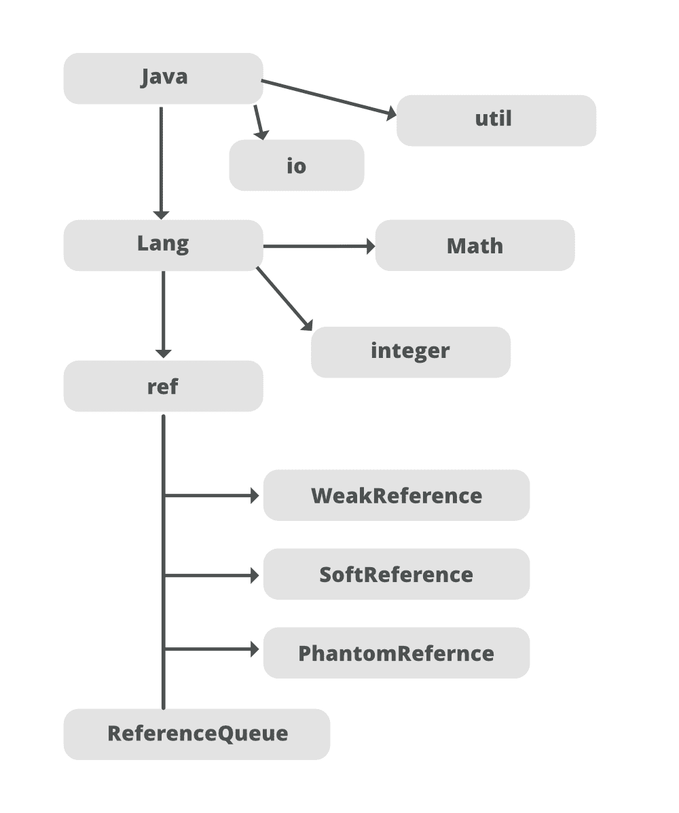

# java 中的 `java.lang.ref.SoftReference` 类

> 原文：[https://www.geeksforgeeks.org/java-lang-ref-softreference-class-in-java/](https://www.geeksforgeeks.org/java-lang-ref-softreference-class-in-java/)

当我们用 Java 创建一个对象时，默认情况下对象不是软的。要创建一个软引用对象，我们必须明确地将其指定给 [**JVM**](https://www.geeksforgeeks.org/jvm-works-jvm-architecture/) 。在软引用中，即使对象可以进行垃圾收集，也不会进行垃圾收集，直到 JVM 急需内存。当 JVM 内存不足时，对象会从内存中清除。

## 为什么使用软参考对象？

创建软引用对象时，它被标记为垃圾收集。但是，除非 JVM 内存不足，否则不会进行垃圾收集。



## 软引用类中的构造函数

| 构造函数参数 | 构造函数描述 |
| --- | --- |
| `SoftReference(Reference)` | Creates a new soft reference that references the given object. |
| `SoftReference(T referent, ReferenceQueue<? super T> q)` | Create a new soft reference that references the given object and registers in the given queue. |

## `get()` 方法

```java
// Java program to show the demonstration
// of get() method of SoftReference Class

import java.lang.ref.SoftReference;
class GFG {
    public static void main (String[] args) {

        // creating a strong object of MyClass
        MyClass obj = new MyClass ();

        // creating a weak reference of type MyClass
        SoftReference<MyClass> sobj = new SoftReference<>(obj);

        System.out.println ("-> Calling Display Function using strong object:");
        obj.Display ();

        System.out.println ("-> Object set to null");
        obj = null;

        // Calling the get() method
        obj = sobj.get();
        System.out.println ("-> Calling Display Function after retrieving from soft Object");
        obj.Display ();
    }
}
class MyClass {
    void Display ()
    {
        System.out.println ("Display Function invoked ...");
    }
}
```

**Output**

```java
-> Calling Display Function using strong object:
Display Function invoked ...
-> Object set to null
-> Calling Display Function after retrieving from soft Object
Display Function invoked ...
```

## 显示软引用类的 `enqueue()` 和 `isEnqueued()` 方法的示例

```java
// Java program demonstrating all the methods
// of SoftRefernce Class

import java.lang.ref.SoftReference;
class GFG {
    public static void main (String [] args) {

        // Creating object of Class X
        X obj = new X ();

        // Creating a soft reference of type X
        SoftReference <X> softobj = new SoftReference <X> (obj);

        System.out.println ("-> Retrieving object from Soft Reference using get ()");
        softobj.get().show();

        System.out.println ("-> Is it possible to queue object using enqueue ()");
        System.out.println (softobj.enqueue ());

        System.out.println ("-> Checking if reference is queued using isEnqueued ()");
        System.out.println (softobj.isEnqueued ());
    }
}
class X {
    void show()
    {
        System.out.println ("show () from X invoked..");
    }
}
```

**Output**

```java
-> Retrieving object from Soft Reference using get ()
show () from X invoked..
-> Is it possible to queue object using enqueue ()
false
-> Checking if reference is queued using isEnqueued ()
false
```

## 从引用类继承的方法

| Method name | 方法描述 |
| --- | --- |
| `clear()` | Clear this reference object. |
| `enqueue()` | Add this reference object to the queue where it is registered, if any. |
| `get()` | Returns the referent of the reference object. |
| `isEnqueued()` | Tell whether this reference object has been enqueued, whether it is a program enqueued or a garbage collector enqueued. |