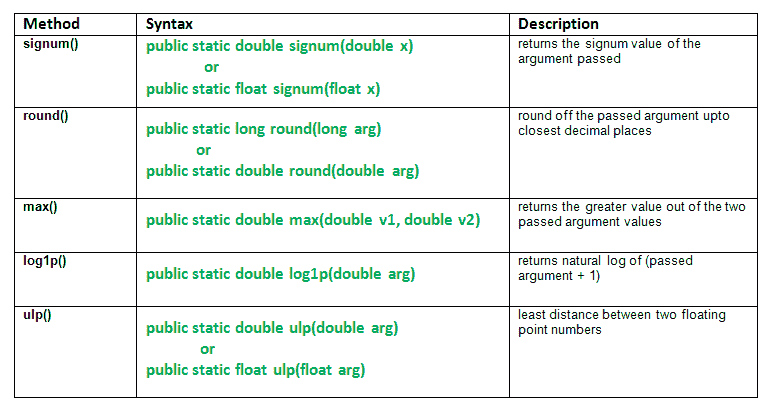

# java.math 类及其方法 | 第 1 集

> 原文：[https://www.geeksforgeeks.org/java-math-class-methods-set-1/](https://www.geeksforgeeks.org/java-math-class-methods-set-1/)

`Math`类提供数学函数来执行基本的数值运算，如指数、对数、平方根和三角函数。`cosh`、`sin`、`tan`、`abs`、`bitLength`、乘法等等。`Math`类函数的实现不返回逐位相同的结果。因此，执行更好的实现。

## 类声明

```java
public final class Math extends Object
```

本集讲解以下方法：
[](https://media.geeksforgeeks.org/wp-content/uploads/java.math-class-methods.png)

## 方法

### 1. `signum()`
`Math.signum()`方法返回传递参数的符号值。

```java
                        -1    if x < 0
signum(x) =             0    if x = 0
                         1    if x > 0
```

**注：**

**语法：**

```java
public static double signum(double x)
// 或
public static float signum(float x)
```

**参数：**
- `x` - 我们需要获取其符号值的参数

**返回值：**
- `x`的符号值

### 2. `round()`
`Math.round()`方法将传递的参数四舍五入到最接近的小数位数。
**注：** 如果参数为`NaN`，结果为0。

**语法：**

```java
public static long round(long arg)
// 或
public static double round(double arg)
```

**参数：**
- `arg` - 需要四舍五入的参数

**返回值：**
- 参数的四舍五入值

### 3. `max()`
`Math.max(double v1, double v2)`方法返回两个传递的参数值中较大的值。这种方法只是比较使用量级，不考虑任何符号。

**语法：**

```java
public static double max(double v1, double v2)
```

**参数：**
- `v1` - 第一个值
- `v2` - 第二个值

**返回值：**
- 根据哪个数字更大返回`v1`或`v2`。如果`v1 = v2`，则可以返回两者中的任意一个。

### 在`Math`类中解释`signum()`、`round()`、`max()`方法的Java代码

```java
// Java code explaining the Math Class methods
// signum(), round(), max()
import java.lang.*;
public class NewClass
{
    public static void main(String args[])
    {
        // Use of signum() method
        double x = 10.4556, y = -23.34789;
        double signm = Math.signum(x);
        System.out.println("Signum of 10.45  = " + signm);

        signm = Math.signum(y);
        System.out.println("Signum of -23.34 = " + signm);
        System.out.println("");

        // Use of round() method
        double r1 = Math.round(x);
        System.out.println("Round off 10.4556  = " + r1);

        double r2 = Math.round(y);
        System.out.println("Round off 23.34789 = " + r2);
        System.out.println("");

        // Use of max() method on r1 and r2
        double m = Math.max(r1, r2);
        System.out.println("Max b/w r1 and r2 = " + r2);
    }
}
```

**输出：**

```java
Signum of 10.45  = 1.0
Signum of -23.34 = -1.0

Round off 10.4556  = 10.0
Round off 23.34789 = -23.0

Max b/w r1 and r2 = -23.0
```

### 4. `log1p()`
`Math.log1p()`方法返回（传递的参数+ 1）的自然对数。

**语法：**

```java
public static double log1p(double arg)
```

**参数：**
- `arg` - 参数

**返回值：**
- `(argument + 1)`的对数。这个结果在精确结果的最后一位的1个单位内。

### 5. `ulp()`
`Math.ulp()`方法返回**最小精度单位（ulp）**，即两个浮点数之间的最小距离。这里，它是参数和下一个较大值之间的最小距离。

**语法：**

```java
public static double ulp(double arg)
// 或
public static float ulp(float arg)
```

**参数：**
- `arg` - 传递的参数

**返回值：**
- 参数与下一个较大值之间的最小距离

### 在`Math`类中解释`ulp()`、`log1p()`方法的Java代码

```java
// Java code explaining the Math Class methods
// ulp(), log1p()
import java.lang.*;
public class NewClass
{
    public static void main(String args[])
    {
        // Use of ulp() method
        double x = 34.652, y = -23.34789;
        double u = Math.ulp(x);
        System.out.println("ulp of 34.652    : " + u);

        u = Math.ulp(y);
        System.out.println("ulp of -23.34789 : " + u);
        System.out.println("");

        // Use of log() method
        double l = 99;
        double l1 = Math.log1p(l);
        System.out.println("Log of (1 + 99)  : " + l1);

        l1 = Math.log(100);
        System.out.println("Log of 100       : " + l1);
    }
}
```

**输出：**

```java
ulp of 34.652    : 7.105427357601002E-15
ulp of -23.34789 : 3.552713678800501E-15

Log of (1 + 99)  : 4.605170185988092
Log of 100       : 4.605170185988092
```

*   [java.math 类及其方法 | 第 2 集](https://www.geeksforgeeks.org/math-class-methods-java-examples-set-2/)
*   [java.math 类及其方法 | 第 3 集](https://www.geeksforgeeks.org/java-math-class-methods-set-3/)

本文由 **莫希特·古普塔** 供稿。如果你喜欢 GeeksforGeeks 并想投稿，你也可以使用 [write.geeksforgeeks.org](https://write.geeksforgeeks.org) 写一篇文章或者把你的文章邮寄到 `review-team@geeksforgeeks.org`。看到你的文章出现在极客博客主页上，帮助其他极客。

如果你发现任何不正确的地方，或者你想分享更多关于上面讨论的话题的信息，请写评论。