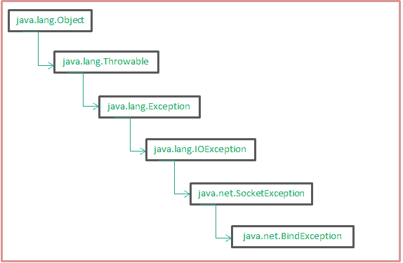
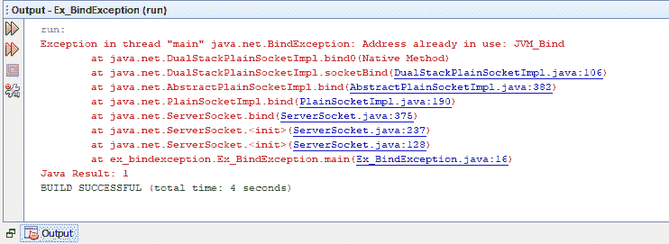

# java.net.BindException 在 Java 中的示例

> 原文：[https://www.geeksforgeeks.org/java-net-bindexception-in-java-with-examples/](https://www.geeksforgeeks.org/java-net-bindexception-in-java-with-examples/)

`java.net.BindException` 是当应用程序试图将套接字绑定到本地地址和端口时，绑定中出现错误时引发的异常。大多数情况下，这可能是由于两个原因造成的，要么端口已经在使用中（由于另一个应用程序），要么所请求的地址无法分配给这个应用程序。`BindException` 继承自 `SocketException` 类，因此显示存在与套接字创建或访问相关的错误。

## 构造函数

下列构造函数可用于 `BindException`：

*   `BindException()`: 创建一个没有详细消息的 `BindException` 类的简单实例。
*   `BindException(String message)`: 用指定的消息创建 `BindException` 类的实例，作为发生绑定错误的原因。

## 方法总结

1.  **从 `java.lang.Throwable` 类继承的方法：**
    `addSuppressed()`、`fillInStackTrace()`、`getCause()`、`getLocalizedMessage()`、`getMessage()`、`getStackTrace()`、`getSuppressed()`、`initCause()`、`printStackTrace()`、`setStackTrace()`
2.  **方法继承自 `java.lang.Object` 类：**
    `clone()`、`equals()`、`finalize()`、`getClass()`、`hashCode()`、`notifyAll()`、`wait()`



## `java.net.BindException` 的层次结构

## 示例

在下面的例子中，我们创建了一个类 `Ex_BindException` 来演示 `BindException`：

### Java 代码

```java
// java.net.BindException in Java with Examples

import java.io.*;
import java.net.*;
public class Ex_BindException {

    // Creating a variable PORT1 with arbitrary port value
    private final static int PORT1 = 8000;

    public static void main(String[] args)
        throws IOException
    {
        // Creating instance of the ServerSocket class
        // and binding it to the arbitrary port
        ServerSocket socket1 = new ServerSocket(PORT1);

        // Creating another instance of the ServerSocket
        // class and binding it to the same arbitrary
        // port, thus it gives a BindException.
        ServerSocket socket2 = new ServerSocket(PORT1);
        socket1.close();
        socket2.close();
    }
}
```

**输出：**



在上面的代码中，我们首先使用指定的端口创建了一个 [`ServerSocket`](https://www.geeksforgeeks.org/socket-programming-in-java/) 类的实例。该实例已成功绑定。但是，当使用同一端口创建另一个实例时，会出现 `BindException`，因为该端口已经绑定到另一个套接字。在这里，我们可以简单地为第二个套接字使用另一个任意端口（它没有被使用）来消除这个异常。