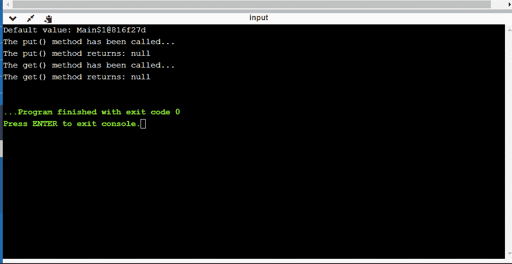

# Java 中的 java.net.ResponseCache 类

> 原文：[https://www.geeksforgeeks.org/java-net-responsecache-class-in-java/](https://www.geeksforgeeks.org/java-net-responsecache-class-in-java/)

`ResponseCache` 用于构建 `URLConnection` 缓存的实现，它指定了必须缓存哪个资源，以及需要缓存资源的持续时间。

通过执行以下操作，可以使用系统创建响应缓存的实例：

> `ResponseCache.setDefault(responseCache)`

使用上述语句创建的实例将调用 `ResponseCache` 的对象，以便：
1.  用于将从外部源检索的资源数据存储到缓存中。
2.  用于应请求获取已存储在缓存中的资源。
3.  响应缓存可以通过 `java.net` 包导入。

> `java.net.ResponseCache`

## ResponseCache 类的方法

| 方法 | 描述 |
| --- | --- |
| `get(URI uri, String rqstMethod, Map<String, List<String>> rqstHeaders)` | 此方法用于根据请求的 URI、请求方法和请求头来检索缓存的响应。 |
| `getDefault()` | 此方法用于检索系统范围的缓存响应。 |
| `put(URI uri, URLConnection conn)` | 每当检索到一个资源时，协议处理器都会调用此方法，`ResponseCache` 必须决定是否将该资源存储在其缓存中。 |
| `setDefault(ResponseCache responseCache)` | 此方法用于设置或取消设置系统级缓存。 |

## ResponseCache 类的应用

1.  在 [`java.net`](https://www.geeksforgeeks.org/tag/java-net-package/) 包中，`ResponseCache` 用于实现各种网络应用的资源缓存，例如：
    *   电子邮件
    *   文件传输
    *   远程终端访问
    *   加载网页

    > `java.net.ResponseCache`

2.  在 `java.net` 中，`ResponseCache` 用于获取系统范围的响应缓存。

    > `public static ResponseCache.getDefault()`

3.  在 `java.net` 中，`ResponseCache` 用于设置或取消设置系统范围的缓存。

    > `public static void ResponseCache.setDefault(ResponseCache responseCache)`

## 用于实现 java.net.ResponseCache 的 Java 程序

```java
import java.io.IOException;
import java.net.*;
import java.util.HashMap;
import java.util.LinkedList;
import java.util.List;
import java.util.Map;
public class JavaResponseCacheExample1 {
    public static void main(String args[]) throws Exception
    {
        // passing the string uri
        String uri = "https://www.onlinegdb.com";

        // Calling the constructor of the URI class
        URI uri1 = new URI(uri);

        // passing the url
        URL url = new URL("http://www.onlinegdb.com");

        // calling the constructor of the URLConnection
        URLConnection urlcon = url.openConnection();
        ResponseCache responseCache = new ResponseCache() {
            // calling the abstract methods
            @Override
            public CacheResponse get(
                URI uri, String rqstMethod,
                Map<String, List<String> > rqstHeaders)
                throws IOException
            {
                return null;
            }

            @Override
            public CacheRequest put(URI uri,
                                    URLConnection conn)
                throws IOException
            {
                return null;
            }
        };

        // The sets the system-wide response cache.
        ResponseCache.setDefault(responseCache);

        // The getDefault() method returns
        // the system-wide ResponseCache .
        System.out.println("Default value: "
                           + ResponseCache.getDefault());
        Map<String, List<String> > maps
            = new HashMap<String, List<String> >();
        List<String> list = new LinkedList<String>();
        list.add("REema");

        // put() method sets all the applicable cookies,
        // present in the response headers into a cookie
        // cache
        maps.put("1", list);
        System.out.println(
            "The put() method has been called...");

        // The put() method returns the
        // CacheRequest for recording
        System.out.println(
            "The put() method returns: "
            + responseCache.put(uri1, urlcon));
        System.out.println(
            "The get() method has been called...");

        // The get() method returns a CacheResponse
        // instance if it is available
        System.out.println(
            "The get() method returns: "
            + responseCache.get(uri1, uri, maps));
    }
}
```

**输出：**

