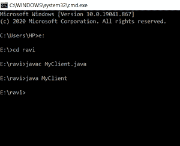
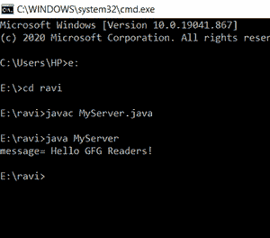

# java 中的 `java.net.Socket` 类

> 原文: [https://www.geeksforgeeks.org/java-net-socket-class-in-java/](https://www.geeksforgeeks.org/java-net-socket-class-in-java/)

`java.net.Socket` 类允许我们创建套接字对象，帮助我们实现所有基本的套接字操作。我们可以执行各种网络操作，如发送、读取数据和关闭连接。使用 `java.net.Socket` 类创建的每个 `Socket` 对象都与一个远程主机完全关联，为了连接到另一个不同的主机，我们必须创建一个新的 `Socket` 对象。

从 `java.net` 包导入套接字类的语法:

> `import java.net.Socket;`

## `Socket` 类使用的方法

| 方法 | 描述 |
| --- | --- |
| `bind(SocketAddress bindpoint)` | 此方法用于将套接字绑定到本地地址。 |
| `close()` | 此方法用于终止套接字。 |
| `connect(SocketAddress endpoint)` | 此方法用于将套接字连接到服务器。 |
| `getChannel()` | 此方法返回与套接字关联的 `SocketChannel` 对象(如果有)。 |
| `getInetAddress()` | 此方法返回套接字连接到的地址。 |
| `getInputStream()` | 此方法返回套接字的输入流。 |
| `getKeepAlive()` | 此方法用于检查 `SO_KEEPALIVE` 是否启用。 |
| `getLocalAddress()` | 此方法用于获取套接字绑定到的本地地址。 |
| `getLocalPort()` | 此方法返回套接字绑定到的本地端口号。 |
| `getLocalSocketAddress()` | 此方法返回套接字绑定的端点地址。 |
| `getOOBInline()` | 此方法检查 `SO_OOBINLINE` 是否已启用。 |
| `getOutputStream()` | 此方法返回套接字的输出流。 |
| `getPort()` | 此方法返回与套接字关联的远程端口号。 |
| `getReceiveBufferSize()` | 此方法用于为套接字获取 `SO_RCVBUF` 选项的值，该值是平台在套接字上用作输入的缓冲区大小。 |
| `getRemoteSocketAddress()` | 这个方法返回套接字的端点地址，如果没有连接，则返回 `null`。 |
| `getReuseAddress()` | 此方法检查是否启用了 `SO_REUSEADDR`。 |
| `getSendBufferSize()` | 此方法用于获取套接字的 `SO_SNDBUF` 选项的值，该值用作套接字上平台输出的缓冲区大小。 |
| `getSoLinger()` | 此方法返回 `SO_LINGER` 的设置。 |
| `getSoTimeout()` | 此方法返回 `SO_TIMEOUT` 的设置。 |
| `getTcpNoDelay()` | 此方法用于测试 `TCP_NODELAY` 是否启用。 |
| `getTrafficClass()` | 此方法获取从该套接字发送的数据包的 IP 报头中的流量类或服务类型。 |
| `isBound()` | 此方法返回套接字的绑定状态。 |
| `isClosed()` | 此方法返回套接字的关闭状态。 |
| `isConnected()` | 此方法返回套接字的连接状态。 |
| `isInputShutdown()` | 此方法返回套接字连接的读半部分是否关闭。 |
| `isOutputShutdown()` | 此方法返回套接字连接的写半部分是否关闭。 |
| `sendUrgentData(int data)` | 这个方法在套接字上发送一个字节的紧急数据。 |
| `setKeepAlive(boolean on)` | 此方法启用/禁用 `SO_KEEPALIVE`。 |
| `setOOBInline(boolean on)` | 此方法启用/禁用 `SO_OOBINLINE`(接收 TCP 紧急数据)默认情况下，此选项处于禁用状态，在套接字上接收的 TCP 紧急数据将被静默丢弃。 |
| `setPerformancePreferences(int connectionTime, int latency, int bandwidth)` | 此方法设置此套接字的性能首选项。 |
| `setReceiveBufferSize(int size)` | 此方法将 `SO_RCVBUF` 选项设置为此套接字指定的值。 |
| `setReuseAddress(boolean on)` | 此方法启用/禁用 `SO_REUSEADDR` 套接字选项。 |
| `setSendBufferSize(int size)` | 此方法将 `SO_SNDBUF` 选项设置为此套接字指定的值。 |
| `setSocketImplFactory(SocketImplFactory fac)` | 此方法为应用程序设置客户端套接字实现工厂。 |
| `setSoLinger(boolean on, int linger)` | 此方法启用/禁用指定停留时间(秒)的 `SO_LINGER`。 |
| `setSoTimeout(int timeout)` | 此方法启用/禁用指定超时的 `SO_TIMEOUT`，以毫秒为单位。 |
| `setTcpNoDelay(boolean on)` | 此方法启用/禁用 `TCP_NODELAY`(禁用/启用 Nagle 算法)。 |
| `setTrafficClass(int tc)` | 此方法为从此套接字发送的数据包在 IP 报头中设置流量类别或服务类型八位字节。 |
| `shutdownInput()` | 这个方法将这个套接字的输入流放在“流的末尾”。 |
| `toString()` | 此方法将套接字转换为字符串。 |

## `Socket` 类应用

1.  `Socket` 类是在创建流套接字时实现的，它连接到指定的端口号和端口地址。
    > `public Socket(InetAddress address, int port)`

2.  `Socket` 类用于创建 `Socket`，并连接到 `Socket` 指定远程端口上的指定远程地址。
    > `SocketFactory.createSocket(InetAddress address, int port, InetAddress localAddress, int localPort)`

3.  在 `javax.net.ssl` 中，`Socket` 类用于返回在给定端口连接到命名主机的现有套接字上分层的套接字。
    > `SSLSocketFactory.createSocket(Socket s, String host, int port, boolean autoClose)`

4.  在 `javax.rmi.ssl` 中，`Socket` 类用于创建一个 SSL 套接字。
    > `SslRMIClientSocketFactory.createSocket(String host, int port)`

5.  在 `java.nio.channels` 中，`Socket` 类用于检索与其通道相关联的套接字。
    > `SocketChannel.socket()`

## `Socket` 类实现的 Java 示例

### 1. 服务器端

```java
import java.io.*;
import java.net.*;
public class MyServer {
    public static void main(String[] args)
    {
        try {
            ServerSocket ss = new ServerSocket(6666);

            // establishes connection
            Socket soc = ss.accept();

            // invoking input stream
            DataInputStream dis
                = new DataInputStream(s.getInputStream());

            String str = (String)dis.readUTF();

            System.out.println("message= " + str);

            // closing socket
            ss.close();

        } // for catching Exception in run time
        catch (Exception e) {
            System.out.println(e);
        }
    }
}
```

**客户端输出:**



### 2. 客户端

```java
import java.io.*;
import java.net.*;
public class MyClient {
    public static void main(String[] args)
    {
        try {

            // initializing Socket
            Socket soc = new Socket("localhost", 6666);

            DataOutputStream d = new DataOutputStream(
                soc.getOutputStream());

            // message to display
            d.writeUTF("Hello GFG Readers!");

            d.flush();

            // closing DataOutputStream
            d.close();

            // closing socket
            soc.close();
        }

        // to initialize Exception in run time
        catch (Exception e) {
            System.out.println(e);
        }
    }
}
```

**服务器输出:**

