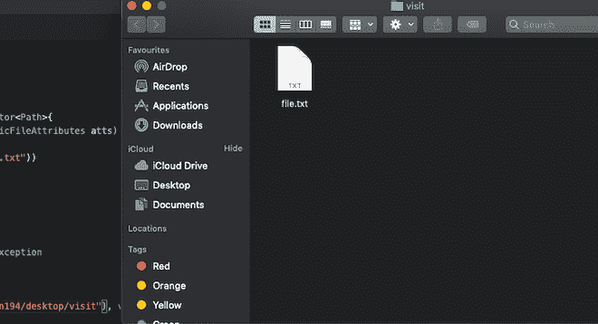
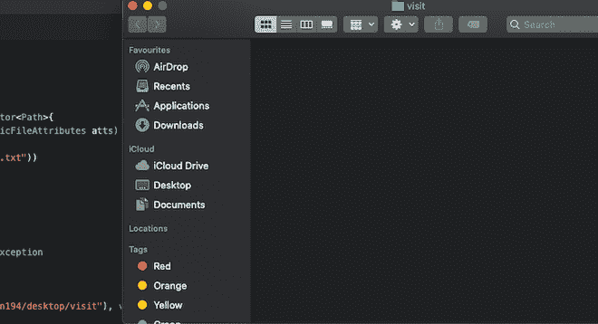

# Java 中的 `SimpleFileVisitor` 类

> 原文：[https://www.geeksforgeeks.org/java-nio-file-simplefilevisitor-class-in-java/](https://www.geeksforgeeks.org/java-nio-file-simplefilevisitor-class-in-java/)

`java.nio.file.SimpleFileVisitor` 类用于访问目录中的所有文件，并在出现输入/输出错误时重新抛出输入/输出异常。

## 类声明

```java
public class SimpleFileVisitor<T>
    extends Object
    implements FileVisitor<T>
```

## 构造方法

*   **受保护的 `SimpleFileVisitor()`**：创建 `SimpleFileVisitor` 类的新对象。

## 方法

| 方法 | 描述 |
| --- | --- |
| `public FileVisitResult preVisitDirectory(T dir, BasicFileAttributes attrs)` | 在访问条目之前，将为此目录调用此方法。除非被重写，否则此方法返回 `CONTINUE`。 |
| `public FileVisitResult postVisitDirectory(T dir, IOException e)` | 在访问条目后，将为此目录调用此方法。除非被重写，否则此方法返回 `CONTINUE`。 |
| `public FileVisitResult visitFile(T file, BasicFileAttributes attrs)` | 此方法在目录中为此文件调用。除非被重写，否则此方法返回 `CONTINUE`。 |
| `public FileVisitResult visitFileFailed(T file, IOException exc)` | 对无法访问的文件调用此方法。除非被重写，否则此方法将重新引发输入/输出异常。这是阻止文件被访问的异常。 |

### 1. `public FileVisitResult preVisitDirectory(T dir, BasicFileAttributes attrs)`

在访问目录中的条目之前，将为此目录调用此方法。此方法返回 `CONTINUE`，除非被重写。

```java
Parameters:
    dir - reference to this directory.
    attrs - attributes of this directory.

Returns: the file visit result.

Throws: IOException.
```

### 2. `public FileVisitResult postVisitDirectory(T dir, IOException e)`

访问目录中的条目后，将为此目录调用此方法。除非被重写，否则此方法返回 `CONTINUE`。

```java
Parameters:
    dir - reference to this directory.
    e - null if there is no error in this directory's iteration, else the I/O exception.

Returns: the file visit result.

Throws: IOException.
```

### 3. `public FileVisitResult visitFile(T file, BasicFileAttributes attrs)`

此方法在目录中为此文件调用。除非被重写，否则此方法返回 `CONTINUE`。

```java
Parameters:
    file - reference to this file.
    attrs - attributes of this file.

Returns: the file visit result.

Throws: IOException.
```

### 4. `public FileVisitResult visitFileFailed(T file, IOException exc)`

对无法访问的文件调用此方法。除非被重写，否则此方法将重新引发输入/输出异常。这是阻止文件被访问的异常。

```java
Parameters:
    file - reference to this file.
    exc - exception that prevented the file from being visited.

Returns: the file visit result.

Throws: IOException.
```

## 示例代码

```java
// Java program to demonstrate working of SimpleFileVisitor class
import java.io.IOException;
import java.nio.file.*;
import java.nio.file.attribute.*;

public class FileVisitorDemo extends SimpleFileVisitor<Path> {
    public FileVisitResult visitFile(Path file, BasicFileAttributes atts) throws IOException {
        if (file.getFileName().toString().endsWith(".txt")) { // delete files ending with .txt
            Files.delete(file);
        } // return result of the operation
        return FileVisitResult.CONTINUE;
    }

    // Method to print message if file visit was not successful
    public FileVisitResult visitFileFailed(Path file, IOException e) throws IOException {
        System.err.println("File could not be visited");
        return FileVisitResult.CONTINUE;
    }

    public static void main(String args[]) throws Exception {
        FileVisitorDemo visitor = new FileVisitorDemo();
        try {
            // visiting all files at "/Users/abhinavjain194/desktop/visit"
            Files.walkFileTree(Paths.get("/Users/abhinavjain194/desktop/visit"), visitor);
        } catch (Exception e) { // printing error if occurred
            System.err.print(e.toString());
        }
    }
}
```

运行程序之前：



运行程序后：

