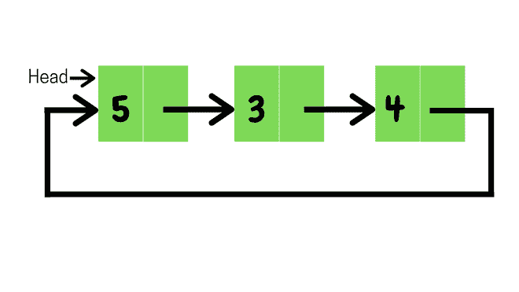

# 从循环链表开头删除节点的 Java 程序

> 原文：[https://www.geeksforgeeks.org/java-program-to-delete-a-node-from-the-beginning-of-the-circular-linked-list/](https://www.geeksforgeeks.org/java-program-to-delete-a-node-from-the-beginning-of-the-circular-linked-list/)

在本文中，我们将学习如何从[循环链表](https://www.geeksforgeeks.org/circular-linked-list/)的开头删除一个节点。考虑如下所示的链表。



## 示例

```java
Input : 5->3->4->(head node)
Output: 3->4->(head node)
```

两个案例在解决问题的同时出现，

### 情况 1：列表为空

*   如果列表是空的，我们将简单地返回。

### 情况 2：列表不为空

*   定义表示节点的 `Node` 类。
*   `delete()`：
    *   如果没有节点，则从函数返回
    *   如果只有一个节点，则将 `head` 和 `tail` 都设置为 `null`
    *   如果它有一个以上的节点，那么它将删除前一个 `head` 节点，`head` 将指向列表中的下一个节点，`tail` 将指向新的 `head`。
*   `printNode()` 将打印列表中的所有节点，如下所示：
    *   节点 `current` 被定义为指向 `head`
    *   打印 `current.val`，直到它再次指向 `head`
    *   在每次迭代中，它将指向下一个节点

## 代码

```java
// Java Program to Delete a Node From the Beginning of the
// Circular Linked List

public class Main {

// Represents the node of list.
    public class Node {
        int val;
        Node next;
        public Node(int val) { this.val = val; }
    }

// Initialising head and tail pointers
    public Node head = null;
    public Node tail = null;

// add new node to the end
    public void addNode(int val)
    {
        // Creating new node
        Node node = new Node(val);

// head and tail will point to new node
        // if list is empty
        if (head == null) {
            head = node;
            tail = node;
            node.next = head;
        }

// otherwise tail point to new node and
        else {
            tail.next = node;
            tail = node;
            tail.next = head;
        }
    }

// Deletes node from the beginning of the list
    public void delete()
    {
        // returns if list is empty
        if (head == null) {
            return;
        }

// otherwise head will point to next element in the
        // list and tail will point to new head
        else {
            if (head != tail) {
                head = head.next;
                tail.next = head;
            }

// if the list contains only one element
            // then both head and tail will point to null
            else {
                head = tail = null;
            }
        }
    }

// displaying the nodes
    public void display()
    {
        Node current = head;
        if (head == null) {
            System.out.println("List is empty");
        }
        else {
            do {
                System.out.print(" " + current.val);
                current = current.next;
            } while (current != head);
            System.out.println();
        }
    }

public static void main(String[] args)
    {
        Main list = new Main();

// Adds data to the list
        list.addNode(5);
        list.addNode(3);
        list.addNode(4);

// Printing original list
        System.out.println("Original List: ");
        list.display();

// deleting node from beginning and
        // displaying the Updated list
        list.delete();
        System.out.println("Updated List: ");
        list.display();
    }
}
```

## 输出

```java
Original List: 
 5 3 4
Updated List: 
 3 4
```