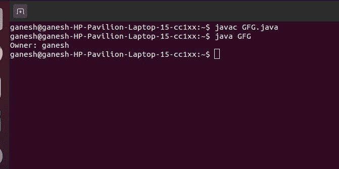

# 获取文件所有者名称的 Java 程序

> 原文: [https://www.geeksforgeeks.org/java-program-to-get-the-files-owner-name/](https://www.geeksforgeeks.org/java-program-to-get-the-files-owner-name/)

`File`类是文件或目录路径名的 Java 表示。因为文件和目录名在不同的平台上有不同的格式，一个简单的字符串不能命名它们。`File`类包含几种方法，用于处理路径名、删除和重命名文件、创建新目录、列出目录内容以及确定文件和目录的几种常见属性。

*   它是文件和目录路径名的抽象表示。
*   路径名，无论是抽象的还是字符串形式的，通常都是绝对的或相对的。抽象路径名的父级也可以是通过调用这个类的`getParent()`方法获得的。
*   首先，我们应该总是通过传递文件名或目录名来创建`File`类对象。文件系统可以对特定文件系统对象上的某些操作实施限制，如读取、写入和执行。这些限制统称为访问权限。
*   `File`类的实例是不可变的；这就是，一旦创建，文件对象所代表的抽象路径名就永远不会改变。

要在 Java 中找到文件所有者，我们将使用`FileOwnerAttributeView`类的`getOwner()`方法。

**方法:**

*   将文件路径作为输入。
*   使用`FileOwnerAttributeView`类创建一个具有文件属性的对象。
*   然后使用`getOwner()`方法获取车主姓名。
*   打印文件所有者的姓名。

**语法:**

```java
file_attribute_object.getOwner()
```

**参数:** 只能用于带有文件属性的对象。

**返回类型:** 返回文件所有者姓名。

**示例 1:** 在 Windows 操作系统中

## Java 代码

```java
// Importing modules
import java.io.*;
import java.nio.file.*;
import java.nio.file.attribute.*;

class GFG {
    public static void main(String[] args) {

        // Taking file path as input
        Path path = Paths.get("C:\\Users\\Gfg\\Article 1.txt");

        // Create object having the file attribute
        FileOwnerAttributeView file = Files.getFileAttributeView(path, 
                                        FileOwnerAttributeView.class);

        // Exception Handling to avoid any errors
        try {
            // Taking owner name from the file
            UserPrincipal user = file.getOwner();

            // Printing the owner's name
            System.out.println("Owner: " + user.getName());
        } catch (Exception e) {
            System.out.println(e);
        }
    }
}
```

**输出**

```java
Owner: DESKTOP-O30NR1H\Aditya_Taparia
```

如果我们在使用`getOwner()`方法时没有使用异常处理，那么它将显示一个错误。

**输出:**

```java
gfg.java:16: error: unreported exception IOException; must be caught or declared to be thrown
                UserPrincipal user = file.getOwner();
                                                  ^
1 error
```

**示例 2:** 在 Linux 机器中 (Ubuntu 发行版)

## Java 代码

```java
// Importing modules
import java.io.*;
import java.nio.file.*;
import java.nio.file.attribute.*;

public class GFG {
    public static void main(String[] args) {

        // Taking file path as input
        Path path = Paths.get("/home/ganesh/GFG.java");

        // Create object having the file attribute
        FileOwnerAttributeView file = Files.getFileAttributeView(path, 
                                        FileOwnerAttributeView.class);

        // Exception Handling to avoid any errors
        try {
            // Taking owner name from the file
            UserPrincipal user = file.getOwner();

            // Printing the owner's name
            System.out.println("Owner: " + user.getName());
        } catch (Exception e) {
            System.out.println(e);
        }
    }
}
```

**输出:**

