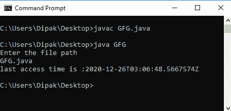

# 获取文件最后访问时间的 Java 程序

> 原文：[https://www.geeksforgeeks.org/java-program-to-get-the-last-access-time-of-a-file/](https://www.geeksforgeeks.org/java-program-to-get-the-last-access-time-of-a-file/)

存储大量数据的每个文件也有自己的数据集（称为元数据），可以用来获取该文件的属性。这种数据类型称为属性。Java 为访问任何文件的任何属性提供了基础，如文件的创建时间、上次访问时间、上次修改时间、文件类型等。

这一切都可以通过 Java 的两个重要的包来完成，即：

*   `java.nio.file.*`
*   `java.nio.file.attribute.*`

我们将在这里使用的这个包的两个主要类是：

1.  `BasicFileAttributeView`
2.  `BasicFileAttributes`

示例：`BasicFileAttributeView` 类的 `readAttributes()` 方法将用于获取 `BasicFileAttributes` 类对象中的属性。

## Java 代码示例

```java
// Java program to get the last access time of a file

import java.nio.file.*;
import java.nio.file.attribute.*;
import java.util.Scanner;

// save as file named gfg.java
public class gfg {
    public static void main(String[] args) throws Exception
    {
        // reading the file path from the system.
        Scanner sc = new Scanner(System.in);

        System.out.println("Enter the file path");

        String s = sc.next();

        // setting the path .
        Path path = FileSystems.getDefault().getPath(s);

        // setting all the file data to the attributes in
        // class file of BasicFileAttributeView.
        BasicFileAttributeView view = Files.getFileAttributeView(
                path, BasicFileAttributeView.class);

        // method to read the file attributes.
        BasicFileAttributes attribute = view.readAttributes();

        // using lastAccessTime() method to print the last
        // access time of that file.
        System.out.println("last access time is :"
                           + attribute.lastAccessTime());
    }
}
```

