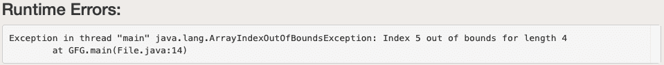
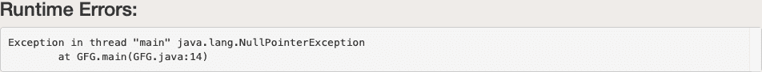
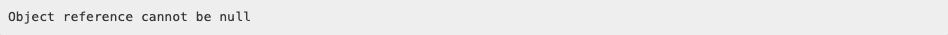

# 处理未检查异常的 Java 程序

> 原文：[https://www.geeksforgeeks.org/java-program-to-handle-unchecked-exception/](https://www.geeksforgeeks.org/java-program-to-handle-unchecked-exception/)

异常是运行时出现的导致程序工作突然中断的问题。请记住，异常从来不会在编译时抛出，而是总是在运行时抛出，无论它是什么类型。编译时不会引发异常。`Throwable`是所有异常和错误的超类。现在迫切需要解决这些问题，在 Java 语言中有一个概念被定义为“异常处理技术”。

有两种类型的异常定义如下：

*   **检查异常**
*   **未检查的异常**

## 真实世界图解：异常

> 考虑一个员工离家去办公室。他被家长监视，拿走身份证和他们能想到的所有东西。虽然员工知道一切，但仍被监控。现在员工出门还是莫名其妙地被耽搁了，因为他的车胎被扎破了，结果是他上班迟到了。现在，这些扰乱他日常生活的意外事件在 Java 中被称为异常。虽然他检查了那些东西，但父母的行为帮助了他，但如果有一天不知何故错过了，员工在家里正确地得到了东西，这本身在 Java 中被称为“检查异常”。家长访问没有任何控制的操作称为“未检查的异常”。在这里，在编程语言中，父权限或监控权限被称为“编译器”。编译器可以检测到的异常称为检查异常，检测不到的称为未检查异常。

## 未检查异常

这些类型的异常发生在程序运行期间。编译器在编译时不会检查这些异常。在 Java 中，`Error`和`RuntimeException`类下的异常是未检查的异常，这种异常是由于不良编程引起的。

1.  **`Error`类异常，如** `StackOverflowError`、`OutOfMemoryError`异常等，很难处理。
2.  **`RuntimeException`，如** `ArrayIndexOutOfBoundsException`、`NullPointerException`等，可以在`try-catch`块的帮助下处理。

程序员通常面临两个主要的未检查异常，即下面借助示例实现讨论它们，并讨论如何处理它们。两种主要方法的建议如下：

1.  **`ArrayIndexOutOfBoundsException`**
2.  **`NullPointerException`**

### 情况 1：`ArrayIndexOutOfBoundsException`

由于访问大于等于数组长度大小的索引，出现此异常。出现此异常后，程序将自动终止。简单来说，试图访问的内存不是当前数据结构本身所拥有的。这里这个异常是在数据结构上定义的，即“数组”。

#### 示例代码

```java
// Importing Classes/Files
import java.io.*;

class GFG {

    // Main Driver Function
    public static void main(String[] args)
    {
        // Array containing 4 elements
        int a[] = { 1, 2, 3, 4 };

        // Try to access elements greater than
        // index size of the array
        System.out.println(a[5]);
    }
}
```

**输出：**



#### 处理`ArrayIndexOutOfBoundsException`

使用`try-catch`块我们可以处理这个异常。`try`语句允许您定义一个要测试错误的代码块，`catch`块捕获给定的异常对象并执行所需的操作。这样程序不会终止。

```java
// Importing Classes/Files
import java.io.*;

public class GFG {

    // Main Driver Method
    public static void main(String[] args)
    {
        // Inserting elements into Array
        int a[] = { 1, 2, 3, 4, 5 };

        // Try block for exceptions
        try {

            // Forcefully trying to access and print
            // element/s beyond indexes of the array
            System.out.println(a[5]);
        }

        // Catch block for catching exceptions
        catch (ArrayIndexOutOfBoundsException e) {

            // Printing display message when index not
            // present in a array is accessed
            System.out.println(
                "Out of index  please check your code");
        }
    }
}
```

**输出：**


### 情况 2：`NullPointerException`

试图访问具有`null`值的对象引用时出现此异常。

#### 示例代码

```java
// Importing Classes/Files
import java.io.*;

public class GFG {
    // Main Driver Method
    public static void main(String[] args)
    {

        // Instance of string a has null value
        String a = null;

        // Comparing null value with the string value
        // throw exception and Print
        System.out.println(a.equals("GFG"));
    }
}
```

**输出：**

 

#### `NullPointerException`的处理技术

```java
// Importing Files/Classes
import java.io.*;

public class GFG {

    // Driver Main Method
    public static void main(String[] args)
    {
        // Assigning NULL to string
        String m = null;

        // Try-Catch Block
        try {

            // Checking the null value with GFG string
            // and throw exception
            if (m.equals("GFG")) {
                // Print String
                System.out.println("YES");
            }
        }

        // Try-Catch Block
        catch (NullPointerException e) {

            // Handles the exception
            System.out.println(
                "Object reference cannot be null");
        }
    }
}
```

**输出：**

