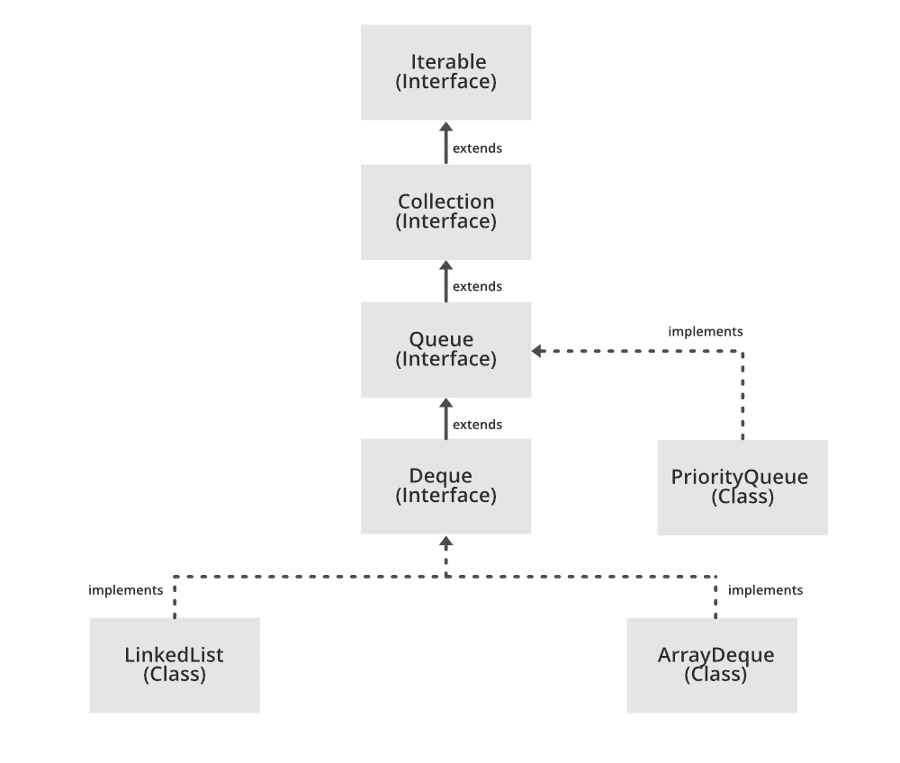

# 实现优先级队列 API 的 Java 程序

> 原文：[https://www.geeksforgeeks.org/java-program-to-implement-priorityqueue-api/](https://www.geeksforgeeks.org/java-program-to-implement-priorityqueue-api/)

`PriorityQueue` 是一种线性数据结构，其中元素根据它们的自然顺序或由构建时在队列中提供的一些自定义比较器进行排序。在 `PriorityQueue` 中，根据自然排序，队列的前面指向最少的元素，后面指向最大的元素。对于字母优先队列，将考虑它们的 ASCII 值进行排序。

优先级队列的一些重要特征如下：
*   它不允许插入空元素。
*   这是一个无界队列，意味着它的大小可以扩展。
*   它继承了像 `Object`、`AbstractCollection`、`AbstractQueue` 这样的类。
*   它不是线程安全的。
*   不能为不可比较的对象创建它。

> 各种操作的时间复杂性：
> *   插入和删除是 `O(log(n))` 的顺序
> *   `remove()` 和 `contains()` 方法的顺序为 `O(n)`
> *   检索操作最快，为 `O(1)` 级

优先级队列类继承 `Queue` 接口及其所有方法。优先级队列 API 实现了 `Serializable`、`Iterable`、`Collection` 和 `Queue`，这可以从下面显示的架构中感知到。

```
Serializable, Iterable<E>, Collection<E>, Queue<E>
```



**语法：**

```java
public class PriorityQueue<E> extends AbstractQueue<E> implements Serializable
```

**参数：** `E` — 该队列中保存的元素类型。

**方法：**

| 方法 | 类型 | 描述 |
| --- | --- | --- |
| `add(E e)` | `boolean` | 将元素 `e` 插入优先级队列 |
| `clear()` | `void` | 从优先级队列中移除所有元素 |
| `contains(Object o)` | `boolean` | 如果它包含指定的元素，则返回 `true` |
| `iterator()` | `Iterator` | 返回所有元素的迭代器 |
| `remove(Object o)` | `boolean` | 从队列中移除指定的元素 |
| `comparator()` | `Comparator` | 返回用于对元素排序的自定义比较器 |
| [`toArray()`](https://www.geeksforgeeks.org/arraylist-toarray-method-in-java-with-examples/) | `Object[]` | 返回包含优先级队列中所有元素的数组。 |
| [`peek()`](https://www.geeksforgeeks.org/stack-peek-method-in-java/) | `E` | 返回优先级队列的头部，而不从队列中删除元素 |
| [`poll()`](https://www.geeksforgeeks.org/queue-poll-method-in-java/) | `E` | 移除并返回队列头。如果队列为空，则返回 `null`。 |
| [`spliterator()`](https://www.geeksforgeeks.org/arraydeque-spliterator-method-in-java/) | `Spliterator<E>` | 对优先级队列中的元素创建后期绑定和故障快速拆分器。 |

**实施：**

**例**

## Java 语言实现

```java
// Java Program to implement Priority Queue API

// Importing all classes from java.util package
import java.util.*;

// Class
class GFG {

// Main driver method
    public static void main(String[] args)
    {
        // Creating(Declaring) an object of PriorityQueue of
        // Integer type i.e Integer elements will be
        // inserted in above object
        PriorityQueue<Integer> pq = new PriorityQueue<>();

// Adding elements to the object created above
        // Custom inputs
        pq.add(89);
        pq.add(67);
        pq.add(78);
        pq.add(12);
        pq.add(19);

// Printing the head of the PriorityQueue
        // using peek() method of Queues
        System.out.println("PriorityQueue Head:"
                           + pq.peek());

// Display message
        System.out.println("\nPriorityQueue contents:");

// Defining the iterator to traverse over elements of
        // object
        Iterator i = pq.iterator();

// Condition check using hasNext() method which hold
        // true till single element is remaining in List
        while (i.hasNext()) {

// Printing the elements of object
            System.out.print(i.next() + " ");
        }

// Removing random element from above elements added
        // from the PriorityQueue
        // Custom removal be element equals 12
        pq.remove(12);

// Display message
        System.out.print("\nPriorityQueue contents:");

// Declaring iterator to traverse over object
        // elements
        Iterator it = pq.iterator();

// Condition check using hasNext() method which hold
        // true till single element is remaining in List
        while (it.hasNext()) {

// Printing the elements
            System.out.print(it.next() + " ");
        }

// Removing all the elements from the PriorityQueue
        // using clear() method
        pq.clear();

// Adding another different set of elements
        // to the Queue object
        // Custom different inputs
        pq.add(5);
        pq.add(7);
        pq.add(2);
        pq.add(9);

// Checking a random element just inserted
        // using contains() which returns boolean value
        System.out.print("The queue has 7 = "
                         + pq.contains(7));

// Display message for content in Priority queue
        System.out.print("\nPriorityQueue contents:");

// Converting PriorityQueue to array
        // using toArray() method
        Object[] arr = pq.toArray();

// Iterating over the array elements
        for (int j = 0; j < arr.length; j++) {

// Printing all the elements in the array
            System.out.print(arr[j] + " ");
        }
    }
}
```

**Output**

```java
PriorityQueue Head:12

PriorityQueue contents:
12 19 78 89 67 
PriorityQueue contents:19 67 78 89 The queue has 7 = true
PriorityQueue contents:2 7 5 9 
```