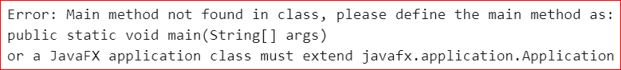

# 不使用主方法打印任何语句的 Java 程序

> 原文：[https://www.geeksforgeeks.org/java-program-to-print-any-statement-without-using-the-main-method/](https://www.geeksforgeeks.org/java-program-to-print-any-statement-without-using-the-main-method/)

我们知道[静态块](https://www.geeksforgeeks.org/g-fact-79/)在主方法之前执行，因此我们可以将我们想要执行的语句放在静态块中。但是对于 `JDK` 7 和上述版本的 `JDK`，代码不会执行，因为编译器首先会在任何其他事情之前寻找主方法。此外，这取决于运行程序所使用的集成开发环境，即程序可能在某些集成开发环境中成功执行，而在某些集成开发环境中可能无法成功执行。此外，我们可以在静态块中异常退出我们的程序，这样 `JVM` 就不会检查主方法，但是正如所讨论的，它取决于 `IDE`，程序是否会运行。

## Java 语言实现

下面是上述方法的代码实现。

```java
// Java Program printing the statement without using main
// method.

class PrintWithoutMain {

// static block
    static
    {
        // prints "Hello World!!" to the console
        System.out.println("Hello World!!");

        // exit from the program
        System.exit(1);
    }
}
```

## 输出

```java
Hello World!!
```

上述代码在 `JDK` 7 之前和之后都不会编译。此外，如果在某些集成开发环境（如 `Intellij`、`Netbeans` 或控制台）上运行上述代码，可能会出现如下错误。

