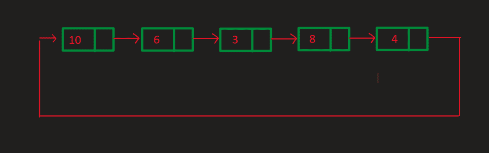
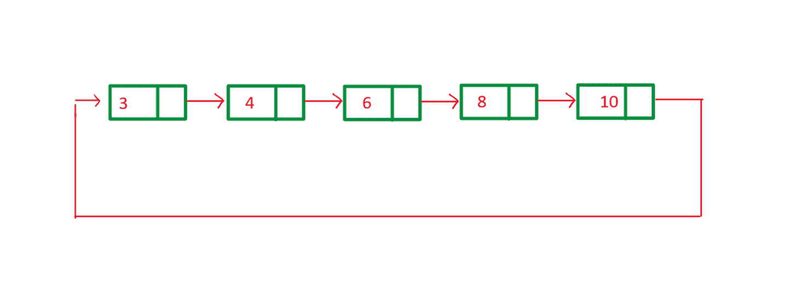
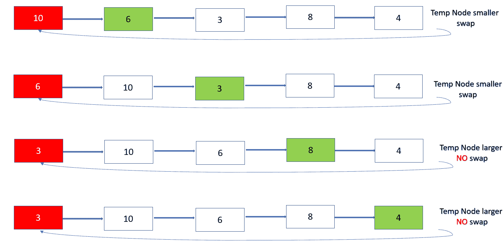

# 对循环链表元素进行排序的 Java 程序

> 原文: [https://www.geeksforgeeks.org/java-program-to-sort-the-elements-of-the-circular-linked-list/](https://www.geeksforgeeks.org/java-program-to-sort-the-elements-of-the-circular-linked-list/)

在一个循环链表中，每个节点都指向序列中的下一个节点，但是最后一个节点指向列表中的第一个节点。这里，创建一个循环链表，并按升序对循环链表进行排序。

排序前循环链表:



循环链表

排序后循环链表:



排序循环链表

**方法:**

1.  取两个指针: `current` 指向节点头部， `temp` 指向 `current` 的下一个节点。
2.  现在，在每次迭代中比较 `current` 指针的值与 `temp` 指针的值。
    这里会出现两种情况：

**情况 1:** 如果 `current` 指针的值**大于** `temp` 指针的值
    交换 `current` 指针和 `temp` 指针的值。
    将 `temp` 指针移动到下一个节点。

**情况 2:** 如果 `current` 指针的值**小于或等于** `temp` 指针的值
    将 `temp` 指针移动到下一个节点。

3.  现在继续这样做，直到 `temp.next != head_of_node`。
4.  完成第 3 步后，将 `current` 节点移动到下一个节点，重复第 1、2、3 步。
5.  每次迭代都会将列表中最短的元素固定到正确的位置。
6.  重复以上步骤，直到 `current.next != head_of_node`。

**让我们看看这对于给定循环链表的第一个节点是如何工作的**



下面是上述方法的实现:

## Java 实现

```java
// Java Program to Sort the Elements
// of the Circular Linked List

import java.io.*;

public class GFG {
    // Stores Information about Node of List
    public class Node {
        int data;
        Node next;
        public Node(int data) { this.data = data; }
    }

    // Declaring Head of the Node
    public Node head_of_node = null;

    // A last pointer to help append values to our list
    public Node last = null;

    // Add method adds values to the end of the list
    public void add(int data)
    {
        Node newNode = new Node(data);
        if (head_of_node == null) {
            head_of_node = newNode;
            last = newNode;
            newNode.next = head_of_node;
        }
        else {
            last.next = newNode;
            last = newNode;
            last.next = head_of_node;
        }
    }

    // Sort_List method sorts the circular
    // linked list Using the algorithm
    public void Sort_List()
    {
        // current pointer pointing to the head of the list
        Node current = head_of_node;

        // a temp pointer
        Node temp = null;

        // variable value helps in swap of the values
        int value;

        // this is the Algorithm discussed above
        if (head_of_node == null) {
            System.out.println("Your list is empty");
        }
        else {
            while (current.next != head_of_node) {
                temp = current.next;
                while (temp != head_of_node) {
                    if (current.data > temp.data) {
                        value = current.data;
                        current.data = temp.data;
                        temp.data = value;
                    }
                    temp = temp.next;
                }
                current = current.next;
            }
        }
    }

    // Print_list method iterates through the list and
    // prints the values stored in the list
    public void Print_List()
    {
        Node current = head_of_node;
        if (head_of_node == null) {
            System.out.println("Your list is empty");
        }
        else {
            do {
                System.out.print(" " + current.data);
                current = current.next;
            } while (current != head_of_node);
            System.out.println();
        }
    }

    // Driver code
    public static void main(String[] args)
    {
        GFG circular_list = new GFG();
        circular_list.add(10);
        circular_list.add(6);
        circular_list.add(3);
        circular_list.add(8);
        circular_list.add(4);

        System.out.print("Original List -->     ");
        circular_list.Print_List();
        circular_list.Sort_List();
        System.out.print("List after Sorting--> ");
        circular_list.Print_List();
    }
}
```

**输出**

```java
Original List -->      10 6 3 8 4
List after Sorting-->  3 4 6 8 10
```

**时间复杂度:** O(N^2)